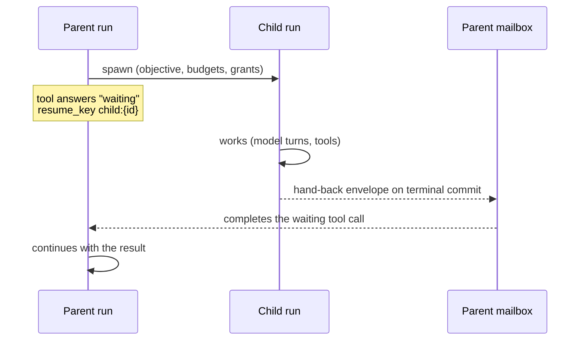

# Agent Delegation

An agent delegates by **spawning a child run**. A child is an ordinary
[agent run](./agent-runs.md) with a parent: it has its own event log, controls,
lease and budgets, and it survives crashes the same way. What makes it a child
is its lineage (`parent_run_id`, `root_run_id`, `depth`), a **typed
objective**, and a **hand-back** into the parent's durable mailbox when it ends.

## The typed objective

A child does not start from a free-text prompt alone. Its objective says:

| Field | Meaning |
|---|---|
| `title`, `instructions` | What to do. |
| `context` | What the child starts with: `none`, `recent_turns` (a bounded list of the parent's recent items), or `snapshot` (a reference to one of the parent's checkpoints, written at spawn time if none is named). |
| `allowed_tools` | Function paths the child may call. An entry ending in `*` is a prefix. Checked when each operation begins: a denied tool returns a `blocked` result the child can re-plan from. |
| `allowed_writes` | Write roots `{workspace, path, ops?}`. They are narrowed to the parent's own [node-development grant](./node-development.md#working-roots-and-grants) and become the child's grant. |
| `expected_artifacts` | What the child must produce. |
| `acceptance_checks` | How the result is judged. |
| `hand_back` | The fields the result must contain, with an optional schema. |

When the child ends, core checks the expected artifacts, acceptance checks and
hand-back contract, and records the verdict as `contract.satisfied` and
`contract.violations` in the hand-back.

## Admission and budgets

Spawning is refused unless the parent is live and within its limits:

- depth at most 4 (or the parent's `max_depth`);
- at most 64 children per run (or `max_children`), and `max_live_children`
  running at once;
- enough spare budget in the parent.

A child's budgets are **carved out of the parent's**. It gets the operations,
model calls and tokens it asks for, clamped to what the parent can spare; if
it asks for nothing it gets half of the spare. Its wall time never exceeds the
parent's remaining wall time. While the child is live, its reservation counts
against the parent. When it hands back, its actual usage, across its whole
subtree, rolls into the parent's `usage.child_*` counters.

Children default to `on_exceeded: fail`: a child paused on its budget would
leave its parent waiting indefinitely.

## Hand-back and the mailbox

Nothing polls for a child's result. The steps are separate, idempotent commits,
each on one run, and any cluster node may perform them:

1. **Spawn.** The parent commits the admission and the full creation plan. The
   child is then created under the id the plan names. If a crash loses the
   create, the sweeper recreates the child from the stored plan.
2. **Hand-back.** The child's terminal commit leaves it *hand-back owed*. The
   parent then commits the hand-back and a mailbox item; the child link
   prevents a second delivery. Finally the child records that its hand-back was
   delivered. Until then it stays on a worklist the sweeper works through.
3. **Resume.** A tool that answered `waiting` with `resume_key: "child:{id}"`
   is completed by the hand-back, whether the child finished before or after the
   tool parked.

A hand-back is a [`raisin.tool-result/1`](../reference/agent-run-contracts.md#the-tool-result-envelope)
envelope with status `succeeded`, `blocked` or `failed`, and a payload of
`{child_run_id, child_no, title, status, outcome, usage, contract}`.

The mailbox also carries **messages**: a child can post to its parent
(`post-to-parent`, up to 64 KiB, deduplicated by message id), and the parent
acknowledges items up to a number to clear them. The mailbox holds at most 256
unacknowledged items.

## Controlling children

A parent can inspect a child (its run, recent events, usage and latest
checkpoint), and send it one of four actions. Each is logged on the parent and
delivered to the child as an ordinary control:

| Action | Arrives at the child as |
|---|---|
| `message` | a steer with input `{type: "parent_message", from_run, message}` |
| `steer` | a steer with input `{type: "parent_steer", from_run, input}` |
| `interrupt` | a `stop` (default) or `pause` |
| `resume` | a `resume` |

**Cascade.** When a parent reaches a terminal state, core stops every live
child, and each of their children in turn. The sweeper repeats this for any
live run whose parent has ended, so a lost wake cannot leave an orphan running.

A client-driven parent can also wait on a child explicitly; the wait is a
pending request of kind `child`.

## Checkpoints for compaction

A checkpoint written for compaction references, rather than copies:

- the run's window of large tool results (4 KiB or more, the last 32);
- the reducer's structured state;
- the transcript cutoff, the last message folded into the summary;
- the run's children and mailbox.

It may be written by the lease holder, by the in-flight operation naming
itself, or by an authorized caller while no driver holds the run. Checkpoints
are read back by number or as `latest`.

## Delegation in ai-tools

The `ai-tools` package turns these primitives into model tools:
`spawn-agent`, `inspect-agent`, `message-agent`, `wait-for-agents` and
`interrupt-agent`, plus `delegate-task` for plan tasks. See
[Delegated Agent Workflows](../guides/ai/delegated-agent-workflows.md).

## Related

- [Agent Runs](./agent-runs.md)
- [Agent Runs HTTP API: children, mailbox, checkpoints](../reference/http-api/agent-runs-api.md#child-runs)
- [Function API: `raisin.agentRuns`](../reference/function-api/agent-runs.md)
