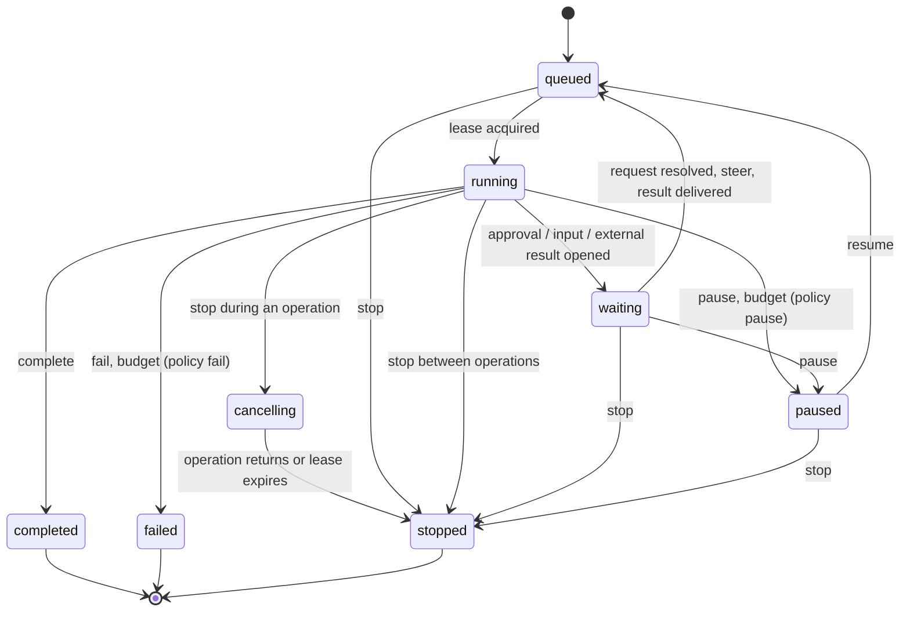

# Agent Runs

An **agent run** (`AgentRun`) is a durable, crash-safe execution of an agent,
owned by RaisinDB core. Every conversation with an agent is a run, a flow's
`ai_agent` step is a run, and a delegated sub-task is a child run. The run, not
the chat transcript, is the authoritative execution state: conversation
messages stay the visible record and audit trail, while the run decides what
happens next.

A run gives you:

- a stable run id, and a **durable event log** whose `seq` numbers are
  contiguous from 1;
- a **lifecycle** in which illegal states cannot be written;
- **one active operation** at a time (a model turn, a tool call, a compaction),
  with its own cancellation;
- **atomic, idempotent controls**: stop, pause, resume, steer, approve, answer;
- **leases and recovery**, so a run survives a worker crash or a server restart
  without repeating side effects;
- **pending requests** (an approval, a question to the user, an external result);
- **budgets** and usage accounting;
- **checkpoints** for compaction and resumption;
- **child runs** with a durable mailbox. See [Agent Delegation](./agent-delegation.md).

## Subject, principal and admission

Every run is *about* a **subject**: a node, named as `{workspace, path,
node_id?}`. A conversation run's subject is the conversation node. There is at
most **one live run per subject**. Creating a run for a subject that already has
one returns the existing run with `created: false`, so a client can steer it
instead of starting a second one. A `create_key` makes a retried create
idempotent in the same way.

A run acts as a **principal**:

- by default, the user who created it;
- with `as_agent: "functions:/agents/x"`, the agent, **on behalf of** the
  caller. Tool calls then run with the agent's rights narrowed to what the user
  may do;
- `on_behalf_of` lets a system caller (a trigger, for example) create a run for
  the user whose message started it. Other callers always act for themselves.

## Server-driven and client-driven runs

| | Server-driven | Client-driven |
|---|---|---|
| Created with | a `reducer: {function_path}` | no reducer |
| Who decides the next step | the reducer function, called by the server | your client |
| Who executes operations | the server's job queue, on any cluster node | your client, holding a lease |
| Typical use | conversations, flow agent steps, child runs | an external agent that wants durable, fenced bookkeeping |

A **reducer** is an ordinary RaisinDB function, in any supported language. The
runtime feeds it one event at a time and it answers with its next state and the
effects it wants: call a tool, ask the model, ask for approval, complete. See
[Domain reducers](#domain-reducers) below and the
[contract reference](../reference/agent-run-contracts.md).

## Lifecycle



The eight statuses are `queued`, `running`, `waiting`, `paused`, `cancelling`,
`completed`, `failed` and `stopped`. The last three are terminal: every control
sent to a terminal run is rejected with `run_terminal`.

The state is a closed type, so combinations such as "an operation in flight
while an approval is open", "waiting with no open request" or "a terminal run
with a lease" cannot be stored at all.

### Operations

An operation is one unit of work: `model_turn`, `tool_call`, `compaction`, or a
custom kind. Each has an `op_id` that doubles as its idempotency key, and two
flags set by whoever asks for it:

- `replay_safe`: the operation may be dispatched again with the same id after
  a crash. Model turns and compactions are replay-safe; a mutating tool is
  replay-safe only if it honours the operation id as its idempotency key.
- `interruptible`: a stop cancels it. A non-interruptible operation runs to its
  end, and the run stops before the next one.

An operation finishes with one of `succeeded`, `waiting`, `retryable`,
`blocked`, `failed` or `cancelled`. A tool that answers `waiting` with a
`resume_key` parks the run until someone delivers the result for that key.

## Controls

Controls are applied atomically, in one commit with the events they cause, and
each carries a caller-chosen **`control_id`**:

| Command | Effect |
|---|---|
| `stop` | Stops the run. Between operations it is immediate; during one the run enters `cancelling` and becomes `stopped` when the operation returns. Open requests are closed and queued steers discarded. |
| `pause` | Pauses at the next boundary and writes a checkpoint. |
| `resume` | Wakes a paused run. After a budget pause you can pass `budget_increase`. |
| `steer` | Queues new input. It is **consumed at the next safe boundary** (between operations), never mid-operation. Events show it as `steer_queued`, then `steer_consumed`. |
| `approve` | Decides an open approval request. It must quote the request's **`subject_digest`**, so an approval covers exactly the change the person saw; a stale digest is rejected with `digest_mismatch`. |
| `provide_input` (`answer`) | Answers an open question. |

Every control returns an acknowledgement:

```json
{ "ack": "applied", "seq": 42 }
{ "ack": "duplicate", "original_seq": 42 }
{ "ack": "rejected", "reason": "unauthorized", "seq": 43 }
```

Resending the same `control_id` with the same command is a no-op
(`duplicate`); reusing it for a different command is rejected
(`control_id_reused`). Retrying a control after a network error is therefore
always safe.

A control is authorized when the caller is the run's principal, the user the
run acts for, a system caller, or presents the run's **control capability**
(a secret given at create time and stored hashed).

## Budgets

A run carries limits, checked each time an operation begins:

`max_turns`, `max_operations`, `max_model_calls`, `max_total_tokens`,
`max_wall_ms`, `max_consecutive_op_failures`, and for delegation
`max_children`, `max_live_children`, `max_depth`.

`on_exceeded` decides what happens: `pause` (the default) keeps the run
resumable, and the pending operation is kept until you resume, optionally with
more budget; `fail` ends the run with `budget_exceeded:<which>`. Usage
(turns, operations, model and tool calls, input and output tokens) is updated
in the same commit as each finished operation.

## Leases, recovery and the sweeper

Whoever executes a run's operations holds a **lease** (90 seconds by default,
renewed while work continues). Every commit presents a **fence**, the lease
owner plus its epoch, and every transition that clears a lease (stop, pause,
terminal, release, takeover) bumps the epoch. A worker that lost its lease can
therefore never write into the run again.

Server-driven runs are advanced by `AgentRunStep` jobs, which any node in the
cluster may pick up. In addition, **every node runs a sweeper every 30
seconds** that:

- takes over runs whose lease expired. A replay-safe operation is dispatched
  again under the same `op_id` (a completion that was already recorded is not
  executed again); a non-replay-safe one is recorded as abandoned and reaches the
  reducer as `operation_failed` with `outcome_unknown: true`, so the domain
  re-reads before it retries;
- wakes queued runs that nobody is driving (a wake lost to a crash);
- closes requests past their expiry;
- finishes the domain bookkeeping of terminal runs;
- delivers owed child hand-backs, stops children of ended parents, and hands
  finished runs to the flow instances waiting for them.

## Storage and cluster behaviour

Runs are stored the way flow instances are: as **ordinary nodes in the
`raisin:system` workspace** of the repository's default branch.

```text
/agent-runs/runs/{bucket}/{run_id}                the run record
/agent-runs/runs/{bucket}/{run_id}/ev/{seq}       one node per event
/agent-runs/runs/{bucket}/{run_id}/ckpt/{n}       checkpoints
/agent-runs/runs/{bucket}/{run_id}/dom/{rev}      write-once domain state
/agent-runs/status/{status}/{run_id}              status index
/agent-runs/subjects/{hash}                       the subject's live run
/agent-runs/create-keys/{hash}                    create-key index
/agent-runs/owed/{finalize|handback}/{run_id}     sweeper worklists
```

Every lookup is a direct read of a derived path, never a query, so it does not
depend on eventually consistent indexes. Each commit is **one node
transaction**, marked as engine bookkeeping: it is durable, versioned and
[replicated](./replication.md) like any node write, but fires no triggers,
snapshots or embeddings.

Commits on one run are serialized with the same mechanism the flow runtime uses
for flow instances: an in-process keyed mutex plus a distributed lease from the
[locks subsystem](../guides/coordination/locks-and-inventory.md). The lease is
held only for the duration of one commit. When another cluster node holds it
for longer than about three seconds, the commit is refused as busy rather than
racing it. Without the locks subsystem configured, commits are serialized
within each node only; when it is configured but unreachable, the commit
proceeds under the in-process lock and the server logs a warning.

A stop issued on one node reaches an operation running on another: the worker
re-reads the run record on every lease renewal and cancels its operation when
it sees `cancelling`.

## Checkpoints

A checkpoint captures what core owns (status, open requests, queued steers,
usage, budgets, counters) and **references** the reducer's domain state, the
transcript cutoff, children and mailbox, and the window of large tool results,
instead of copying them. Entering `paused` always writes one. Compaction writes
one too, so a long conversation can be rebuilt from structured state rather
than from a prose summary. Checkpoints are numbered and can be read back.

## Projections

A reducer may attach a **projection**: a list of items `{key, title, status,
detail}` and a summary, which UIs display as the run's plan. Readers always get
the *effective* projection: an `in_progress` item survives only while the run is
`running`, and otherwise shows as `waiting`, `paused`, `stopped`, `failed` or
`blocked`. A stopped run never displays an active task, whatever the domain
last stored.

## Domain reducers

A reducer is a function that receives `(its last state, one authoritative
event)` and returns `(its next state, effects)`. The contract,
`raisin.agent-run.reducer/1`, is the same for every language:

- **Deterministic by policy.** The server calls the reducer inline (never as a
  queued job) under a deterministic execution policy that every runtime
  enforces: all host calls are refused, the clock reads the epoch and
  randomness is a fixed sequence. JavaScript, Starlark and WebAssembly
  reducers behave the same.
- **Validated.** Every response is checked against the contract before core
  applies it: one operation effect at a time, effect ids derived from the state
  revision, every tool call of the last model turn answered, and so on. A
  violation fails the run with `reducer_refused:<code>`.
- **Pinned.** The run records a hash of the reducer's artifact when it binds
  it. If a later call finds a different artifact, the run pauses with
  `reducer_changed`; resuming requires `accept_reducer_change: true`. A missing
  or crashing reducer pauses the run with `reducer_unavailable`, resumable after
  a redeploy.
- **Exactly once.** Each reducer answer is committed together with the effects
  it causes. A crash before the commit re-delivers the same event, and the
  repeated answer is recognized and ignored.

Tools report back in a common envelope, `raisin.tool-result/1`, which carries
status, reads, writes, artifacts, evidence and diagnostics, so a reducer can
reason about what really changed rather than about the model's prose. Both
contracts are specified in the [reference](../reference/agent-run-contracts.md).

## Where runs are used

- **Conversations.** The `ai-tools` package routes every user message to the
  conversation's run: a new run, or a steer into the live one. The default
  reducer, `/lib/raisin/ai/agent-run-reducer`, runs the model loop with loop
  detection, progress accounting and plan approval.
- **Flow `ai_agent` steps.** The step starts a run and waits for it. See
  [AI Steps](../guides/workflows/ai-steps.md#ai_agent-steps).
- **Delegation.** An agent's sub-tasks are child runs. See
  [Agent Delegation](./agent-delegation.md).
- **External clients.** Any client can create, follow and control runs over
  HTTP, WebSocket or from a function. See
  [Drive an Agent Run from a Client](../guides/ai/drive-an-agent-run.md).

## Related

- [Agent Runs HTTP & WebSocket API](../reference/http-api/agent-runs-api.md)
- [JavaScript client: Agent Runs](../reference/javascript-client/agent-runs.md)
- [Function API: `raisin.agentRuns`](../reference/function-api/agent-runs.md)
- [Node Development](./node-development.md), the safe write surface for agents
