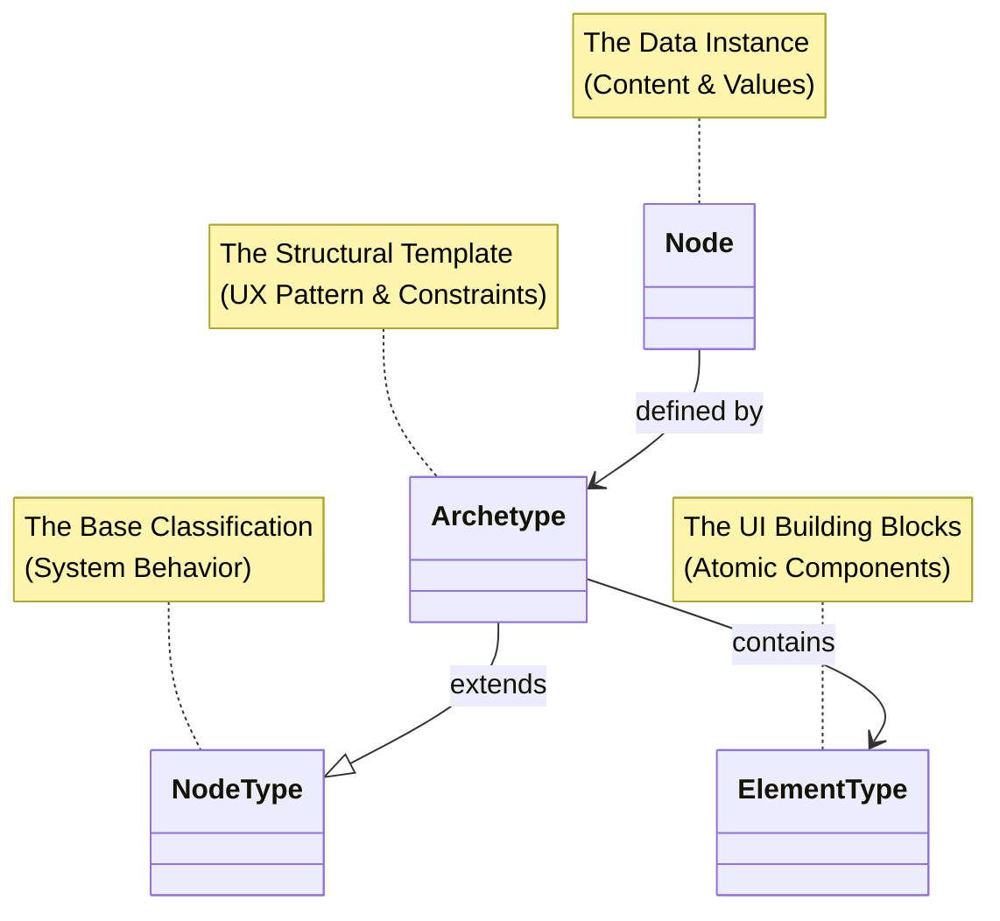
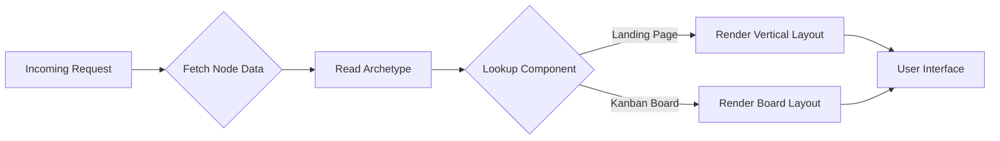

# Data-Centric Application Design (DCAD)

Data-Centric Application Design (DCAD) is a paradigm where **your schema IS your application**. Instead of hard-coding UI layouts, navigation, and routing into application logic, DCAD treats the data structure as the single source of truth that drives every aspect of the user experience.

## What is DCAD?

In traditional development, the UI dictates what data is fetched and how it's displayed. DCAD inverts this: the **data structure dictates the view**. Your application becomes a rendering engine that interprets schemas to produce the experience — dynamically flexible for humans and natively readable for AI agents.

## The Core Pillars

### 1. Data as the Single Source of Truth

In traditional MVC, the view often dictates what data is fetched. In DCAD, the **data schema dictates the view**. The application shell (layout, navigation, routing) is subservient to the data schema. If the schema changes, the application adapts automatically.

### 2. Unified Graph Structure

You define the "what" (content) and the "how" (flow) in the same structure. Graph relationships between data nodes naturally define navigation paths and UI hierarchy.

### 3. Schema-Driven Dynamic UX

The UI is not hard-coded — it is interpreted. Switch a node's archetype from "Landing Page" to "Kanban Board," and the UX pattern shifts instantly without a frontend deployment.

### 4. Agent-Native Readability

Because the application is built on strict, self-describing schemas rather than opaque UI logic, AI agents can easily read, navigate, and interact with it. The schema acts as a universal API for both your frontend and your AI tools.

## The Four Layers

DCAD separates content (the **instance**) from structure (the **definition**) using a four-part hierarchy:

### Node (the data instance)

The actual content stored in your database — a specific entity like "The Home Page" or "Q3 Marketing Board." A node is purely a data vessel that points to an **Archetype** to know how to behave.

### NodeType (the base classification)

The high-level abstract category. It defines system-level capabilities: Is this versionable? Indexable? Think of it as the "laws of physics" for that data object.

### Archetype (the structural template)

The bridge between raw data and user experience. An archetype extends a NodeType to define a specific UX pattern — what fields exist and which ElementTypes are allowed in its content areas.

### ElementType (the UI building blocks)

Atomic, reusable schema definitions that map directly to UI components: Hero Section, Feature Grid, Kanban Card, Pricing Table.

Learn more about each layer: [Nodes](/docs/concepts/data-model/nodes) | [NodeTypes](/docs/concepts/data-model/nodetypes) | [Archetypes](/docs/concepts/data-model/archetypes) | [Elements](/docs/concepts/data-model/elements)

## Concrete Example: Same Data, Different UX

Consider a single `page` node at `/content/home`. The data stays the same — but the archetype determines the experience.

**With a "Landing Page" archetype:**
- Structure: A vertical stack of content blocks
- Allowed elements: Hero, Features, Text, CTA
- Result: A marketing page with sequential sections

**With a "Kanban Board" archetype:**
- Structure: Horizontal columns containing draggable cards
- Allowed elements: Column, Card
- Result: A project management board with drag-and-drop

Switching the archetype in the database instantly changes the entire UX on the next load — no frontend deployment required.

## The Rendering Engine

In DCAD, your frontend acts as a rendering engine. It doesn't hard-code routes like `/home` or `/dashboard`. Instead, it interprets your schema:

1. **Receive data:** Load the node based on the URL
2. **Identify archetype:** Read the `archetype` property
3. **Resolve component:** Look up the matching renderer in a registry
4. **Render:** Pass the data into that component

## Why DCAD for AI

### Context Window Efficiency

Because UI is separated from data, you can feed an AI agent the raw data structure. The agent understands the exact page structure without parsing HTML or CSS.

### Hallucination Prevention

The archetype definition acts as a strict constraint. When an AI generates content, it must choose from the `allowed_element_types` — it can't invent UI elements that don't exist in your schema.

### Self-Healing

Update an archetype definition, and AI agents immediately understand the new rules of engagement without retraining. The schema is the universal contract for humans, code, and AI agents alike.

## Getting Started with DCAD

- **[Understanding DCAD](/docs/tutorials/dcad/understanding-dcad)** — How DCAD inverts the UI-data relationship
- **[Building Dynamic UI](/docs/tutorials/dcad/building-dynamic-ui)** — Build a dynamic UI with archetype switching
- **[Archetypes in Practice](/docs/tutorials/dcad/archetypes-in-practice)** — Compose archetypes and ElementTypes
- **[Archetypes Concept](/docs/concepts/data-model/archetypes)** — Deep dive into archetype structure and inheritance
