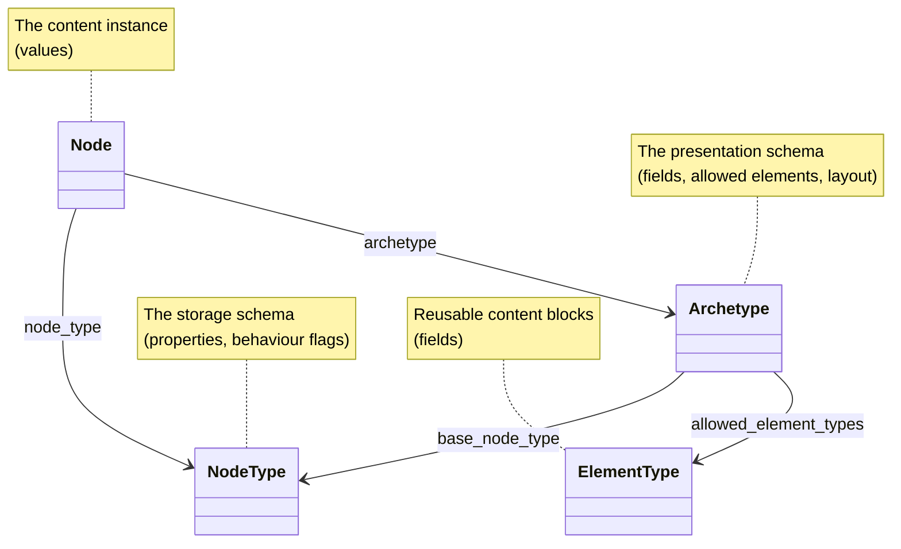
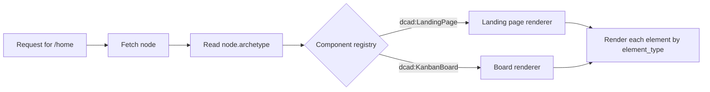

# Data-Centric Application Design (DCAD)

Data-Centric Application Design (DCAD) is the way RaisinDB expects applications to be built: the description of how content is structured and presented lives in the database next to the content, and the frontend reads that description instead of hard-coding it. Change the definition, and every client that renders from it changes with it.

## The idea

In a conventional application the UI decides which fields exist and how they are laid out; the database just stores values. RaisinDB inverts this. A node points at an archetype, the archetype declares the node's fields and which content blocks it may contain, and the blocks are described by element types. A frontend becomes an interpreter of these definitions: it fetches a node, looks up its archetype, and renders each field and block with the component registered for it.

Because the definitions are data, they are also readable by tools and AI agents. An agent that can read an archetype knows exactly which fields a page has and which element types it may add, so it can produce valid content without guessing at a UI.

## The four layers


```mermaid
classDiagram
  class Node
  class NodeType
  class Archetype
  class ElementType

  note for Node "The content instance
  (values)"
  note for NodeType "The storage schema
  (properties, behaviour flags)"
  note for Archetype "The presentation schema
  (fields, allowed elements, layout)"
  note for ElementType "Reusable content blocks
  (fields)"

  Node --> NodeType : node_type
  Node --> Archetype : archetype
  Archetype --> NodeType : base_node_type
  Archetype --> ElementType : allowed_element_types
```

### Node: the content instance

A node is the stored content. It names its NodeType in `node_type` and, optionally, its archetype in `archetype`. Its `properties` hold the values.

```json
{
  "path": "/home",
  "node_type": "dcad:Page",
  "archetype": "dcad:LandingPage",
  "properties": {
    "title": "Home",
    "slug": "home",
    "content": [
      { "element_type": "dcad:Hero", "headline": "Welcome", "subheadline": "Build on data" },
      { "element_type": "dcad:TextBlock", "body": "<p>Hello</p>" }
    ]
  }
}
```

### NodeType: the storage schema

The NodeType defines the properties the server validates and indexes, which children a node may have, and behaviour flags such as `versionable`, `publishable` and `auditable`. It answers "what is this thing and how does the system treat it".

### Archetype: the presentation schema

An archetype is built on a NodeType (`base_node_type`) and adds editor-facing fields. A field has a `$type` such as `TextField`, `RichTextField`, `MediaField`, `OptionsField` or `CompositeField`, plus a title, `required` and other hints. A `SectionField` is a content area: it lists the element types allowed inside it. An archetype can also carry a `layout` that groups fields into containers, groups and tabs.

```yaml
name: dcad:LandingPage
title: Landing Page
base_node_type: dcad:Page
fields:
  - $type: TextField
    name: title
    title: Page Title
    required: true
  - $type: TextField
    name: slug
    required: true
  - $type: SectionField
    name: content
    title: Page Content
    allowed_element_types: [dcad:Hero, dcad:TextBlock]
```

### ElementType: the building blocks

An element type is a reusable block with its own fields. A value of that type in a node is an object whose `element_type` names the type and whose other keys are the field values.

```yaml
name: dcad:Hero
title: Hero Section
fields:
  - $type: TextField
    name: headline
    required: true
  - $type: TextField
    name: subheadline
```

Learn more about each layer: [Nodes](/docs/concepts/data-model/nodes) | [NodeTypes](/docs/concepts/data-model/nodetypes) | [Archetypes](/docs/concepts/data-model/archetypes) | [Elements](/docs/concepts/data-model/elements)

## What the server checks

When a node carries an archetype, the server validates its properties against the resolved archetype on every write that goes through the node API. Required fields must be present, and an element placed in a section must be one of the section's allowed types:

```json
{"code":"VALIDATION_FAILED",
 "message":"Element type 'dcad:KanbanCard' is not allowed in field 'archetype 'dcad:LandingPage'.content'"}
```

```json
{"code":"VALIDATION_FAILED",
 "message":"Missing required field 'headline' at archetype 'dcad:LandingPage'.content[0]"}
```

This is what lets a frontend or an agent trust the shape of what it reads.

## Same data, different experience

Two archetypes can share one NodeType. `dcad:LandingPage` above renders a vertical stack of blocks. A `dcad:KanbanBoard` archetype on the same `dcad:Page` type could declare a `CompositeField` of columns, each with a `SectionField` of `dcad:KanbanCard` elements. Pointing a node at the other archetype changes what the editor shows and what the frontend renders, with no code deployed. The archetype is a column in SQL:

```sql
UPDATE 'site' SET archetype = 'dcad:KanbanBoard' WHERE path = '/home';
```

## The rendering engine


```mermaid
graph LR
    A[Request for /home] --> B[Fetch node]
    B --> C[Read node.archetype]
    C --> D{Component registry}
    D -->|dcad:LandingPage| E[Landing page renderer]
    D -->|dcad:KanbanBoard| F[Board renderer]
    E --> G[Render each element by element_type]
    F --> G
```

1. Fetch the node for the requested path.
2. Read its `archetype`.
3. Look up the matching renderer in a registry keyed by archetype name.
4. Inside a section, look up a renderer for each element's `element_type`.

An application that needs the field definitions themselves, for example to build an editor, reads the resolved archetype from `GET /api/management/{repo}/{branch}/archetypes/{name}/resolved`, which returns the merged `resolved_fields`, `resolved_layout` and `inheritance_chain`.

## Getting started

- [Understanding DCAD](/docs/tutorials/dcad/understanding-dcad) walks through creating the four layers on a running server.
- [Building Dynamic UI](/docs/tutorials/dcad/building-dynamic-ui) builds a renderer that switches on the archetype.
- [Archetypes in Practice](/docs/tutorials/dcad/archetypes-in-practice) covers inheritance and nested content areas.
- [Archetypes](/docs/concepts/data-model/archetypes) is the reference for archetype structure.
