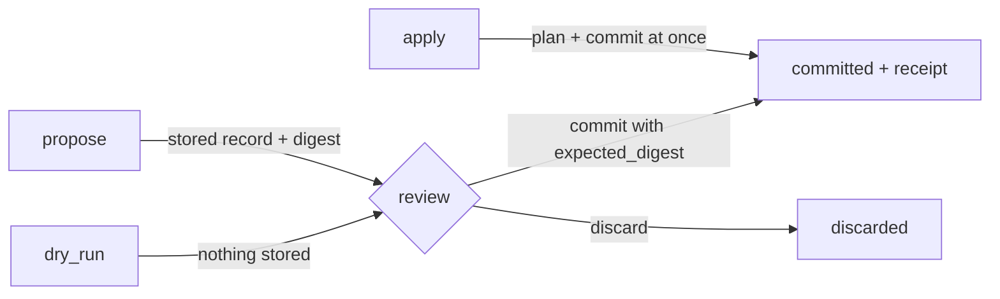

# Node Development

The node-development surface (`node-dev`) treats a repository the way a coding
agent treats a source tree, with one difference: the "files" are typed nodes
with stable ids and references. It gives agents, and any client, a safe way to
read and change a subtree:

| A filesystem agent has | Node development has |
|---|---|
| an absolute path | a **locator**: repository, branch, workspace, path, node id, revision |
| a working directory | **working roots** that bound every path, with per-root permissions |
| a patch applied atomically | a **changeset**, planned, reviewed and committed in one transaction |
| "file changed since you read it" | an `expected_revision` that turns into a **conflict**, never a silent overwrite |
| `git mv` | a **move** that keeps the node id, children and references |
| a worktree | a **branch**: fork, diff, merge, discard |

It is built only from what RaisinDB already has: transactions, branches, the
revision log, the reference index and row-level security. Every read is
filtered by row- and field-level security, and every write runs with the
caller's own rights.

## Locators and revisions

Every node is named by a locator:

```json
{
  "repository": "myapp",
  "branch": "main",
  "workspace": "content",
  "path": "/articles/launch",
  "node_id": "4b1c…",
  "revision": { "value": "a93f…", "alg": "raisin.node/1" }
}
```

The node id is the identity: it survives moves and renames. The path is the
current location. The revision (scheme `raisin.node/1`) is a digest of the
node's id, path, version counter and update time, so any write *or move*
changes it. Pass the revision you read as `expected_revision` on a later
write, and a node changed in the meantime becomes a conflict instead of being
overwritten.

A **target** in a request is either a path string, resolved against the first
root when relative, or `{workspace?, path?, node_id?}`, where the id wins.

## Working roots and grants

Every call is bounded by **roots**:

```json
[{ "workspace": "content", "path": "/articles", "ops": ["read", "create", "update"] }]
```

Paths are normalized (`..` included) before they are checked, so nothing can
climb out of a root. A root may restrict the operations allowed inside it:
`read`, `create`, `update`, `delete`, `move`, `copy`; omitting `ops` allows all
of them.

Roots also serve as a **grant** for [agent runs](./agent-runs.md). When a run
is created with `executor_config.node_dev.roots`, every node-dev call made from
inside that run (a tool call carrying the run's `__raisin_context`) is
confined to those roots. The grant is read from the run record, never from the
model's arguments, and a call may only narrow it. A delegated
[child run](./agent-delegation.md) receives its parent's grant, narrowed
further by its objective's `allowed_writes`.

## Reads

| Method | Returns |
|---|---|
| `stat` | Whether the target exists, its locator, type, archetype, child count and version. |
| `read` | Properties (optionally only some keys), children and last editor. |
| `list` | Children as locators with name, type and whether they have children. |
| `diff` | One node compared across two revisions or two branches: moved or not, and changed keys. |
| `watch` | Changes under the roots since a cursor, from the revision log; resume with the returned cursor. |

## Changesets

A changeset is an ordered list of operations committed atomically:

| Op | Fields |
|---|---|
| `create` | `path`, `node_type`, `archetype?`, `properties?`, `workspace?` |
| `patch` | `target`, `set?`, `unset?`, `archetype?`, `expected_revision?` |
| `move` | `target`, `to_parent`, `new_name?`, `expected_revision?` |
| `rename` | `target`, `new_name`, `expected_revision?` |
| `copy` | `source`, `to_parent`, `new_name?` |
| `delete` | `target`, `recursive?`, `expected_revision?` |

The planner resolves, authorizes and checks every operation **before anything
is written**. It keeps an overlay, so a later op sees the effect of an earlier
one: you can create a folder and then a node inside it in one changeset. The
plan predicts the exact effects (moved and deleted descendants, referrers,
changed keys) and carries a **digest**, a SHA-256 over the operations and the
node revisions they were planned against.

A changeset moves through review like this:



- **`dry_run`** returns the plan and stores nothing.
- **`propose`** stores a reviewable changeset record with status `proposed`.
- **`commit`** re-plans with the committing caller's own rights. Bound to an
  `expected_digest`, it commits only if the plan is still the one that was
  approved; otherwise the result is a `digest_mismatch` conflict.
- **`discard`** abandons a proposal.
- **`apply`** plans and commits in one call.

### Conflicts

A commit that cannot happen as reviewed returns a `conflict` result, and
nothing is written:

| Code | Cause |
|---|---|
| `stale_revision` | The node changed since the `expected_revision` was read. |
| `missing` | The target does not exist. |
| `exists` | The destination is occupied. |
| `not_empty` | A non-recursive delete of a node with children. |
| `invalid_move` | A move into the node's own subtree. |
| `published` | A move of a published node; unpublish it first. |
| `digest_mismatch` | The plan differs from the approved digest. |

### Receipts

A committed changeset returns a **receipt** saying exactly what happened, per
operation: the action (`created`, `updated`, `moved`, `copied`, `deleted`), the
old and new locator, changed properties, created, deleted and moved
descendants, the references that point at moved nodes, and the resulting
branch revision.

**Moves keep identity.** A move preserves the node's id, its children, its
references and `created_by`. It emits `Updated` events marked `moved` with the
`old_path`, for the node and every descendant, so consumers see a move rather
than a delete plus a create, and references to the moved nodes are retargeted.

### Idempotency and change records

An `idempotency_key` names a changeset. Replaying a committed key returns the
stored receipt with `replayed: true`; reusing the key with different
operations is refused with `idempotency_key_reused`. Inside an agent run the
key defaults to `run:<run_id>:<operation_id>`, so a re-dispatched tool call
cannot commit twice.

The changeset record is an ordinary node in `raisin:system`, at
`/changesets/<xx>/<id>` on the same branch, written **in the same
transaction** as the changes it commits. It replicates like any other node.

## Branches as worktrees

| Method | Behaviour |
|---|---|
| `fork_branch` | Creates a branch from the current one. Idempotent. |
| `diff_branch` | Lists changes against a base (default `main`), filtered to the roots. |
| `merge_branch` | Merges into a target. With `dry_run` it only reports; with conflicts it reports them and merges nothing. A protected target needs an admin. |
| `discard_branch` | Deletes the branch. Only its creator or an admin may, and never a protected or root branch. |

Forking copies the branch's index entries, which is not free on a large
repository. Prefer a reviewed changeset on the working branch for ordinary
edits, and fork only when you need real isolation.

## Cluster safety

Commits on one branch are serialized with the same pairing the flow runtime
uses: an in-process keyed mutex plus a lease from the
[locks subsystem](../guides/coordination/locks-and-inventory.md). When another
node holds the lease, the call answers `busy` (HTTP 503) instead of racing.

## Tool mode

When a request carries `__raisin_context` (a call from inside an agent run) or
`envelope: true`, every answer, errors included, is a
[`raisin.tool-result/1`](../reference/agent-run-contracts.md#the-tool-result-envelope)
envelope: reads with their revisions, writes with `from` for moves, exactly one
primary artifact, and read-back evidence. A run's reducer can then track what
really changed.

## Where to use it

- [HTTP API](../reference/http-api/node-dev-api.md): `POST /api/node-dev/{repo}/{method}`
- [JavaScript client](../reference/javascript-client/node-dev.md): `db.nodeDev()`
- [Functions](../reference/function-api/node-dev.md): `raisin.nodeDev.*`
- Agent tools in `ai-tools`, under `/lib/raisin/node-dev/`: `node-stat`,
  `node-list`, `node-read`, `node-diff`, `node-watch`, `node-dry-run`,
  `node-propose`, `node-apply`, `node-changeset` and `node-branch`.
