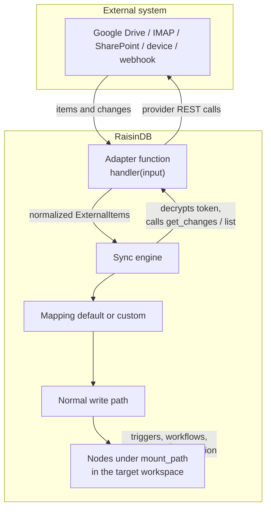

# Virtual Nodes

**Virtual Nodes** mount an external system — a Google Drive folder, a mailbox, a
SharePoint site, a stream of webhooks — into a workspace as ordinary RaisinDB
nodes. A background **sync engine** polls the external source through a small
**adapter function**, maps each remote item to a node, and keeps the subtree up
to date. From that point on, the mounted data is just data: it lives at a real
path, in a real workspace, with real node types.

Two words carry the whole feature. A **connector** is a configured external
system — the Google Drive account, the mailbox, the SharePoint site — held on a
`raisin:Integration` node. A **mount** is one subtree that a connector syncs into
a workspace path, held on a `raisin:VirtualMount` node. The admin console calls
these **Connectors** and **Mounts**.

## What works today

Virtual Nodes sync **both directions**. The engine brings external items *in* and
keeps them current, and — since this release — pushes local edits back out under
a mode you choose per mount. Be precise about the boundary:

| Capability | Status |
|------------|--------|
| Sync external items into nodes (metadata + links) | **Yes** |
| Triggers, workflows, agents, SQL, full-text search on synced nodes | **Yes** |
| Delta sync when the connector supports it, else full reconcile | **Yes** |
| Ephemeral mounts with TTL cleanup | **Yes** |
| Test connection + capability detection | **Yes** |
| Webhook-driven refresh via `raisin.integrations.sync_now(mount_id)` | **Yes** |
| **Near-real-time push sync** (`mode: webhook`/`hybrid`) — provider pings trigger a delta re-sync instead of interval polling | **Yes — experimental / preview.** Fully generic; any connector adds it via three optional adapter ops. Needs `RAISINDB_BASE_URL`. See [Real-time sync with webhooks](../guides/integrations/realtime-sync-webhooks.md). |
| **Gmail** mail (real IMAP + XOAUTH2) into ephemeral nodes | **Yes — experimental / preview**, read-only. IMAP is a read protocol — sending needs SMTP, which is planned and not built. See [Connect Gmail](../guides/integrations/connect-gmail.md). |
| **Gmail** push (near-real-time) via Google Cloud **Pub/Sub** | **Yes — experimental / preview.** Requires operator Pub/Sub topic + push subscription. See [Real-time sync with webhooks](../guides/integrations/realtime-sync-webhooks.md#gmail--operator-sets-up-pubsub-then-its-automatic). |
| **Microsoft 365** mail + calendar + **OneDrive files** over Microsoft Graph (`raisin:Event` nodes for calendar) | **Yes — experimental / preview.** Reads all three; writes mail read-state, the calendar (full mirror), and sends/RSVPs. OneDrive stays read-only — a Graph drive write is an upload session, not a JSON body. See [Connect Microsoft 365](../guides/integrations/connect-microsoft-365.md). |
| **Microsoft 365** push (near-real-time) for mail / calendar / files | **Yes — experimental / preview.** Automatic on a `webhook`/`hybrid` mount (Graph subscriptions). |
| **Google Calendar** events into `raisin:Event` nodes | **Yes — experimental / preview.** Reads and writes (full mirror). Google has no trash for events, so a delete is irreversible and does not propagate unless you ask for it. See [Sync Google Calendar](../guides/integrations/sync-google-calendar.md). |
| **Google Calendar** push (near-real-time) | **Yes — experimental / preview.** Automatic on a `webhook`/`hybrid` mount (`events.watch` channels). |
| **Writing local edits back to the provider** — `state_only`, `mirror` and `submit`, chosen per mount | **Yes — experimental / preview.** Every mode is off by default and opted into per mount. See [The write path](#the-write-path). |
| **Mail read-state** pushed back to Microsoft 365 | **Yes — experimental / preview** (`state_only`). Needs the `Mail.ReadWrite` scope, which the connector does not request by default. |
| **Calendar mirror** — create, edit and delete events from RaisinDB, both providers | **Yes — experimental / preview** (`mirror`). Needs a write scope on the connector. |
| **Sending mail** and **RSVP** as outbox commands | **Yes — experimental / preview** (`submit`), Microsoft 365 only. IMAP cannot send — that needs SMTP, which is planned and not built. |
| Conflict handling — `remote_wins`, `local_wins`, `error`, or your own resolver function | **Yes — experimental / preview.** `remote_wins` is the default. |
| Downloading file **content** into the binary store | **On demand.** Sync writes metadata only; the bytes are fetched when something asks, so a mailbox import is not multiplied by whole documents. Mail attachments arrive as `raisin:Asset` children with `file == null` until then. |
| On-demand read resolution (resolve a path live on access) | **No** — deferred by design; nodes appear only on the sync interval. |

## The content-hub pitch

The reason to mount instead of merely *calling* an external API is that synced
nodes flow through **the same write path as everything else**. They are not a
special read-only overlay — they are committed nodes. So every capability you
already rely on works on them, with no extra wiring:

- **Triggers** fire when a synced file appears, changes, or disappears.
- **Workflows and agents** can read, react to, and reason over mounted content.
- **SQL** queries them like any other rows — filter, join, aggregate.
- **Full-text search** indexes their titles and text.
- **Replication** carries them to other nodes in a cluster.
- **Access control** and **branching** apply exactly as they do to native nodes.

RaisinDB becomes a **content hub**: your Drive, your inbox, your device fleet,
and your own application data all sit in one queryable, versioned, permissioned
tree — and automations you write once run against all of them.

## What you can mount

The framework is deliberately general. An adapter is just a function that
translates a handful of normalized operations into calls against one external
system, so the same machinery covers persistent storage, live device state, and
transient event streams alike.

| Use case | What gets mounted | Node lifecycle |
|----------|-------------------|----------------|
| **Mailbox sync** | Incoming messages from IMAP / a mail API | Ephemeral — processed, then expired |
| **Google Drive sync** | Files and folders from a Drive folder | Persistent, kept in sync |
| **SharePoint** | Document library items | Persistent, kept in sync |
| **Webhook ingestion** | Events pushed by an external system | Ephemeral — react and drop |
| **IoT state** | Current state of lights, locks, sensors | Persistent, updated in place |
| **Agent inboxes** | Tasks or messages routed to an agent | Ephemeral — consumed by a workflow |

The only difference between these patterns is **intent** — persistent data
versus transient events — expressed through a mount's sync configuration
(`ephemeral` + `ttl_seconds`). The node types, the adapter contract, the sync
engine, and the trigger system are identical across all of them.

## How a connector reaches a service

An adapter reaches its external system one of two ways, and the split is worth
understanding before you build one.

- **Pure-JS over HTTP — user-writable today.** Any service with a REST or
  HTTP-native API is reachable from an adapter with nothing but
  `raisin.http.*`. You write the adapter as an ordinary function, allowlist the
  host in its `network_policy`, and mount it. **No server changes, no release** —
  this covers the large majority of SaaS connectors (Google Drive, SharePoint,
  any JSON API, JMAP mail, webhooks). If your service speaks HTTP, you can ship a
  connector for it yourself.

- **Native protocol bindings — a database feature, not a function.** Some
  protocols are not HTTP: IMAP (RFC 3501), for instance, needs a persistent,
  line-oriented TCP connection, and the function sandbox has no raw socket. When
  `raisin.http` cannot express a protocol, RaisinDB adds it **natively in Rust**
  and exposes a high-level binding to both the QuickJS/JS and Starlark/Python
  runtimes — the first is `raisin.imap.*`. An adapter then calls that binding the
  same way it calls `raisin.http`.

Be honest about the boundary: **a brand-new wire protocol is a RaisinDB feature
addition** — it ships in a release, not in a function you author. What you *can*
always do today, without waiting on anyone, is write a connector for any
HTTP/REST service. Native bindings exist so the same adapter model still reaches
the handful of protocols HTTP can't.

## Architecture

Two node types describe an integration, and one engine drives it:

- A **`raisin:Integration`** holds provider-level configuration and connected
  accounts (OAuth client, tokens). It usually lives once per repository in the
  `raisin:system` workspace.
- A **`raisin:VirtualMount`** points an integration's account at a **path** in a
  target workspace, plus a `remote_root` on the provider side and a sync
  schedule.
- The **sync engine** wakes on an interval, invokes the mount's **adapter
  function** for changes, maps each item, and materializes the results as nodes.



Because the last hop is the ordinary write path, the dashed arrow — triggers,
workflows, SQL, search, replication — comes for free.

## How a sync runs

On the first sync (or when the provider has no delta API, or on a manual full
sync) the engine does a **full reconcile**: it lists the remote subtree, upserts
every item, and deletes any mount-owned node it no longer sees. Afterwards it
switches to **delta sync**: it asks the adapter only for changes since the last
cursor, which is fast and cheap.

Matching is by a stable **external id**, so a rename or move on the provider side
updates the existing node instead of creating a duplicate. An unchanged item
(same change token) is skipped entirely, so a quiet source produces no revision
churn and no spurious trigger storms. Deletes are **scoped** — the engine only
removes nodes it owns, never native nodes that happen to sit under the same path.

Every synced node carries a small set of reserved metadata properties
(`__virtual`, `__mount_id`, `__external_id`, `__etag`, `__synced_at`) that mark
it as mount-managed and let you query it with ordinary SQL:

```sql
SELECT * FROM 'default' WHERE properties->>'__mount_id'::String = $1
```

## The boundaries in detail

The matrix above is the short version. The reasoning behind each "No":

:::info Current scope
- **Metadata and links, not file bytes.** A synced file becomes a lightweight
  node with its title, size, MIME type, and links (`web_url`, `download_url`) —
  the binary content is **not** downloaded into the node. The adapter contract
  defines a `get_content` operation for forward-compatibility, but the engine
  never calls it in this release.
- **Read/reconcile only — write-through is unbuilt.** The sync engine only ever
  reads from the provider and reconciles nodes. It has **no** code path that
  pushes a local edit back out. The `write_config` field and the adapter's
  `create`/`update`/`delete` operations exist in the contract, but they are
  inert: the admin console hides the write-back controls, and a mount that
  requests `write_through` records `writeback_supported: false` in its state so
  the UI can explain why nothing is propagated. This is not an "off by default"
  toggle — there is nothing to switch on.
- **`remote_wins` is the contract's only conflict strategy** — relevant once
  write-through exists; today a sync is always remote-authoritative.
- **Background sync only.** Nodes appear on the sync interval (or when you call
  `sync_now`); there is no on-access "resolve this path live" fallback. That is
  deferred by design.
:::

## The write path

:::info Off by default
Every mode is opt-in per mount, and a mount that has not opted in behaves exactly
as it did before. That is deliberate: a write configuration reaches somebody
else's mailbox or calendar, so it is something you turn on, never something you
inherit.

A write also needs an OAuth scope the connectors do not request by default —
[the reference](../reference/virtual-node-adapters.md#the-write-path) covers the
three steps that takes.
:::

### One mechanism, three shapes

The hard part of a write path is that "writing" means different things for
different resources. A calendar event can be edited. An email cannot — it is
immutable by nature, so the only meaningful write is *sending* a new one. A file
can be replaced. A single generic "push the node back" would be wrong for two of
those three.

The resolution: **a write mode is a property of the mount, not of the connector.**
The same mail connector serves a read-state mount and a sending mount.

| mode | the node is… | changing it means | example |
|------|--------------|-------------------|---------|
| `mirror` | the remote object | create / update / delete propagate | calendar event, Drive file |
| `state_only` | an immutable record with mutable state | only the connector's declared writable fields propagate; other edits are rejected, not silently dropped | mail: the body is fixed, read/flags/folder are not |
| `submit` | a **command** | creating it and queueing it performs the action, exactly once | send, reply, forward, RSVP |

`submit` is what makes immutable resources coherent. A mailbox is modelled as
three mounts rather than one:

```
/mail/inbox    state_only   incoming messages; read state and folder are writable
/mail/sent     read-only    the canonical sent message, synced back from the provider
/mail/outbox   submit       messages you write — creating one and queueing it sends it
```

Reply and forward need no special handling: the outbox node names the action and
the message it answers, and the connector uses the provider's own message id. The
same shape generalizes to anything — a chat outbox, a refund queue, an order
submission mount are all `submit` collections.

### Sending happens at most once

A retried send is a duplicate email, so the engine treats `submit` unlike every
other operation. The command is durably marked *sending* **before** the provider
is called; on success it becomes *sent*. If the outcome is ambiguous — a timeout,
a connection drop — it parks as *unknown* and **is never retried automatically**.
Only an explicit rate-limit response, which proves nothing happened, is requeued.
Resolving a parked command is a human decision, surfaced in the console.

### Deleting is a policy, not a behaviour

"Delete this email" and "delete this file" should not mean the same thing, so each
connector declares a default and each mount can override it: `detach` removes the
node locally and leaves the provider untouched, `trash` uses the provider's own
trash, and `purge` (never a default) deletes for real. Moves are likewise
`push`, `detach`, or `reject`.

Destructive writes are additionally bounded: a mis-scoped bulk statement that
would delete a large fraction of a mount is stopped before it reaches the
provider, the pending writes are parked rather than lost, and an operator is asked
to confirm. Reads keep running throughout.

### Connectors stay simple

The engine owns the hard parts — detecting what changed, ordering, ensuring a
write is not repeated, preventing a pushed change from echoing back as a new
change, and the safety rails. A connector implements the provider calls and
declares what it can do. It never writes nodes itself; it returns results and the
engine writes.

That boundary is also the security boundary: connectors run privileged, so a
connector that could write nodes could write *any* node in the workspace.

## Branches: where config lives and where nodes land

A mount has a **`target_branch`** (default `main`) — the branch its synced nodes
are written to. But every mount and connector's **configuration** always lives on
the repository's **config (default) branch**, and the periodic scanner reads
mounts **only** from that branch. Two consequences users ask about constantly:

- **Creating or forking a branch does not start a second sync.** A forked branch
  that carries a *copy* of a mount node is inert — the scanner never looks at it,
  so it never fires. Only the config-branch original drives a sync, and it does
  so exactly once regardless of how many branches exist.
- **To land synced nodes on a non-default branch, set `target_branch`** on the
  mount. The mount node itself still lives on the config branch; only its
  materialized virtual nodes go to `target_branch`.

:::warning Operational prerequisites
- **Set and back up `RAISIN_MASTER_KEY`.** Account tokens are stored as
  AES-256-GCM ciphertext on the integration node. The engine needs the master
  key to decrypt them just before each adapter call. If the key is missing or
  lost, no mount can authenticate — and previously-encrypted tokens become
  unrecoverable. Treat it like any other production secret: set it once, back it
  up, never rotate it out from under existing ciphertext.
- **Multi-node deployments need the Redis locks backend.** The engine takes a
  per-mount lease so two nodes never sync the same mount at once. On a single
  node the in-process lock is enough; in a **replicated cluster you must
  configure the Redis locks backend**, or concurrent syncs are not
  cluster-safe.
- **The first sync of a large folder is a node-event storm.** A full reconcile
  writes one node per remote item, and each write emits a node event. Mounting a
  folder with thousands of files fires thousands of triggers on the first run.
  Scope your triggers tightly (by path prefix and operation), and expect the
  initial burst; steady-state delta syncs only touch what changed.
:::

## Next steps

- **[Sync a Google Drive folder](../guides/integrations/sync-google-drive.md)** —
  the end-to-end happy path, from installing the adapter to a trigger firing on
  change.
- **[Sync a mailbox](../guides/integrations/sync-a-mailbox.md)** — the ephemeral
  "agents work the inbox" pattern over a real IMAP server via `raisin.imap.*`.
- **[Build a connector](../guides/integrations/build-a-custom-adapter.md)** —
  scaffold with `raisindb create adapter`, implement `capabilities` + `list`,
  install, test, and mount.
- **[Virtual node adapter reference](../reference/virtual-node-adapters.md)** —
  the full operation, data-type, and configuration tables.
