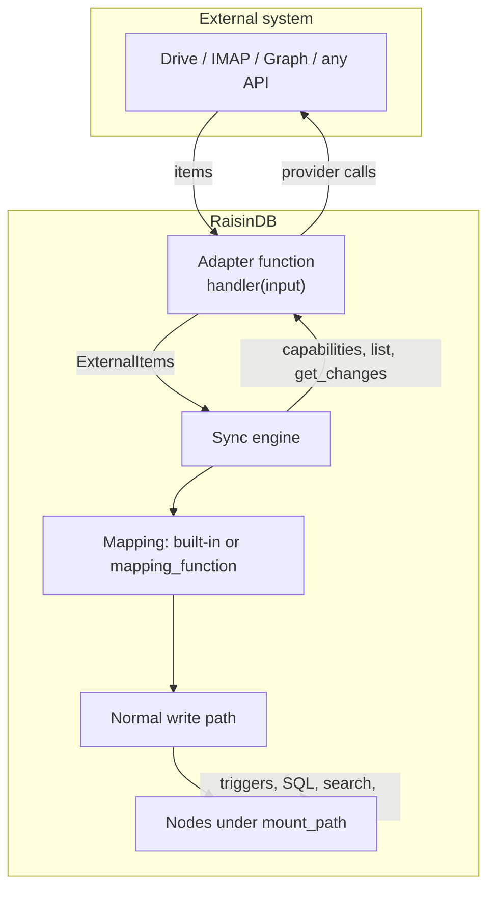

# Virtual Nodes

Virtual Nodes mount an external system, such as a Google Drive folder, a
mailbox, a calendar or any HTTP API, into a workspace as ordinary nodes. A
background sync engine asks a small **adapter function** what is in the
external system, maps each item to a node, and keeps the subtree current. From
then on the mounted data is just data: it has a path, a workspace, a node type,
and it shows up in SQL, search, triggers and workflows like anything else.

Two nodes describe an integration:

- A **connector** is a configured external system, held on a
  `raisin:Integration` node: the provider, the adapter function, OAuth settings,
  and the connected accounts. The admin console calls these **Connectors**.
- A **mount** is one subtree that a connector syncs into a workspace path,
  held on a `raisin:VirtualMount` node. The console calls these **Mounts**.

Both live in the `raisin:system` workspace of the repository, connectors under
`/integrations/<name>` and mounts under `/mounts/<name>`.

## What a mount can do

| Capability | Status |
|------------|--------|
| Sync external items into nodes (metadata and links) | Yes |
| Delta sync when the connector has a changes feed, full listing otherwise | Yes |
| Triggers, workflows, SQL and full-text search over synced nodes | Yes |
| Ephemeral mounts that expire nodes after a TTL | Yes |
| Test connection and capability detection | Yes |
| On-demand sync from a function or over HTTP | Yes |
| Push-driven sync (`mode: webhook` or `hybrid`) for connectors that support it | Preview. Needs `RAISINDB_BASE_URL`. See [Real-time sync with webhooks](../guides/integrations/realtime-sync-webhooks.md). |
| Writing local edits back to the provider (`state_only`, `mirror`, `submit`) | Preview. Off unless a mount opts in. See [The write path](#the-write-path). |
| File bytes | Fetched on demand, and cached only when the mount sets `cache_content`. |
| Adopting a node someone creates under the mount path | Only for a `mirror` mount that names the node type in `create_node_types`. |
| Resolving a path live on first access | No. Nodes appear on the sync interval or when a sync is requested. |

Shipped connectors: Google Drive, IMAP and Gmail, Microsoft 365 (mail, calendar,
OneDrive and SharePoint) and Google Calendar. Each is a built-in package you
install per repository. You can also
[build your own](../guides/integrations/build-a-custom-adapter.md).

## Why mount instead of calling an API

Synced nodes go through the same write path as every other node, so
everything that works on nodes works on them without extra wiring:

- Triggers fire when a synced item appears, changes or disappears.
- Workflows and agents read and react to mounted content.
- SQL queries them, including joins with your own data.
- Full-text and vector search index them.
- Replication carries them to other nodes in a cluster.
- Access control and branching apply as they do to native nodes.

## How a connector reaches a service

Most services speak HTTP. An adapter for one is an ordinary function that uses
`raisin.http.fetch` against the provider's API, with the host allowlisted in
the function's `network_policy`. No server change is needed, and this covers
Google Drive, Microsoft Graph, Google Calendar and any JSON API.

Some protocols are not HTTP. IMAP needs a persistent TLS connection, which a
function cannot open. For those RaisinDB provides a native binding and the
adapter calls it the same way it would call `raisin.http`. The IMAP binding is
`raisin.imap.listMailboxes`, `raisin.imap.fetchSince` and
`raisin.imap.fetchMessage`. Adding another wire protocol is a server feature
rather than something an adapter can do on its own.

## How a sync runs

The engine wakes once a minute, finds every enabled mount whose interval has
elapsed, and enqueues a run per mount. A run:

1. Reads the mount and its connector, decrypts the connection's credential,
   and asks the adapter for its `capabilities`.
2. Runs a **full walk** the first time, when the connector has no changes feed,
   or when you ask for `full` or `remap`: it calls `list` for the root and for
   every folder it finds, upserts each item, and then deletes any mount-owned
   node it did not see.
3. Runs a **delta** on every later run when the connector supports changes: it
   calls `get_changes` with the stored cursor and applies only what changed.

Items are matched by their provider id, stored on the node as
`__external_id`, so a rename or move on the provider side updates the existing
node. An item whose change token (`etag`) is unchanged is skipped before the
mapper runs, so a quiet source produces no revisions and no trigger noise.



Every synced node carries a few reserved properties: `__virtual`,
`__mount_id`, `__external_id`, `__etag` and `__synced_at`. They are plain
properties, so a mount's nodes are one query away:

```sql
SELECT path, name FROM 'default'
WHERE properties->>'__mount_id'::String = 'HlrbuYjrnytco3_1DGQZv';
```

Without a custom mapper, folders become `raisin:Folder` nodes and everything
else becomes a `raisin:Node` with a `title` and a `meta` object holding the
mime type, size, links and any provider metadata. A `mapping_function` on the
mount replaces that with the node type and properties you want; the shipped
connectors use one to produce `raisin:Mail`, `raisin:Event` and
`raisin:Asset` nodes.

## The write path

Writing back is off for every mount until it opts in with a `write_config`.
Three modes cover the shapes a remote object can have:

| mode | the node is | a local change means |
|------|-------------|----------------------|
| `mirror` | the remote object | create, update and delete propagate |
| `state_only` | an immutable record with some mutable state | only the properties listed in `mutable_fields` propagate |
| `submit` | a command | creating a node and setting its `status` to `queued` performs the action once |

The mode belongs to the mount, not the connector, so one mail connector can
serve a `state_only` inbox and a `submit` outbox side by side:

```
/mail/inbox    state_only   raisin:Mail            read state is writable
/mail/outbox   submit       raisin:OutboundMail    queue one to send it
```

A `submit` command is marked `sending` before the provider is called and
`sent` afterwards. Only a `rate_limited` answer puts it back in the queue. Any
other failure, a timeout included, parks it as `unknown` for a person to check,
because a second attempt could send a duplicate.

Deletes and moves are policies: `delete_policy` is `detach` (remove the node
locally, leave the provider alone), `trash` or `purge`, and `move_policy` is
`push`, `detach` or `reject`. Bulk deletes are held for confirmation in the
console before they reach the provider. The
[adapter reference](../reference/virtual-node-adapters.md#write_config) lists
every field.

### What a write needs

A mount resolves its mode on every run from three things: the adapter's
declared capabilities, the mapper's `to_external` operation, and the mount's
own `write_config`. When one is missing the mount records
`writeback_supported: false` and the reason in `writeback_last_error`, and
keeps syncing read-only. The console shows that reason on the mount.

Writes also need an OAuth scope that allows them. Providers do not widen a
grant that already exists, so an account connected with read scopes keeps
reading fine and fails every write with a 403 until it is reconnected. The
connections list reports `missing_scopes` per account, and the console shows
a **Reconnect** button that re-runs consent and updates the account in place,
so mounts that reference it keep working.

### Nodes created locally

A mount knows the nodes it materialized; they carry `__mount_id` and
`__external_id`. A node someone creates under the mount path carries neither,
and neither a sync nor a remap adopts it, because both walk the provider's
items. To have such nodes created at the provider, set `mode: mirror` and name
the node type in `create_node_types`, against an adapter that declares
`can_create`.

### Changing a mapper

A sync skips unchanged items before the mapper runs, so a changed mapper does
not reach items that are already synced. Run a **remap** (`mode: remap` on the
sync endpoint, or the Remap button in the console) to re-run the mapper for
every item. It writes a revision per item, so it is an operator action rather
than a schedule. Engine-derived properties such as extracted text survive it.

## Branches

A mount has a `target_branch` (default `main`) that selects where its nodes
are written. The mount and connector nodes themselves always live on the
repository's config branch, and the periodic scan reads only that branch.
Forking a branch therefore never starts a second sync; a copy of the mount
node on another branch is inert.

## Operational prerequisites

- **`RAISIN_MASTER_KEY`** encrypts every stored token and secret. The engine
  needs it to decrypt a connection before each adapter call, and without it no
  connection can be created. Back it up with the database.
- **Multi-node deployments** need the `redis` locks backend. The engine takes a
  per-mount lease so two nodes never sync the same mount at once; the
  in-process backend only serializes within one process.
- **The first sync of a large folder** writes one node per item and fires one
  node event per write. Scope triggers to the mount path and the operations you
  care about, and expect that initial burst.

## Next steps

- [Sync a Google Drive folder](../guides/integrations/sync-google-drive.md):
  the end-to-end happy path with a trigger on change.
- [Sync a mailbox](../guides/integrations/sync-a-mailbox.md): the ephemeral
  inbox pattern over IMAP.
- [Build a connector](../guides/integrations/build-a-custom-adapter.md):
  scaffold an adapter with `raisindb create adapter`, implement `capabilities`
  and `list`, and mount it.
- [Virtual node adapter reference](../reference/virtual-node-adapters.md): every
  operation, field and endpoint.
