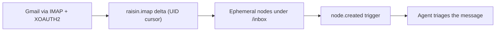

# Connect Gmail

:::caution Experimental / Preview
The Gmail connector is an **experimental / preview** feature. Validate it against
your own account before relying on it in production. It is **read-only** — mail is
brought *in* as nodes; nothing is written back to Gmail.
:::

This guide mounts a Gmail mailbox into a workspace as a stream of nodes. Gmail is
reached over **real IMAP (RFC 3501)** via the native `raisin.imap` binding,
authenticated with an **XOAUTH2** access token minted from Google's OAuth flow —
so it slots straight into the flagship **"agents work the inbox"** pattern. For
the concepts, see **[Virtual Nodes](../../concepts/virtual-nodes.md)**.

## What you'll build



New mail materializes as a `raisin:Node` under a mount path. A trigger dispatches
an agent per message; once handled, the node expires on its TTL — so the inbox
stays a **rolling working set**, not an ever-growing archive.

## Before you start

- A running RaisinDB instance and a repository you can install packages into.
- **`RAISIN_MASTER_KEY` set and backed up on the server** — the connector stores
  your Google tokens AES-256-GCM encrypted, and the sync engine needs this key to
  decrypt them just before each connection.
- A Google account with the mailbox you want to mount.

## Step 1 — Install the connector

The Gmail connector ships in the built-in IMAP adapter package. Gmail shares the
generic IMAP adapter — it is simply reached as a standard IMAP server.

```bash
raisindb package install imap-adapter --repo myapp
```

This deploys the IMAP adapter (`/adapters/imap`), a default mapper
(`/mappers/imap-default`), and a **disabled** Gmail connector template
(`/integrations/gmail`) preset with `host: imap.gmail.com`, `port: 993`,
`tls: true`, and `auth: xoauth2`. No credentials are shipped.

## Step 2 — Create a Google OAuth client

In the [Google Cloud Console](https://console.cloud.google.com/):

1. Create or select a project and **enable the Gmail API**.
2. Configure the OAuth consent screen and add the mail scope
   `https://mail.google.com/` (the scope the connector requests).
3. Create an **OAuth 2.0 Client ID** of type *Web application*.
4. Add your RaisinDB callback as an authorized redirect URI:
   `https://<your-host>/api/integrations/<repo>/oauth/callback` (the callback is
   repo-scoped — use the repository you are connecting the connector in).
5. Copy the **Client ID** and **Client secret**.

:::tip Where to find the URLs
Don't hand-assemble the redirect URI. Open **Connectors → Gmail** in the admin
console — the **Redirect URI** is shown there read-only with a copy button
(`https://<your-host>/api/integrations/<repo>/oauth/callback`). Paste that exact
value into step 2.4. If you are **authoring your own connector**, put the
provider-side steps (like these) into the connector's `setup_instructions`
(Markdown) and an optional `docs_url` — the admin console renders them on the
connector page so your users get the same guide.
:::

## Step 3 — Set the client id / secret and connect an account

In the admin console, open **Connectors → Gmail**:

1. Paste your **Client ID** and **Client secret**. The secret is encrypted at
   rest (AES-256-GCM) into `client_secret_encrypted` — it is never stored in
   cleartext and never leaves the server.
2. Set the **redirect URI** to match step 2.4, then **enable** the connector.
3. Click **Connect an account** and complete Google's OAuth flow. The connected
   account is stored with encrypted access and refresh tokens, and its verified
   email address is recorded as the account **subject**.

You must also **allowlist the IMAP host** in the adapter function's
`network_policy.allowed_urls` — the native binding enforces the same egress
policy as `raisin.http`, so an un-allowlisted host is refused **before any socket
opens**:

```yaml
network_policy:
  allowed_urls:
    - imaps://imap.gmail.com:993
```

:::note Refresh tokens never leave the server
The adapter only ever receives a short-lived XOAUTH2 access token, used as the
IMAP login secret. The refresh token is stored encrypted and used solely by the
engine's token-refresh logic; adapter code never sees it. The engine keeps the
access token fresh so the mailbox stays connected without re-consent.
:::

:::tip Test the connection first
Use **Test connection** before mounting — it runs `capabilities` and a small
`list` probe against your mailbox and confirms host, credentials, and allowlist
in one click.
:::

## Step 4 — Mount the mailbox (the ephemeral pattern)

The `ephemeral` + `ttl_seconds` settings are what turn the mount into a rolling
queue. Create a `raisin:VirtualMount` through the admin console's **Mounts** page
or as a node in `raisin:system`:

```yaml
node_type: raisin:VirtualMount
properties:
  title: Gmail Inbox
  integration_ref: /integrations/gmail
  account_ref: "<connected account id from step 3>"
  target_workspace: default
  target_branch: main            # branch the message nodes are written to
  mount_path: /inbox
  remote_root: INBOX             # Gmail label / IMAP folder (defaults to INBOX)
  sync_config:
    mode: poll
    interval_seconds: 60
    max_items_per_sync: 200
    ephemeral: true              # auto-delete synced nodes past their TTL
    ttl_seconds: 86400           # 1 day
  enabled: true
```

`remote_root` selects the Gmail label / IMAP folder (`INBOX` by default). The
connection coordinates — host, port, TLS, XOAUTH2 — come from the connector and
the connected account, not the mount.

Each message becomes a `raisin:Node` carrying `title` (subject), `from`, `to`,
`date`, `snippet`, `message_id`, and an `unread` flag, plus the reserved
`__virtual` / `__mount_id` / `__external_id` metadata. Labels come through as
`raisin:Folder`.

## Step 5 — Fire an agent per message

Because synced messages are ordinary nodes, a standard `node_event` trigger reacts
to each new one. Scope it to `node.created` under the mount path:

```javascript
// Trigger: on node.created under /inbox where node_type == raisin:Node
function handler(input) {
  const msg = input.event.node;
  const p = msg.properties;
  if (p.unread !== true) return;          // skip already-handled mail

  // One dispatch per message — never fan out per-item work in the sync loop.
  raisin.agents.dispatch("support-triage", {
    subject: p.title,
    from: p.from,
    snippet: p.snippet,
    message_id: p.message_id,
    node_path: msg.path,
  });
}
```

The flow is: **new mail → IMAP UID delta → materialized node → `node.created` →
agent**. When the agent finishes and the TTL lapses, the ephemeral node is
reaped, keeping `/inbox` a live queue rather than an archive.

## Running in production

- **Ephemeral cleanup is automatic** — nodes past `ttl_seconds` are reaped.
- **Auth expiry pauses the mount.** On `401`/`403` the adapter throws
  `auth_expired`; the engine refreshes the OAuth token or sets the mount
  `auth_required` until you reconnect. On `429` it throws `rate_limited` and
  backs off.
- **Multi-node clusters need the Redis locks backend**, or two nodes can sync the
  same mailbox at once.
- **`RAISIN_MASTER_KEY` must be set and backed up** — account tokens are stored
  encrypted with it.

## Next steps

- **[Sync a mailbox](sync-a-mailbox.md)** — the same ephemeral pattern over any
  IMAP server with an app password.
- **[Connect Microsoft 365](connect-microsoft-365.md)** — mail *and* calendar
  over Microsoft Graph.
- **[Adapter reference](../../reference/virtual-node-adapters.md)** — full field
  tables.
