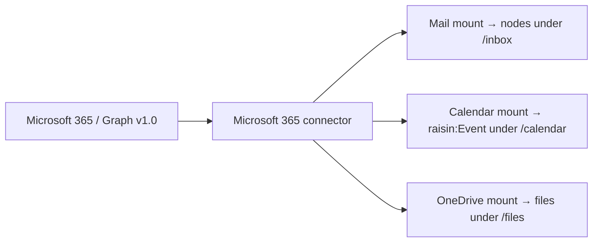

# Connect Microsoft 365 (mail + calendar + OneDrive)

:::caution Experimental / Preview
The Microsoft 365 connector is an **experimental / preview** feature. Validate it
against your own account before relying on it in production. It is **read-only** —
mail, events, and files are brought *in* as nodes; nothing is written back to
Microsoft 365.
:::

This guide connects a Microsoft 365 account over **Microsoft Graph v1.0**, then
creates mounts from the one connector: an Outlook **mail** mount, a **calendar**
mount that produces `raisin:Event` nodes, and an optional **OneDrive files** mount.
For the concepts, see **[Virtual Nodes](../../concepts/virtual-nodes.md)**.

## What you'll build



One connector, one connected account, several mounts distinguished by
`sync_config.resource`.

## Before you start

- A running RaisinDB instance and a repository you can install packages into.
- **`RAISIN_MASTER_KEY` set and backed up on the server** — the connector stores
  your Microsoft tokens AES-256-GCM encrypted; the engine needs this key to
  decrypt them before each Graph call.
- A Microsoft 365 account (work/school or personal) with mail and a calendar.

## Step 1 — Install the connector

The Microsoft 365 connector ships as a built-in package:

```bash
raisindb package install ms-graph-adapter --repo myapp
```

This deploys the Graph adapter (`/adapters/ms-graph`), a **mail** mapper
(`/mappers/ms-graph-mail`), a **calendar** mapper (`/mappers/ms-graph-calendar`),
and a **disabled** connector template (`/integrations/ms-graph`) with the
Microsoft identity endpoints preset. No credentials are shipped.

## Step 2 — Register an Azure (Microsoft Entra) app

In the [Azure portal](https://portal.azure.com/) → **Microsoft Entra ID → App
registrations**:

1. **New registration.** Give it a name and choose the supported account types
   (the template's `common` authority accepts both work/school and personal
   accounts; swap for a tenant id to restrict to one tenant).
2. Under **Authentication**, add a **Web** redirect URI:
   `https://<your-host>/api/integrations/<repo>/oauth/callback` (repo-scoped —
   use the repository you are connecting in).
3. Under **API permissions**, add these **delegated** Microsoft Graph scopes:
   - `Mail.Read`
   - `Calendars.Read`
   - `Files.Read` — only if you will mount OneDrive files (Step 6)
   - `offline_access` (so Microsoft issues a refresh token)
4. Under **Certificates & secrets**, create a **client secret** and copy it.
5. Copy the **Application (client) ID**.

These are exactly the least-privilege read scopes the connector template
requests.

:::tip Where to find the URLs
Don't hand-assemble the redirect URI. Open **Connectors → Microsoft 365** in the
admin console — the **Redirect URI** is shown there read-only with a copy button
(`https://<your-host>/api/integrations/<repo>/oauth/callback`). Paste that exact
value into step 2.2 as the **Web** reply URL. If you are **authoring your own
connector**, put the provider-side steps into the connector's `setup_instructions`
(Markdown) and an optional `docs_url` — the admin console renders them on the
connector page.
:::

## Step 3 — Set the client id / secret and connect

In the admin console, open **Connectors → Microsoft 365**:

1. Paste the **Client ID** and **Client secret**. The secret is encrypted at rest
   (AES-256-GCM) into `client_secret_encrypted` — never stored in cleartext.
2. Set the **redirect URI** to match step 2.2, then **enable** the connector.
3. Click **Connect an account** and complete Microsoft's OAuth consent. The
   account is stored with encrypted access and refresh tokens; the engine keeps
   the access token fresh via `offline_access`.

:::note Refresh tokens never leave the server
The adapter only ever receives a short-lived `access_token`. The refresh token is
stored encrypted and used solely by the engine's token-refresh logic.
:::

:::tip Test the connection first
Use **Test connection** on the connector before mounting — it runs `capabilities`
and a small `list` probe against your account.
:::

## Step 4 — Mount mail (`resource: mail`)

The adapter surface is chosen by `sync_config.resource`. `mail` (the default)
syncs an Outlook mail folder via `/me/mailFolders/{id}/messages`.

```yaml
node_type: raisin:VirtualMount
properties:
  title: Outlook Inbox
  integration_ref: /integrations/ms-graph
  account_ref: "<connected account id from step 3>"
  target_workspace: default
  target_branch: main
  mount_path: /inbox
  remote_root: inbox                     # mail folder id (defaults to "inbox")
  mapping_function: /mappers/ms-graph-mail
  sync_config:
    resource: mail
    mode: poll
    interval_seconds: 60
    max_items_per_sync: 200
    ephemeral: true                      # rolling inbox; drop after TTL
    ttl_seconds: 86400
  enabled: true
```

Each message becomes a message-shaped `raisin:Node`. The ephemeral settings make
`/inbox` a rolling working set — pair it with a `node.created` trigger to run an
agent per message, exactly as in **[Connect Gmail](connect-gmail.md#step-5--fire-an-agent-per-message)**.

## Step 5 — Mount the calendar (`resource: calendar`)

Set `resource: calendar` and point `mapping_function` at the calendar mapper. The
adapter reads `/me/calendars/{id}/events` and drives incremental sync via
`calendarView/delta` bounded by a time window.

```yaml
node_type: raisin:VirtualMount
properties:
  title: Work Calendar
  integration_ref: /integrations/ms-graph
  account_ref: "<same connected account id>"
  target_workspace: default
  target_branch: main
  mount_path: /calendar
  remote_root: calendar                  # calendar id (defaults to "calendar")
  mapping_function: /mappers/ms-graph-calendar
  sync_config:
    resource: calendar
    mode: poll
    interval_seconds: 300
    ephemeral: false                     # persistent — keep the calendar in sync
    window:
      days_back: 7                       # default 7
      days_ahead: 30                     # default 30
  enabled: true
```

Each event becomes a `raisin:Event` node with typed properties: `title`, `start`,
`end`, `all_day`, `location`, `attendees`, `organizer`, `recurrence`, `status`,
`url`, and `calendar_id` — plus the reserved `__virtual` / `__mount_id` /
`__external_id` metadata. `raisin:Event` is a strict node type, so only its
declared properties are kept.

Query events like any other rows — see **[Sync Google Calendar → query
events](sync-google-calendar.md#step-4--query-events-with-sql)** for a `WHERE start
> now()` example; the shape is identical here.

## Step 6 — Mount OneDrive files (`resource: files`, optional)

The same Graph connector also mounts a OneDrive folder. Set `resource: files` and the
adapter reads `/me/drive/root/children` with `/me/drive/root/delta` for incremental
sync. Folders become `raisin:Folder` nodes and files become link-carrying nodes
(`web_url` / `download_url`) — like Google Drive, **content bytes are not downloaded**.
Requires the `Files.Read` scope from Step 2.

```yaml
node_type: raisin:VirtualMount
properties:
  title: OneDrive
  integration_ref: /integrations/ms-graph
  account_ref: "<same connected account id>"
  target_workspace: default
  target_branch: main
  mount_path: /files
  remote_root: root                      # drive item id (defaults to "root")
  sync_config:
    resource: files
    mode: poll
    interval_seconds: 300
    max_items_per_sync: 200
    ephemeral: false                     # persistent — keep the folder in sync
  enabled: true
```

Point `remote_root` at a specific drive-item id to mount a subfolder instead of the
drive root. No `mapping_function` is needed — the built-in mapping handles files and
folders.

## Real-time sync (Experimental)

All three Graph surfaces — mail, calendar, and OneDrive files — are **push-capable**.
Set `sync_config.mode: hybrid` (or `webhook`) on any mount and the connector
registers a Microsoft Graph subscription so changes arrive within seconds instead of
on the poll interval. This needs `RAISINDB_BASE_URL` set on the server. See
**[Real-time sync with webhooks](realtime-sync-webhooks.md)**.

## Running in production

- **Two mounts, one lease each.** The mail and calendar mounts sync independently.
- **Auth expiry pauses the mount.** On `401`/`403` the adapter throws
  `auth_expired`; the engine refreshes or sets the mount `auth_required`. On `429`
  it throws `rate_limited` and backs off.
- **Multi-node clusters need the Redis locks backend.**
- **`RAISIN_MASTER_KEY` must be set and backed up.**

## Next steps

- **[Sync Google Calendar](sync-google-calendar.md)** — the same event model for
  Google.
- **[Connect Gmail](connect-gmail.md)** — the IMAP + XOAUTH2 inbox pattern.
- **[Adapter reference](../../reference/virtual-node-adapters.md)** — full field
  tables.
