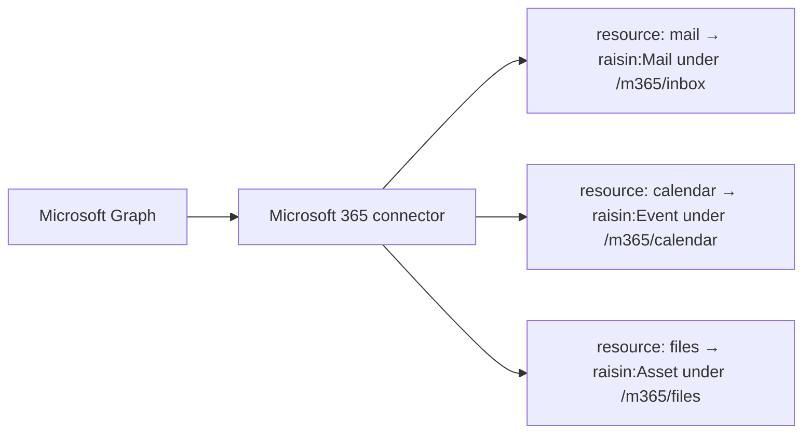

# Connect Microsoft 365 (mail, calendar, OneDrive)

:::caution Preview
The Microsoft 365 connector is a preview feature. Validate it against your own
account before relying on it in production.
:::

This guide connects a Microsoft 365 account over Microsoft Graph and creates
mounts from the one connector: an Outlook mail mount, a calendar mount that
produces `raisin:Event` nodes, and an optional OneDrive or SharePoint files
mount. The three differ only in `sync_config.resource` and the mapper. For the
concepts see [Virtual Nodes](../../concepts/virtual-nodes.md).



## Before you start

- A running RaisinDB instance and a repository you can install packages into.
- `RAISIN_MASTER_KEY` set on the server and backed up.
- `RAISINDB_BASE_URL` set to your public base URL.
- A Microsoft 365 account with mail and a calendar.

## Step 1: Install the connector

```bash
raisindb package install ms-graph-adapter --repo myapp
```

This deploys the adapter (`/adapters/ms-graph`), the mappers
`/mappers/ms-graph-mail`, `/mappers/ms-graph-calendar`, `/mappers/ms-graph-files`
and `/mappers/ms-graph-outbox`, a conflict resolver
`/resolvers/ms-graph-mail`, the node types `msgraph:ConnectorConfig` and
`msgraph:ConnectionConfig`, and the template `/connectors/ms-graph` with the
Microsoft identity endpoints and scopes preset.

## Step 2: Add the connector and register an Entra app

In the admin console open **Connectors**, click **Add connector**, choose the
**Microsoft 365** template and save. The editor shows the **OAuth Redirect
URI** with a copy button, and renders the template's setup instructions.

In the [Azure portal](https://portal.azure.com/) under **Microsoft Entra ID →
App registrations**:

1. **New registration.** Choose the supported account types. The template
   uses the `common` authority; for a single-tenant app paste the
   **Directory (tenant) ID** into the connector editor's *Microsoft directory
   (tenant) ID* box and click **Apply**, which rewrites the endpoints.
2. Under **Authentication** add a **Web** redirect URI and paste the value
   from the connector editor.
3. Under **API permissions** add delegated Microsoft Graph scopes. The
   template requests `offline_access`, `openid`, `email`, `profile`,
   `Mail.Read`, `Mail.ReadWrite`, `Mail.Send`, `Calendars.Read`,
   `Calendars.ReadWrite`, `Files.Read`, `Files.ReadWrite`, `Sites.Read.All`,
   `Sites.ReadWrite.All` and their `.Shared` and `.All` variants. Grant the
   ones you need; remove the rest from the connector's scope list before
   connecting so consent asks only for those. Reads need the `Read` scopes;
   the write path needs `Mail.ReadWrite`, `Mail.Send`, `Calendars.ReadWrite`
   or `Files.ReadWrite`.
4. Under **Certificates & secrets** create a client secret and copy its
   value.
5. Copy the **Application (client) ID**.

## Step 3: Connect the account

In the connector editor paste the client id and secret, enable the connector,
save, and click **Connect account**. The account appears with its address as
the subject and the scopes Microsoft granted. Microsoft does not widen an
existing grant: if you add a scope later, the connections list shows it under
*Missing permissions* and the **Reconnect** button re-runs consent and updates
the account in place, so mounts that reference it keep working.

Each connection can carry its own settings from `msgraph:ConnectionConfig`:
`tenant_id`, `resource`, `principal` (a shared mailbox or another user),
`drive_scope`, `site_id`, `drive_id` and `include_body`. A mount's
`sync_config` overrides them.

Run **Test connection**. To test the calendar or files surface rather than
the mailbox, the mount editor's inline test forwards the mount's `resource`.

## Step 4: Mount mail

Open **Mounts**, click **New Mount**, pick the connector and account, set
*Resource* to **Mail**, choose the mail folder with **Browse** (the adapter
implements `browse` for folders, calendars, sites and drives), and select
`/mappers/ms-graph-mail`. As a node:

```yaml
node_type: raisin:VirtualMount
properties:
  title: Outlook Inbox
  integration_ref: /integrations/ms-graph
  account_ref: "<connection id>"
  target_workspace: default
  target_branch: main
  mount_path: /m365/inbox
  remote_root: inbox                    # mail folder id; "inbox" is the default
  mapping_function: /mappers/ms-graph-mail
  sync_config:
    resource: mail
    mode: poll
    interval_seconds: 300
    ephemeral: true
    ttl_seconds: 86400
    include_body: false                 # true syncs body_html and body_text
    include_attachments: false          # true adds raisin:Asset children
  enabled: true
```

Messages become `raisin:Mail` nodes with `subject`, `from`, `from_address`,
`to`, `cc`, `bcc`, `reply_to`, `date`, `received_at`, `sent_at`, `snippet`,
`unread`, `is_read`, `importance`, `has_attachments`, `conversation_id`,
`message_id`, `folder`, `labels`, `web_url` and `provider: "ms-graph"`. Graph
has a delta feed, so after the first walk each run fetches only what changed.

For mail the adapter declares `can_update` with
`mutable_fields: ["unread", "is_read", "importance"]`, so a mount with

```yaml
write_config:
  mode: state_only
  mutable_fields: [unread, is_read, importance]
```

pushes read-state changes back to Outlook. Sending is a separate `submit`
mount with `/mappers/ms-graph-outbox`, whose `raisin:OutboundMail` commands
support `send`, `reply`, `reply_all` and `forward`.

## Step 5: Mount the calendar

Set *Resource* to **Calendar** and the mapper to `/mappers/ms-graph-calendar`:

```yaml
node_type: raisin:VirtualMount
properties:
  title: Work Calendar
  integration_ref: /integrations/ms-graph
  account_ref: "<connection id>"
  target_workspace: default
  target_branch: main
  mount_path: /m365/calendar
  remote_root: calendar                 # calendar id; "calendar" is the default
  mapping_function: /mappers/ms-graph-calendar
  sync_config:
    resource: calendar
    mode: poll
    interval_seconds: 300
    window:
      days_back: 7                      # default 7
      days_ahead: 30                    # default 30
  enabled: true
```

Events become `raisin:Event` nodes with `title`, `ical_uid`, `calendar_id`,
`start_utc`, `end_utc`, `start_local`, `end_local`, `timezone`, `all_day`,
`recurrence_type`, `recurrence`, `status`, `show_as`, `my_response`,
`organizer_email`, `organizer_name`, `attendees`, `location`,
`online_meeting_url` and `url`. `raisin:Event` is strict and carries the
`raisin:VirtualNode` mixin. The window moves with time, so the mount is a
rolling view rather than an archive. See
[Sync Google Calendar](sync-google-calendar.md#step-4-query-events-with-sql)
for a query over upcoming events; the shape is identical.

For the calendar the adapter declares `can_create`, `can_update`,
`can_delete`, `supports_trash` and a default delete policy of `trash`, and
the mapper implements `to_external`, so `write_config.mode: mirror` with a
`mutable_fields` list makes the node the event: edits, creates of
`raisin:Event` nodes named in `create_node_types`, and deletes propagate.
RSVPs go through a `submit` mount with `/mappers/ms-graph-outbox` and
`raisin:CalendarAction` commands whose `action` is `accept`, `decline` or
`tentative`.

## Step 6: Mount OneDrive or SharePoint files

Set *Resource* to **Files** and the mapper to `/mappers/ms-graph-files`. Files
become `raisin:Asset` nodes with `title`, `size`, `web_url`, `download_url`,
`created_at` and `modified_at`; folders become `raisin:Folder`.

```yaml
node_type: raisin:VirtualMount
properties:
  title: OneDrive
  integration_ref: /integrations/ms-graph
  account_ref: "<connection id>"
  target_workspace: default
  target_branch: main
  mount_path: /m365/files
  mapping_function: /mappers/ms-graph-files
  sync_config:
    resource: files
    drive_scope: me                     # me | user (with principal) | site (with site_id)
    mode: poll
    interval_seconds: 300
  enabled: true
```

Leave `remote_root` empty for the drive root or set it to a drive item id.
For a SharePoint library set `drive_scope: site` and `site_id`; the console's
**Browse** lists sites and libraries. The files adapter declares
`accepts_content`, so a `mirror` mount uploads file bytes on create and on a
changed file, and its default delete policy is `trash`.

## Real-time sync

All three surfaces support push. Set `sync_config.mode` to `hybrid` (or
`webhook`) and the engine registers a Graph subscription on the next run,
renews it before it expires, and removes it when the mount is disabled. This
needs `RAISINDB_BASE_URL`. See
[Real-time sync with webhooks](realtime-sync-webhooks.md).

## Running in production

- Each mount syncs under its own lease, so mail and calendar run
  independently.
- A rejected token pauses the mount with status `auth_required`; Graph 429 and
  503 responses are reported as `rate_limited` and honour `Retry-After`.
- A write refused for a missing scope is reported as `config_error` naming the
  scope, and the mount stands off before retrying the drain.
- Replicated clusters need the `redis` locks backend.

## Next steps

- [Sync Google Calendar](sync-google-calendar.md): the same event model for
  Google.
- [Connect Gmail](connect-gmail.md): the IMAP and XOAUTH2 inbox pattern.
- [Adapter reference](../../reference/virtual-node-adapters.md).
