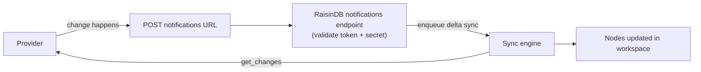

# Real-time sync with webhooks (Experimental)

:::caution Experimental / Preview
Push-based real-time sync is an **experimental / preview** feature. Validate it
against your own account before relying on it in production. Like all virtual-node
sync it is **read-only** — external items are brought *in* as nodes; nothing is
written back to the provider.
:::

By default a mount **polls**: the sync engine wakes on its interval and asks the
provider "what changed?". With **push**, the provider tells RaisinDB the moment
something changes, and the mount re-syncs within seconds — "on new email", "on
calendar change" — without a tight polling interval. This guide explains the model
and the per-provider setup. For the concepts, see
**[Virtual Nodes](../../concepts/virtual-nodes.md)**; for the adapter contract, see
the **[Adapter reference](../../reference/virtual-node-adapters.md)**.

## Push vs poll — one mental model

**A push notification is only an _invalidation signal_.** RaisinDB never reads the
provider's notification payload. A ping just means *"re-run this mount's normal delta
sync"* — the same `get_changes` delta that polling would have run, only triggered by
the provider instead of a timer. That single reframe is why push is fully generic:
Microsoft Graph subscriptions, Google Calendar channels, and Gmail Pub/Sub all
collapse to the same handful of steps, and nothing provider-specific lives in the
RaisinDB engine.



:::tip It is generic — any connector can do it
The shipped Gmail / Microsoft 365 / Google Calendar connectors are just examples. A
**custom connector** gets push by implementing three optional adapter operations —
`subscribe`, `renew`, `unsubscribe` — and reporting `supports_push: true`. See the
**[Adapter reference §2.9](../../reference/virtual-node-adapters.md)** and
**[Build a custom adapter](build-a-custom-adapter.md)**.
:::

## Sync modes: `poll`, `webhook`, `hybrid`

A mount's `sync_config.mode` selects how it is driven:

| `mode` | Behavior |
|--------|----------|
| `poll` (default) | Interval polling only. No push. Works with every connector. |
| `webhook` | **Push only.** The mount is not polled; it registers a provider subscription and re-syncs on each ping. If the provider goes quiet, so does the mount. |
| `hybrid` | **Push _and_ a slow poll.** Near-instant on pings, with the interval poll as a safety net for any missed notification. Recommended for anything you care about. |

The setup below applies to `webhook` and `hybrid` mounts on a **push-capable**
connector.

## Prerequisites

- **`RAISINDB_BASE_URL` must be set on the server** to your public HTTPS base URL
  (e.g. `https://raisin.example.com`). The engine builds each mount's notification
  URL from it and hands that URL to the provider. **Without it, push cannot be wired**
  and the mount is marked `push_status: "failed"`.
- The provider must be able to reach that URL over the public internet.
- A push-capable connector already connected (see the per-provider guides).

:::tip Where to find the URLs
You never hand-assemble these. The per-mount **Notification URL** is shown
read-only (with a copy button) on the **mount** in the admin console once the
mount exists — this is the value you paste into a Gmail Pub/Sub push subscription
below; for Graph and Google Calendar the engine registers it for you. The OAuth
**Redirect URI** lives on the **connector page** (see the per-provider guides). If
you are **authoring your own connector**, put the provider-side steps into the
connector's `setup_instructions` (Markdown) and an optional `docs_url` — the admin
console renders them alongside these URLs.
:::

## How the lifecycle works (what the engine does for you)

You author a `webhook`/`hybrid` mount; the engine handles the rest:

1. **Subscribe.** On first run the engine mints a stable, unguessable per-mount
   notification URL (`{RAISINDB_BASE_URL}/api/integrations/{repo}/notifications/{token}`)
   and asks the connector to register a provider subscription pointing at it.
2. **Receive.** The provider POSTs that URL on every change. RaisinDB verifies the
   token and a per-subscription secret, then enqueues a normal delta sync and
   acknowledges immediately — it never blocks on the sync.
3. **Renew.** Provider subscriptions are short-lived (Graph ~3 days, Google ~7 days).
   A background job renews them with a day of headroom, so push keeps working.
4. **Tear down.** Disabling the mount unsubscribes on a best-effort basis.

The notification URL is **public** (providers cannot send a bearer token), so it is
guarded by the unguessable token plus the per-subscription secret. No secret or token
material is ever logged.

## Per-provider setup

### Microsoft 365 (Graph) — automatic

Nothing extra. Set `sync_config.mode: hybrid` (or `webhook`) on any Graph mount —
mail, calendar, or OneDrive files. On the next run the connector creates a Graph
subscription for the mount's resource and Graph validates the URL automatically. See
**[Connect Microsoft 365](connect-microsoft-365.md)**.

```yaml
sync_config:
  resource: mail          # or calendar / files
  mode: hybrid            # push + safety-net poll
  interval_seconds: 300
```

### Google Calendar — automatic

Nothing extra. Set `mode: hybrid` (or `webhook`) on a Google Calendar mount — the
connector opens an `events.watch` channel pointed at the mount's notification URL and
renews it before it expires. See **[Sync Google Calendar](sync-google-calendar.md)**.

```yaml
sync_config:
  mode: hybrid
  interval_seconds: 300
  window:
    days_back: 7
    days_ahead: 30
```

### Gmail — operator sets up Pub/Sub, then it's automatic

Gmail push does **not** POST your server directly. It publishes to a Google Cloud
**Pub/Sub** topic, and a Pub/Sub **push subscription** forwards each message to the
mount's notification URL. The connector can only arm the mailbox (`users.watch`
against your topic); it cannot create the topic or the subscription — that is an
operator step in Google Cloud.

**One-time Google Cloud setup:**

1. **Enable the Cloud Pub/Sub API** in the same Google Cloud project as your Gmail
   OAuth client.
2. **Create a topic**, e.g. `projects/<your-project>/topics/gmail-push`.
3. **Grant Gmail permission to publish** to it: add the member
   `gmail-api-push@system.gserviceaccount.com` with the **Pub/Sub Publisher** role on
   the topic. (Gmail's `users.watch` fails without this.)
4. **Create a push subscription** on that topic whose **delivery type is _Push_** and
   whose **endpoint URL** is your mount's notification URL:
   `https://<your-host>/api/integrations/<repo>/notifications/<mount_token>`.
   (Enable the mount once first so the engine generates the token; read it from the
   mount's `state.push_notification_url`.)
5. **Add a shared secret** so RaisinDB can verify the pings: append a `token=<secret>`
   query parameter to the push endpoint URL in Pub/Sub, and set the **same** value as
   `sync_config.pubsub_verify_token` on the mount.

**On the mount**, name the topic and (optionally) the verify token, and choose a push
mode:

```yaml
node_type: raisin:VirtualMount
properties:
  # ... integration_ref, account_ref, mount_path, remote_root: INBOX ...
  sync_config:
    mode: hybrid
    interval_seconds: 300
    ephemeral: true
    ttl_seconds: 86400
    pubsub_topic: projects/<your-project>/topics/gmail-push
    pubsub_verify_token: <the same secret you put on the push subscription>
  enabled: true
```

With the topic present the Gmail connector arms `users.watch` on `subscribe` and calls
`users.stop` on teardown. The Pub/Sub message body (its `historyId`) is **ignored** —
the ping only triggers the mount's normal IMAP delta. See
**[Connect Gmail](connect-gmail.md)**.

:::note Signed (OIDC) Pub/Sub push
If you configure the Pub/Sub push subscription with **OIDC authentication** instead of
a shared-secret query token, the callback carries a signed JWT. A custom adapter or the
notifications glue can verify it with `raisin.crypto.verifyJwt(token, { jwks_url, issuer, audience })`
— the generic signed-push primitive. The shipped Gmail path uses the simpler shared-secret
token above.
:::

## Verifying push is live

- Check the mount's `state.push_status` — `"active"` means a subscription is
  registered. `"failed"` (with `state.push_last_error`) usually means
  `RAISINDB_BASE_URL` is unset or the provider rejected the URL; `"unsupported"` means
  the connector can't push and the mount is `webhook` mode (switch it to `poll` or
  `hybrid`).
- Make a change on the provider side (send yourself an email, add a calendar event)
  and watch the node appear within seconds rather than on the poll interval.

## Non-goals (honest limits)

- **Push is an invalidation signal, not a data feed.** RaisinDB re-runs delta sync; it
  never trusts the notification payload. A provider that only pushes (no delta/list
  API) cannot drive real-time sync this way.
- **Still read-only.** Push does not add write-back; the sync engine brings items *in*
  only.
- **`RAISINDB_BASE_URL` is mandatory** for push. Behind NAT or without a public URL,
  stay on `poll` mode.
- **Multi-node clusters need the Redis locks backend**, exactly as for polling sync.
- **Gmail requires the operator Pub/Sub setup above** — there is no way for the
  connector to bootstrap the topic for you.

## Next steps

- **[Connect Microsoft 365](connect-microsoft-365.md)** — mail, calendar, and OneDrive.
- **[Sync Google Calendar](sync-google-calendar.md)** — event push.
- **[Connect Gmail](connect-gmail.md)** — the inbox pattern the Pub/Sub topic feeds.
- **[Build a custom adapter](build-a-custom-adapter.md)** — add push to your own
  connector with `subscribe` / `renew` / `unsubscribe`.
