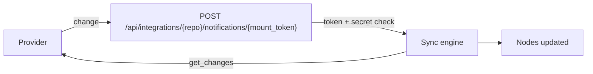

# Real-time sync with webhooks

:::caution Preview
Push-based sync is a preview feature. Validate it against your own account
before relying on it in production.
:::

By default a mount polls: the engine wakes on the mount's interval and asks
the provider what changed. With push, the provider tells RaisinDB the moment
something changes and the mount re-syncs within seconds. This guide explains
the model and the per-provider setup. For the concepts see
[Virtual Nodes](../../concepts/virtual-nodes.md).

## A push is a signal, not a data feed

A notification only tells the engine to run the mount's normal delta sync
now. The engine does not read the provider's payload; it enqueues the same
`get_changes` run polling would have run. That is why one mechanism covers
Microsoft Graph subscriptions, Google Calendar channels and Gmail Pub/Sub,
and why a provider that pushes but has no changes feed cannot be driven this
way.



## Sync modes

| `sync_config.mode` | Behavior |
|--------------------|----------|
| `poll` (default) | Interval polling only. |
| `webhook` | Push only. The mount subscribes and is never polled. If the provider goes quiet, so does the mount. |
| `hybrid` | Push plus the interval poll as a safety net. Recommended. |

The `sync-config` endpoint and the console refuse `webhook` on a connector
whose cached capabilities do not declare `supports_push`.

## Prerequisites

- A public HTTPS base URL for the server. The engine takes it from the
  connector's stored OAuth `redirect_uri`, or from `RAISINDB_BASE_URL`. With
  neither, a push mount records `push_status: "failed"` and
  `push_last_error` names the missing setting.
- A connector whose adapter declares `supports_push`.

## What the engine does

1. **Subscribe.** On the first run of a `webhook` or `hybrid` mount the
   engine mints a per-mount token, builds
   `{base}/api/integrations/{repo}/notifications/{mount_token}`, and calls the
   adapter's `subscribe` with that URL. The adapter returns the provider's
   `subscription_id`, an optional `secret` and `expires_at`.
2. **Receive.** The provider calls that URL. The endpoint answers validation
   handshakes (`validationToken` or `challenge` in the query or body, and a
   bare GET), checks the stored secret against every query parameter, header
   and body string in constant time, records the delivery, and enqueues a
   delta sync. It returns `{"status":"queued"}` or `already_running`. The
   token is the mount's `push_mount_token`, so the URL from `setup-urls` is
   valid as soon as it is shown. A token that matches no mount gets
   `410 Gone`, which tells the provider to retire the subscription.
3. **Renew.** A renewal job runs every 30 minutes and calls `renew` for any
   subscription expiring within a day.
4. **Tear down.** Disabling the mount calls `unsubscribe`. Delete a mount
   through `DELETE /api/integrations/{repo}/mounts/{mount_id}` (the console's
   delete button) so the subscription is removed first; a generic node delete
   leaves it registered.

The mount's `state` records `push_status` (`active`, `failed` or
`unsupported`), `push_subscription_id`, `push_expires_at`,
`push_notification_url`, `push_last_error`, and delivery counters
(`push_deliveries_ok`, `push_deliveries_rejected`, `push_last_delivery_at`,
`push_last_rejected_reason`). The console's mount page shows them under
*Webhook health*, together with the notification URL and a copy button.

## Per-provider setup

### Microsoft 365

Nothing extra. Set `mode: hybrid` on a mail, calendar or files mount. The
adapter creates a Graph subscription with a two-day expiry and a
`clientState` secret; Graph validates the URL itself.

```yaml
sync_config:
  resource: mail
  mode: hybrid
  interval_seconds: 300
```

### Google Calendar

Nothing extra. Set `mode: hybrid` and the adapter opens an `events.watch`
channel (seven-day lifetime) on the mount's calendar.

### Gmail

Gmail publishes to a Google Cloud Pub/Sub topic, and a Pub/Sub push
subscription forwards each message to the mount's notification URL. The
connector arms the mailbox with `users.watch`; the topic and the push
subscription are yours to create.

One-time setup in the Google Cloud project that holds your OAuth client:

1. Enable the **Cloud Pub/Sub API**.
2. Create a topic, for example `projects/<project>/topics/gmail-push`.
3. Grant `gmail-api-push@system.gserviceaccount.com` the **Pub/Sub
   Publisher** role on it.
4. Set `pubsub_topic` and a `pubsub_verify_token` of your choosing on the
   mount's `sync_config` and set `mode: hybrid`. Without a topic the connector
   reports `supports_push: false` and the mount stays poll-only.
5. Read the mount's **Notification URL** from the mount page (or
   `GET /api/integrations/{repo}/mounts/{mount_id}/setup-urls`) and create a
   **push subscription** on the topic with that URL as the endpoint. Add the
   verify token to the endpoint URL as a query parameter, for example
   `?token=<verify token>`; the endpoint matches the stored secret against any
   query parameter.

```yaml
sync_config:
  mode: hybrid
  interval_seconds: 300
  ephemeral: true
  ttl_seconds: 86400
  reconcile_deletes: false
  pubsub_topic: projects/<project>/topics/gmail-push
  pubsub_verify_token: <the same value as in the push endpoint URL>
```

On subscribe the adapter calls `users.watch` with the topic and the `INBOX`
label and returns the verify token as the subscription secret; on teardown it
calls `users.stop`. The Pub/Sub message body is ignored.

If you configure the push subscription with OIDC authentication instead, a
function can verify the signed token with
`raisin.crypto.verifyJwt(token, { jwks_url, issuer, audience })`; the shipped
path uses the shared token.

## Custom connectors

Any adapter gets push by implementing three operations and declaring
`supports_push: true`:

| Operation | Params | Returns |
|-----------|--------|---------|
| `subscribe` | `{ notification_url }` | `{ subscription_id, secret?, expires_at?, resource? }` |
| `renew` | `{ subscription_id, notification_url }` | `{ subscription_id, expires_at? }` |
| `unsubscribe` | `{ subscription_id }` | ignored |

`expires_at` is ISO 8601; a subscription without one is never renewed.

## Refreshing from your own webhook

For a provider whose webhook you receive yourself, call
`raisin.integrations.syncNow(mountId)` from the handler. The built-in
`raisin-integrations` package ships `/lib/raisin/integrations/webhook-refresh`,
a function that reads `mount_id` (and an optional `mode`) from the request's
query, body or route parameters and enqueues the sync; expose it through an
`http` trigger to get a webhook URL.

## Verifying push is live

- `push_status: "active"` means the subscription is registered. `"failed"`
  with `push_last_error` usually means no public base URL or a URL the
  provider could not reach. `"unsupported"` means the connector cannot push
  and the mount is in `webhook` mode; switch it to `poll` or `hybrid`.
- `push_deliveries_ok` should increase after a change on the provider side.
  A rejected delivery records `push_last_rejected_reason`, typically a secret
  mismatch.

## Limits

- Push re-runs the delta sync; it never applies the notification payload.
- A public URL is mandatory. Behind NAT, stay on `poll`.
- Replicated clusters need the `redis` locks backend, as for polling.

## Next steps

- [Connect Microsoft 365](connect-microsoft-365.md)
- [Sync Google Calendar](sync-google-calendar.md)
- [Connect Gmail](connect-gmail.md)
- [Build a connector](build-a-custom-adapter.md)
