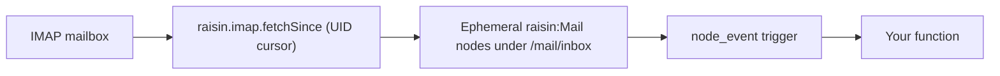

# Sync a mailbox

This guide mounts an IMAP inbox into a workspace as a stream of short-lived
`raisin:Mail` nodes and runs a function on each new message. Once a message
has been handled its node expires, so the mounted inbox stays a rolling
working set rather than an archive. For the concepts see
[Virtual Nodes](../../concepts/virtual-nodes.md).



## How the adapter talks to IMAP

IMAP is a persistent TLS connection, not HTTP, so the adapter uses the native
`raisin.imap` binding: `listMailboxes(conn)` enumerates folders,
`fetchSince(conn, sinceUid, { mailbox, limit })` returns messages with a UID
above the cursor, and `fetchMessage(conn, uid, { mailbox })` fetches one
message with its body. The binding owns the protocol in Rust; the adapter
maps its results onto the adapter contract. A message's IMAP UID is the item's
identity and the highest UID seen is the sync cursor, together with the
mailbox's `UIDVALIDITY`, so a reset mailbox forces a full resync.

Two consequences shape the mount layout:

- `list` enumerates mailboxes, not messages. Messages arrive through the delta
  feed, and the shipped mount configuration sets `reconcile_deletes: false`
  so a full walk does not prune them.
- The delta feed only reports new messages. A message deleted on the server
  stays in the workspace until the mount's TTL expires it, which is why the
  inbox mount is ephemeral.

## Step 1: Install the adapter

```bash
raisindb package install imap-adapter --repo myapp
```

This deploys the adapter (`/adapters/imap`), the inbox mapper
(`/mappers/imap-default`), the outbox mapper (`/mappers/imap-outbox`), the
`imap:ConnectionConfig` node type, and two connector templates in
`raisin:system`: `/connectors/imap` for any IMAP server with an app password,
and `/connectors/gmail` for Gmail over OAuth (see
[Connect Gmail](connect-gmail.md)).

The adapter's capabilities are `can_read: true`, `supports_changes: true`,
and `default_ttl: 86400`. It declares no update or delete operation; the
inbox is read-only. `can_submit` becomes `true` when the outbox can resolve a
sender (below).

## Step 2: Add the connector and a connection

In the admin console open **Connectors**, click **Add connector**, and choose
the **IMAP Mailbox** template. The connector needs no OAuth client for the
app-password path. Enable it and save.

Then click **Add connection**. The form comes from `imap:ConnectionConfig`:

| Field | Default | Notes |
|-------|---------|-------|
| `host` | `imap.gmail.com` | Your provider's IMAP host. |
| `port` | `993` | |
| `tls` | `true` | Implicit TLS. `false` is only for trusted or loopback hosts. |
| `mailbox` | `INBOX` | Default mailbox for mounts on this connection. |
| `username` | | The full mailbox address. Passed to the adapter in the credential. |
| `password` | | An app-specific password. Stored encrypted with `RAISIN_MASTER_KEY`, decrypted only for the adapter call, never shown again. |

Over HTTP the same connection is one request:

```bash
curl -s -X POST localhost:8090/api/integrations/myapp/connections \
  -H "Authorization: Bearer $TOKEN" -H 'content-type: application/json' \
  -d '{"integration_path":"/integrations/imap","label":"support",
       "config":{"host":"imap.fastmail.com","port":993,"tls":true,"username":"support@example.com"},
       "secrets":{"password":"<app password>"}}'
```

```json
{"id":"C84dv6-Ceo70bUJKCjlb6","label":"support","auth_kind":"config",
 "config":{"host":"imap.fastmail.com","port":993,"tls":true,"username":"support@example.com"},
 "secret_fields":["password"],"created_at":"2026-09-06T18:42:16Z"}
```

One connector can hold several connections, one per mailbox. A mount then
names the connection it uses in `account_ref`.

The binding checks the host against the adapter function's `network_policy`
before opening a socket, using a synthetic `imaps://<host>:<port>` URL. The
shipped adapter allows `imap.gmail.com`, `imap.fastmail.com`,
`outlook.office365.com` and `imap.mail.me.com` on port 993. For another
server, add it to `allowed_urls` on `/adapters/imap`:

```yaml
network_policy:
  http_enabled: true
  allowed_urls:
    - imaps://mail.example.com:993
```

Run **Test connection** with the connection selected. It logs in and lists
the mailboxes.

## Step 3: Mount the inbox

The connector template carries a **mount bundle**, so the Mounts page offers
**Add bundle** next to **New Mount**. The bundle asks for the connection,
the target workspace and a root folder, then creates two mounts:

| Mount | Path | Mapper | Mode |
|-------|------|--------|------|
| Inbox | `<root>/inbox` | `/mappers/imap-default` | read-only, ephemeral, 24 hour TTL |
| Outbox | `<root>/outbox` | `/mappers/imap-outbox` | `submit` |

The bundle also asks which mailbox to sync and whether to sync only that
folder (`folder_scope: folder`) or every folder beneath it (`tree`). The
target workspace must allow `raisin:Mail`, `raisin:Folder` and
`raisin:Asset`, and `raisin:OutboundMail` for the outbox; the repository's
`default` workspace does.

The inbox mount as a node, if you prefer to create it yourself:

```yaml
node_type: raisin:VirtualMount
properties:
  title: Support Inbox
  integration_ref: /integrations/imap
  account_ref: "<connection id>"
  target_workspace: default
  target_branch: main
  mount_path: /mail/inbox
  remote_root: INBOX
  mapping_function: /mappers/imap-default
  sync_config:
    mode: poll
    interval_seconds: 300
    ephemeral: true
    ttl_seconds: 86400
    reconcile_deletes: false
  enabled: true
```

Each message becomes a `raisin:Mail` node named after its subject, with
`subject`, `from`, `from_address`, `to`, `cc`, `bcc`, `reply_to`, `date`,
`received_at`, `snippet`, `message_id`, `in_reply_to`, `references`,
`thread_id`, `unread`, `flags`, `has_attachments`, `size` and `folder`,
plus the reserved `__mount_id` and `__external_id`. Attachments become
`raisin:Asset` children with their name, mime type and size; their bytes are
fetched on demand through
`POST /api/integrations/content/{repo}/{branch}/{ws}/by-id/{node_id}` when
someone opens them. Mailboxes come through as `raisin:Folder`.

## Step 4: Run a function per message

A `node_event` trigger scoped to the inbox path runs your function for each
new message:

```yaml
node_type: raisin:Trigger
properties:
  title: Triage incoming mail
  enabled: true
  trigger_type: node_event
  config:
    event_kinds: [created]
  filters:
    workspaces: [default]
    paths: ["**/mail/inbox/**"]
    node_types: [raisin:Mail]
  function_path: /lib/triage-mail
```

```javascript
function handler(input) {
  const { event, workspace } = input.flow_input;
  const msg = raisin.nodes.get(workspace, event.node_path);
  const p = msg.properties;
  if (p.unread !== true) return { skipped: true };

  // hand the message to a workflow, an agent, or your own code
  return raisin.flows.run("/flows/support-triage", {
    subject: p.subject,
    from: p.from_address,
    snippet: p.snippet,
    message_id: p.message_id,
    node_path: msg.path,
  });
}
```

New mail arrives on the poll interval, becomes a node, fires the trigger, and
is expired by the mount's TTL a day later.

## Sending from the outbox

IMAP has no way to send. The outbox mount sends through the tenant's
configured email provider instead: create a `raisin:OutboundMail` node under
`/mail/outbox` with `action: send` (or `reply`, `reply_all`, `forward` with
`in_reply_to_external_id` set to the inbox message's `__external_id`), `to`,
`subject` and `body_text` or `body_html`, then set its `status` to `queued`.
The next drain sends it once and marks it `sent`, `failed`, or `unknown` if
the outcome could not be determined.

For that to work the adapter function `/adapters/imap` needs
`email_policy.enabled: true` with an `allowed_recipients` list (it ships with
`enabled: false`), the tenant needs an enabled sender on its
`raisin:EmailConfig` node at `/config/email`, and the mount names the sender in
`sync_config.email_provider` when more than one is configured. Until those
resolve, the connector's capabilities report `can_submit: false` with the
reason in `submit_unavailable_reason`.

## Refreshing on a webhook

Any function can enqueue a run:

```javascript
raisin.integrations.syncNow(mountId);
// { job_id: "...", status: "queued" } or { job_id: null, status: "already_running" }
```

Gmail can also push through Cloud Pub/Sub; see
[Real-time sync with webhooks](realtime-sync-webhooks.md).

## Running in production

- Expired nodes are removed by the engine; nothing else needs to delete them.
- A rejected login makes the adapter throw `auth_expired`, which pauses the
  mount with status `auth_required` until the connection is fixed.
- Every binding call opens its own connection, so `folder_scope: tree` costs
  one login per mailbox per poll.
- Replicated clusters need the `redis` locks backend.
- `RAISIN_MASTER_KEY` must be set and backed up.

## Next steps

- [Connect Gmail](connect-gmail.md): the same adapter over OAuth.
- [Build a connector](build-a-custom-adapter.md): the adapter contract.
- [Adapter reference](../../reference/virtual-node-adapters.md).
