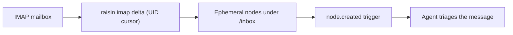

# Sync a mailbox

This guide mounts an email inbox into a workspace as a stream of short-lived
nodes, then fires an agent on each new message — the flagship **"agents work the
inbox"** pattern. For the concepts, see
**[Virtual Nodes](../../concepts/virtual-nodes.md)**.

## What you'll build



New mail materializes as a `raisin:Node` under a mount path. A trigger dispatches
an agent per message; once handled, the node expires on its TTL — so the inbox
stays a **rolling working set**, not an ever-growing archive.

## How the adapter talks to IMAP

This adapter speaks **real IMAP (RFC 3501)** — the protocol your mail server
already runs on port `993`. It does *not* need a JMAP proxy or any HTTP gateway.

IMAP needs a persistent, line-oriented TLS/TCP connection, which the function
sandbox's `raisin.http` binding cannot express. RaisinDB closes that gap with a
**native IMAP binding**, `raisin.imap.*`: the protocol lives in Rust and the
adapter calls high-level operations against it. See
[how a connector reaches a service](../../concepts/virtual-nodes.md#how-a-connector-reaches-a-service)
for why a wire protocol like this is a database feature rather than something you
hand-roll in a function.

The binding maps cleanly onto the adapter contract: `raisin.imap.fetchSince`
returns messages after a UID cursor (the delta feed), the mailbox's `highestUid`
is the sync cursor, and each message's stable IMAP **UID** is the `external_id`.
`UIDVALIDITY` is returned alongside so the adapter can detect a mailbox reset and
force a full resync.

## Step 1 — Install the adapter

```bash
raisindb package install imap-adapter --repo myapp
```

This deploys the IMAP adapter (`/adapters/imap`), a default mapper
(`/mappers/imap-default`), and a **disabled** connector template
(`/integrations/imap`) carrying no credentials. The adapter is read-only:
`can_read: true`, `supports_changes: true` (UID-based delta), everything else
`false`; its `default_ttl` is `86400` (one day).

## Step 2 — Connect an account

In the admin console → **Connectors** → **IMAP Mailbox**, fill in the server
coordinates and credentials:

- **Host / port / TLS.** Your provider's IMAP hostname and port — for example
  `imap.gmail.com:993` or `imap.fastmail.com:993` — with TLS on (implicit TLS on
  993 is the default and recommended).
- **Username.** The full mailbox address.
- **App password.** In your provider's security settings create an
  **app-specific password** for mail access and paste it. Most providers require
  an app password rather than your account password when 2FA is on. The password
  is stored AES-256-GCM encrypted and decrypted only in Rust, immediately before
  the connection — it never appears in logs or in the function sandbox.

You must **allowlist the server** in the adapter function's
`network_policy.allowed_urls` — the native binding enforces the same egress
policy as `raisin.http`, so a host that matches no pattern is refused **before
any socket is opened**. Add an `imaps://` entry for your server, e.g.:

```yaml
network_policy:
  allowed_urls:
    - imaps://imap.gmail.com:993
```

Then **enable** the connector.

:::note Authentication
The binding supports two mechanisms. **App password** (the default) uses plain
`LOGIN` — set the account's `password`. **XOAUTH2** uses OAuth2 bearer tokens for
providers that require them (e.g. Gmail, Outlook) — set `auth: "xoauth2"` on the
connection and pass the OAuth access token as the `password`; the adapter also
selects XOAUTH2 automatically when the credential carries an `access_token` and no
static password. Connections use implicit TLS on port 993 by default; `tls: false`
allows a plaintext connection for trusted or loopback hosts only.
:::

:::tip Test connection
Use **Test connection** before mounting — it runs `capabilities` and a small
`list` probe against your mailbox and confirms the host, credentials, and
allowlist in one click. See
**[Build a connector → Test the connection](build-a-custom-adapter.md#test-the-connection-before-you-mount)**.
:::

## Step 3 — Mount the inbox (the ephemeral pattern)

The `ephemeral` + `ttl_seconds` settings are what make the mount a rolling queue:

```yaml
node_type: raisin:VirtualMount
properties:
  title: Support Inbox
  integration_ref: /integrations/imap
  account_ref: "<connected_accounts[].id>"
  target_workspace: default
  target_branch: main            # branch the message nodes are written to
  mount_path: /inbox
  remote_root: inbox             # mailbox role, id, or name (defaults to inbox)
  sync_config:
    mode: poll
    interval_seconds: 60
    max_items_per_sync: 200
    ephemeral: true              # auto-delete synced nodes past their TTL
    ttl_seconds: 86400           # 1 day — matches the adapter default
  enabled: true
```

`remote_root` selects the mailbox to sync (defaults to `inbox`). The connection
coordinates — host, port, TLS, username, app password — come from the connected
account, not the mount.

Each message becomes a `raisin:Node` carrying `title` (subject), `from`, `to`,
`date`, `snippet`, `message_id`, and an `unread` flag, plus the reserved
`__virtual` / `__mount_id` / `__external_id` metadata. Mailboxes come through as
`raisin:Folder`.

## Step 4 — Fire an agent per message

Because synced messages are ordinary nodes, a standard `node_event` trigger reacts
to each new one. Scope it to `node.created` under the mount path:

```javascript
// Trigger: on node.created under /inbox where node_type == raisin:Node
function handler(input) {
  const msg = input.event.node;
  const p = msg.properties;
  if (p.unread !== true) return;          // skip already-handled mail

  // One dispatch per message — never fan out per-item work in the sync loop.
  raisin.agents.dispatch("support-triage", {
    subject: p.title,
    from: p.from,
    snippet: p.snippet,
    message_id: p.message_id,
    node_path: msg.path,
  });
}
```

The flow is: **new mail → IMAP UID delta → materialized node → `node.created` →
agent**. When the agent finishes and the TTL lapses, the ephemeral node is
reaped, keeping `/inbox` a live queue rather than an archive.

Use your deployment's actual agent-dispatch and trigger-registration APIs; the
load-bearing guarantee is that each new message arrives as a `raisin:Node` under
`mount_path` with the properties above.

## Refreshing on a webhook

Polling every 60 seconds is fine for most inboxes, but if your provider can push
a notification, refresh on demand instead of waiting for the interval:

```javascript
raisin.integrations.sync_now(mountId);
// → { job_id: "…" | null, status: "queued" | "already_running" }
```

`already_running` means a sync is already in flight and the call was a safe
no-op — so it is safe to call on every webhook. Set the mount's
`sync_config.mode` to `webhook` to take it off the periodic driver entirely and
drive it only from `sync_now`.

## Running in production

- **Ephemeral cleanup is automatic** — nodes past `ttl_seconds` are reaped; you
  do not delete them yourself.
- **Auth expiry pauses the mount.** On `401`/`403` the adapter throws
  `auth_expired`; the engine refreshes (OAuth) or sets the mount `auth_required`
  until you reconnect. On `429` it throws `rate_limited` and backs off.
- **Multi-node clusters need the Redis locks backend**, or two nodes can sync the
  same mailbox at once.
- **`RAISIN_MASTER_KEY` must be set and backed up** — the account token is stored
  encrypted with it.

## Next steps

- **[Build a connector](build-a-custom-adapter.md)** — the full adapter contract.
- **[Sync a Google Drive folder](sync-google-drive.md)** — the persistent
  (non-ephemeral) counterpart.
- **[Adapter reference](../../reference/virtual-node-adapters.md)** — full field
  tables.
