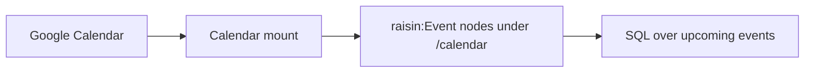

# Sync Google Calendar

:::caution Preview
The Google Calendar connector is a preview feature. Validate it against your
own account before relying on it in production.
:::

This guide connects a Google account and mounts a calendar so its events
appear as `raisin:Event` nodes, kept current within a moving time window, and
then queries them with SQL. For the concepts see
[Virtual Nodes](../../concepts/virtual-nodes.md).



## Before you start

- A running RaisinDB instance and a repository you can install packages into.
- `RAISIN_MASTER_KEY` set on the server and backed up.
- `RAISINDB_BASE_URL` set to your public base URL.
- A Google account with the calendar you want to mount.

## Step 1: Install the connector

```bash
raisindb package install google-calendar-adapter --repo myapp
```

This deploys the adapter (`/adapters/google-calendar`), the event mapper
(`/mappers/google-calendar-default`), the RSVP mapper
(`/mappers/google-calendar-outbox`), and the template
`/connectors/google-calendar`.

## Step 2: Add the connector and connect an account

In the admin console open **Connectors**, click **Add connector**, choose the
**Google Calendar** template and save. Copy the **OAuth Redirect URI** from
the editor.

In the [Google Cloud Console](https://console.cloud.google.com/):

1. Select a project and enable the **Google Calendar API**.
2. Configure the OAuth consent screen.
3. Create an **OAuth 2.0 Client ID** of type *Web application* and paste the
   redirect URI under *Authorized redirect URIs*.
4. Copy the **Client ID** and **Client secret**.

The template requests two scopes: `calendar.readonly`, which is enough for a
read-only mount, and `calendar.events`, which a `mirror` mount and RSVPs need.
Decide before connecting: Google issues a widened scope only on a fresh
consent, so an account connected without `calendar.events` has to be
reconnected to gain it. The console shows the shortfall as *Missing
permissions* with a **Reconnect** button.

Paste the client id and secret into the connector editor, enable it, save,
and click **Connect account**. Then run **Test connection**.

## Step 3: Mount a calendar

Open **Mounts** and click **New Mount**. The adapter implements `browse`, so
**Browse** next to *Remote root* lists your calendars; `primary` is the
default. As a node:

```yaml
node_type: raisin:VirtualMount
properties:
  title: My Calendar
  integration_ref: /integrations/google-calendar
  account_ref: "<connection id>"
  target_workspace: default
  target_branch: main
  mount_path: /calendar
  remote_root: primary
  mapping_function: /mappers/google-calendar-default
  sync_config:
    mode: poll
    interval_seconds: 300
    window:
      days_back: 7                      # default 7
      days_ahead: 90                    # default 90
  enabled: true
```

The first run lists the window; later runs use Google's `syncToken` delta.
Each event becomes a `raisin:Event` node with `title`, `ical_uid`,
`calendar_id`, `start_utc`, `end_utc`, `start_local`, `end_local`,
`timezone`, `all_day`, `recurrence_type`, `recurrence`,
`series_master_external_id`, `status`, `show_as`, `my_response`,
`organizer_email`, `organizer_name`, `attendees`, `location`,
`location_geo`, `online_meeting_url` and `url`, plus the reserved
`__mount_id` and `__external_id`. The target workspace must allow
`raisin:Event`; the repository's `default` workspace does.

## Step 4: Query events with SQL

`start_utc` and `end_utc` are ISO 8601 strings, and `now()` returns one, so
"upcoming events" is a string comparison:

```sql
SELECT properties->>'title'::String     AS title,
       properties->>'start_utc'::String AS starts_at,
       properties->>'location'::String  AS location
FROM 'default'
WHERE node_type = 'raisin:Event'
  AND properties->>'start_utc'::String > now()
ORDER BY properties->>'start_utc'::String
LIMIT 20;
```

Add `AND properties->>'__mount_id'::String = '<mount node id>'` to scope the
query to one calendar mount.

## Writing events back

The adapter declares `can_create`, `can_update` and `can_delete` with
thirteen mutable fields (`title`, `description_html`, `description_text`,
`start_local`, `start_utc`, `end_local`, `end_utc`, `timezone`, `all_day`,
`location`, `attendees`, `show_as`, `recurrence`), and the default mapper
implements `to_external`. A mount with

```yaml
write_config:
  mode: mirror
  mutable_fields: [title, start_utc, end_utc, location]
  create_node_types: [raisin:Event]
```

pushes edits, creates events for `raisin:Event` nodes you add under the mount
path, and handles deletes according to `delete_policy`. Two provider facts
matter here:

- Google has no trash for events. The adapter declares `supports_trash: false`
  and a default delete policy of `detach`, so a local delete leaves the event
  on Google unless the mount sets `delete_policy: purge`.
- Google emails every attendee when an event with attendees changes. The
  adapter sends `sendUpdates=none` unless the mount sets
  `sync_config.send_updates` to `externalOnly` or `all`.

RSVPs are commands rather than edits: a second mount with
`write_config.mode: submit` and `/mappers/google-calendar-outbox` holds
`raisin:CalendarAction` nodes whose `action` is `accept`, `decline` or
`tentative` and whose `target_external_id` is the event's `__external_id`.
Setting a command's `status` to `queued` sends it once.

## Real-time sync

Set `sync_config.mode` to `hybrid` and the engine opens an `events.watch`
channel on the calendar, renews it before its seven-day expiry, and stops it
when the mount is disabled. See
[Real-time sync with webhooks](realtime-sync-webhooks.md).

## Running in production

- A rejected token pauses the mount with status `auth_required`. A 429 backs
  off.
- The window is computed as now minus `days_back` to now plus `days_ahead`
  on every run, so events age out at the back and appear at the front.
- Replicated clusters need the `redis` locks backend.

## Next steps

- [Connect Microsoft 365](connect-microsoft-365.md): the same `raisin:Event`
  model for Outlook.
- [Adapter reference](../../reference/virtual-node-adapters.md).
