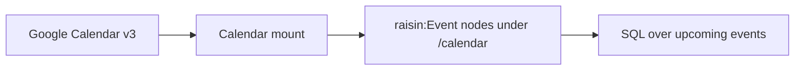

# Sync Google Calendar

:::caution Experimental / Preview
The Google Calendar connector is an **experimental / preview** feature. Validate
it against your own account before relying on it in production.

Events sync both ways: a mount can mirror them, so a create, edit or delete in
RaisinDB reaches Google. Two provider facts are worth knowing before you enable
it. **Google has no trash for events** — a delete is immediate and unrecoverable,
so it does not propagate unless you explicitly set the mount's `delete_policy` to
`purge`. And **Google mails every attendee** when an event with attendees
changes, so every write sends `sendUpdates=none` unless the mount opts in.
Writing also needs the `calendar.events` scope. Add it to the connector, then
press **Reconnect** on the account — the console flags the shortfall for you,
and reconnecting updates the account in place rather than creating a second one.
Google issues a widened scope on fresh consent only.
:::

This guide connects a Google account and mounts a calendar so its events appear
as `raisin:Event` nodes, kept current on an interval within a moving time window.
Then you query them with ordinary SQL. For the concepts, see
**[Virtual Nodes](../../concepts/virtual-nodes.md)**.

## What you'll build



## Before you start

- A running RaisinDB instance and a repository you can install packages into.
- **`RAISIN_MASTER_KEY` set and backed up on the server** — Google tokens are
  stored AES-256-GCM encrypted and decrypted by the engine before each call.
- A Google account with the calendar you want to mount.

## Step 1 — Install the connector

The Google Calendar connector ships as a built-in package:

```bash
raisindb package install google-calendar-adapter --repo myapp
```

This deploys the Calendar v3 adapter (`/adapters/google-calendar`), a default
mapper (`/mappers/google-calendar-default`), and a **disabled** connector template
(`/integrations/google-calendar`). No credentials are shipped.

## Step 2 — Create a Google OAuth client and connect

In the [Google Cloud Console](https://console.cloud.google.com/):

1. Create or select a project and **enable the Google Calendar API**.
2. Configure the OAuth consent screen and add the scope
   `https://www.googleapis.com/auth/calendar.readonly` (the least-privilege scope
   the connector requests).
3. Create an **OAuth 2.0 Client ID** of type *Web application*.
4. Add the redirect URI
   `https://<your-host>/api/integrations/<repo>/oauth/callback` (repo-scoped).
5. Copy the **Client ID** and **Client secret**.

:::tip Where to find the URLs
Don't hand-assemble the redirect URI. Open **Connectors → Google Calendar** in
the admin console — the **Redirect URI** is shown there read-only with a copy
button (`https://<your-host>/api/integrations/<repo>/oauth/callback`); paste that
exact value into step 4. If you later switch the mount to `webhook`/`hybrid`, the
per-mount **Notification URL** is shown on the **mount** (Google Calendar
auto-registers it — see [Real-time sync](realtime-sync-webhooks.md)). And if you
are **authoring your own connector**, put the provider-side steps into the
connector's `setup_instructions` (Markdown) and an optional `docs_url` — the admin
console renders them on the connector page.
:::

Then in the admin console, open **Connectors → Google Calendar**:

1. Paste the **Client ID** and **Client secret** (the secret is encrypted at rest
   into `client_secret_encrypted`, never stored in cleartext).
2. Set the **redirect URI** to match step 4, then **enable** the connector.
3. Click **Connect an account** and complete Google's OAuth flow. The account is
   stored with encrypted tokens; `access_type=offline` yields a refresh token so
   the engine keeps the mount synced without re-consent.

:::tip Test the connection first
Use **Test connection** before mounting — it runs `capabilities` and a small
`list` probe against your calendar.
:::

## Step 3 — Mount a calendar

Create a `raisin:VirtualMount`. `remote_root` is the calendar id (`primary` for
your default calendar); `sync_config.window` bounds how far back and ahead events
are synced.

```yaml
node_type: raisin:VirtualMount
properties:
  title: My Calendar
  integration_ref: /integrations/google-calendar
  account_ref: "<connected account id from step 2>"
  target_workspace: default
  target_branch: main
  mount_path: /calendar
  remote_root: primary                   # calendar id (defaults to "primary")
  sync_config:
    mode: poll
    interval_seconds: 300
    ephemeral: false                     # persistent — keep the calendar in sync
    window:
      days_back: 7                       # default 7
      days_ahead: 90                     # default 90
  enabled: true
```

The engine runs a windowed **full reconcile** first, then switches to incremental
`syncToken` deltas. Each event becomes a `raisin:Event` node with typed
properties: `title`, `start`, `end`, `all_day`, `location`, `attendees`,
`organizer`, `recurrence`, `status`, `url`, and `calendar_id` — plus the reserved
`__virtual` / `__mount_id` / `__external_id` / `__synced_at` metadata. Cancelled
events are treated as deletions and are not materialized.

## Step 4 — Query events with SQL

Synced events go through the normal write path, so they are just rows. `start` and
`end` are stored as ISO-8601 strings, which sort correctly as text — so "upcoming
events" is a straight string comparison against the current time:

```sql
SELECT properties->>'title'::String    AS title,
       properties->>'start'::String    AS starts_at,
       properties->>'location'::String AS location
FROM 'default'
WHERE node_type = 'raisin:Event'
  AND properties->>'start'::String > now()
ORDER BY properties->>'start'::String
LIMIT 20;
```

`now()` returns the current timestamp as an ISO string, so this returns the next
20 events across the mounted calendar. Add `AND properties->>'__mount_id'::String
= '<mount node id>'` to scope to one specific calendar mount.

## Running in production

- **Auth expiry pauses the mount.** On `401`/`403` the adapter throws
  `auth_expired`; the engine refreshes the token or sets the mount
  `auth_required`. On `429` it throws `rate_limited` and backs off.
- **Multi-node clusters need the Redis locks backend.**
- **`RAISIN_MASTER_KEY` must be set and backed up.**
- **The window moves with time.** Because bounds are computed as
  `now ± window`, events drop off the back as they age out and appear at the front
  as they enter the look-ahead — the mount is a rolling window, not a full archive.

## Next steps

- **[Connect Microsoft 365](connect-microsoft-365.md)** — the same `raisin:Event`
  model for Outlook calendars.
- **[Connect Gmail](connect-gmail.md)** — mailboxes as ephemeral nodes.
- **[Adapter reference](../../reference/virtual-node-adapters.md)** — full field
  tables.
