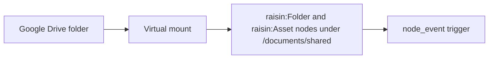

# Sync a Google Drive folder

This guide takes a Google Drive folder and makes its files show up as nodes
in a workspace, kept current in the background, with a trigger that runs
whenever a file is added or changed. For the concepts see
[Virtual Nodes](../../concepts/virtual-nodes.md).

## What you'll build



## Before you start

- A running RaisinDB instance and a repository you can install packages into.
- `RAISIN_MASTER_KEY` set on the server. Google tokens are stored encrypted
  with it, and the engine needs it to decrypt them before each call. Back it
  up; losing it makes every stored token unreadable.
- A Google account with access to the folder.

## Step 1: Install the adapter package

The Google Drive adapter is a built-in package. Install it into your
repository:

```bash
raisindb package install google-drive-adapter --repo myapp
```

The package deploys:

| Path | Workspace | Purpose |
|------|-----------|---------|
| `/adapters/google-drive` | `functions` | The adapter. |
| `/mappers/google-drive-default` | `functions` | Maps files to `raisin:Asset` nodes. |
| `/connectors/google-drive` | `raisin:system` | A disabled connector template with Google's OAuth endpoints and scopes filled in. |

## Step 2: Add the connector

In the admin console open **Connectors** and click **Add connector**. Pick the
Google Drive template and give it a name; the console copies the template to
`/integrations/<name>` and opens the editor.

The editor's **Provider setup** section shows the **OAuth Redirect URI** with
a copy button, in the form
`https://<your-host>/api/integrations/<repo>/oauth/callback`. It is built
from `RAISINDB_BASE_URL`, so set that on the server before this step. The same
section renders the template's setup instructions.

## Step 3: Create a Google OAuth client

In the [Google Cloud Console](https://console.cloud.google.com/):

1. Create or select a project and enable the **Google Drive API**.
2. Configure the OAuth consent screen.
3. Create an **OAuth 2.0 Client ID** of type *Web application*.
4. Under *Authorized redirect URIs* paste the redirect URI from the connector
   editor.
5. Copy the **Client ID** and **Client secret**.

The template requests `drive.readonly`, `drive.file` and
`drive.metadata.readonly`. That is enough to read any folder and to write
files the app created. To write through to files the app did not create,
change the connector's scopes to `https://www.googleapis.com/auth/drive`
before connecting the account.

## Step 4: Connect an account

Back in the connector editor:

1. Paste the **Client ID** and **Client secret**. The secret is encrypted
   server-side into `client_secret_encrypted` and never displayed again.
2. Enable the connector and save.
3. Click **Connect account** and complete Google's consent screen. The
   account appears under the connector with its email address as the label and
   the scopes Google granted.

The adapter only ever sees a current access token. The refresh token stays
encrypted on the connector node and is used by the engine's refresh job.

Run **Test connection** with the account selected. It calls the adapter's
`capabilities` and lists up to ten items of the root, and its result is the
quickest check that the client, scopes and account are right.

## Step 5: Mount a folder

Open **Mounts** and click **New Mount**. The editor asks for the connector,
the account, the target workspace and branch, the mount path, the remote root,
and the mapping function. The **Browse** button next to *Remote root* is
available for connectors that implement `browse`; for Drive, paste the folder
id from the folder's URL (`https://drive.google.com/drive/folders/<id>`).

The same mount as a node under `/mounts` in `raisin:system`:

```yaml
node_type: raisin:VirtualMount
properties:
  title: Shared Drive Docs
  integration_ref: /integrations/google-drive
  account_ref: "<connection id>"          # optional when the connector has one account
  target_workspace: default
  target_branch: main
  mount_path: /documents/shared
  remote_root: "<Google folder id>"
  mapping_function: /mappers/google-drive-default
  sync_config:
    mode: poll
    interval_seconds: 300
    max_items_per_sync: 500
  enabled: true
```

With the default mapper, folders become `raisin:Folder` nodes and files
become `raisin:Asset` nodes carrying `title`, `mimeType`, `size`, `web_url`,
`download_url`, `created_at`, `modified_at` and `provider: "google-drive"`.
The target workspace has to allow both types. Leave `mapping_function` out
and files become plain `raisin:Node` nodes with the same values under a
`meta` object.

## Step 6: Watch files appear

The first run walks the folder tree with `list`; after that the adapter's
`supports_changes: true` lets the engine ask Drive's changes feed for what
moved since the last cursor. The mount page shows each run's counts, and the
mount node's `state.last_run` holds the same record. Query the subtree:

```sql
SELECT path, node_type, properties->>'title'::String AS title
FROM 'default'
WHERE properties->>'__mount_id'::String = '<mount node id>'
ORDER BY path;
```

A synced file holds metadata and links, not bytes. To let the indexing
pipeline fetch bytes for text extraction and thumbnails, set
`sync_config.cache_content: true` on the mount (the console's *Sync
settings* card has it). Cached copies are dropped 30 minutes after their last
use unless you set `content_ttl_seconds`.

## Step 7: Fire a trigger on change

Synced nodes go through the normal write path, so a `raisin:Trigger` of type
`node_event` sees them. This one runs a function for every file created or
updated under the mount:

```yaml
node_type: raisin:Trigger
properties:
  title: On Drive document change
  enabled: true
  trigger_type: node_event
  config:
    event_kinds: [created, updated]
  filters:
    workspaces: [default]
    paths: ["**/documents/shared/**"]
    node_types: [raisin:Asset]
  function_path: /lib/index-incoming-doc
```

The function receives the event under `input.flow_input`:

```javascript
function handler(input) {
  const { event, workspace } = input.flow_input;
  const node = raisin.nodes.get(workspace, event.node_path);
  // extract text, notify a channel, start a workflow ...
  return { ok: true, path: event.node_path };
}
```

Sync writes are attributed to the actor `virtual-mount-sync`. If your trigger
writes back into the same subtree, check the event's actor so it does not
re-fire on the engine's own writes. The first sync of a large folder fires
the trigger once per file.

## Writing back

The Drive adapter declares `can_create`, `can_update`, `can_delete`,
`accepts_content` and `mutable_fields: ["title"]`, and the default mapper
implements `to_external`. A mount with

```yaml
write_config:
  mode: mirror
  mutable_fields: [title]
  delete_policy: trash
```

pushes renames and replaced file contents to Drive and moves deleted nodes to
Drive's trash. This is a preview feature; it needs the account connected with
a scope that allows writes to the files in question. See
[The write path](../../concepts/virtual-nodes.md#the-write-path).

## Running in production

- **Single node:** nothing to configure.
- **Replicated cluster:** enable the `redis` locks backend so the per-mount
  lease is shared. With the in-process backend the engine logs a warning and
  two nodes may sync the same mount at once.
- **Auth expiry:** when Google rejects the token the mount pauses with status
  `auth_required` until the account is reconnected. Transient failures back
  the interval off and mark the mount `error`, then `degraded` after five in a
  row; a successful run clears it.

## Next steps

- [Build a connector](build-a-custom-adapter.md) to mount a system that is not
  Google Drive.
- [Adapter reference](../../reference/virtual-node-adapters.md) for the full
  mount and `sync_config` tables.
