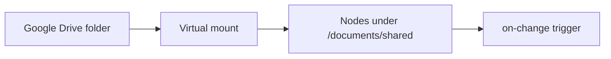

# Sync a Google Drive folder

This guide takes you from nothing to a live Google Drive mount: a Drive folder
whose files show up as nodes in a workspace, kept in sync in the background, with
a trigger firing whenever something changes. For the concepts behind this, see
**[Virtual Nodes](../../concepts/virtual-nodes.md)**.

## What you'll build



By the end, files in a Drive folder appear as `raisin:Folder` and file nodes
under a path you choose, and a function runs each time one is added or edited.

## Before you start

- A running RaisinDB instance and a repository you can install packages into.
- **`RAISIN_MASTER_KEY` set on the server** — the integration stores your Google
  tokens encrypted, and the sync engine needs this key to decrypt them. Set it
  once and back it up; if it is lost, connected accounts stop working.
- A Google account with access to the folder you want to mount.

## Step 1 — Install the adapter package

The Google Drive adapter ships as a built-in package. If it is not already
present, install it like any other package:

```bash
raisindb package install google-drive-adapter --repo myapp
```

Installing it deploys two functions into the `functions` workspace and a
pre-configured (but **disabled**) integration template into `raisin:system`:

| Path | Workspace | Purpose |
|------|-----------|---------|
| `/adapters/google-drive` | `functions` | The Drive adapter function. |
| `/mappers/google-drive-default` | `functions` | Default per-item mapping. |
| `/integrations/google-drive` | `raisin:system` | Integration template, disabled. |

## Step 2 — Create a Google OAuth client

In the [Google Cloud Console](https://console.cloud.google.com/):

1. Create or select a project and **enable the Google Drive API**.
2. Configure the OAuth consent screen and add the Drive scopes.
3. Create an **OAuth 2.0 Client ID** of type *Web application*.
4. Add your RaisinDB callback as an authorized redirect URI:
   `https://<your-host>/api/integrations/<repo>/oauth/callback` (the callback is
   repo-scoped — use the repository you are connecting the integration in).
5. Copy the **Client ID** and **Client secret**.

The template requests least-privilege scopes by default —
`drive.readonly`, `drive.file`, and `drive.metadata.readonly`. To later write
through to files your app did not create, widen the integration's scope to
`https://www.googleapis.com/auth/drive`.

## Step 3 — Connect the integration

In the admin console, open **Connectors → Google Drive**:

1. Paste your **Client ID** and **Client secret**. The secret is encrypted at
   rest (AES-256-GCM); it is never stored in cleartext and never leaves the
   server.
2. Set the **redirect URI** to match step 2.4 above, then **enable** the
   integration.
3. Click **Connect an account**. This runs the Google OAuth flow and stores the
   account — with encrypted access and refresh tokens — under the integration's
   `connected_accounts`.

:::note Refresh tokens never leave the server
The adapter function only ever receives a short-lived `access_token`. The
refresh token is stored encrypted and used solely by the engine's token-refresh
logic. Adapter code cannot see it.
:::

Note the connected account's `id` — you'll reference it from the mount in the
next step.

:::tip Test the connection first
Before creating a mount, click **Test connection** on the connector. It runs the
adapter's `capabilities` and a small `list` probe against your account and folder
and returns a diagnostic report — the fastest way to confirm the OAuth client,
scopes, and folder id are all correct. See
**[Build a connector → Test the connection](build-a-custom-adapter.md#test-the-connection-before-you-mount)**.
:::

## Step 4 — Mount a folder

A mount is a `raisin:VirtualMount` node. Create one through the admin console's
**Mounts** page, or as a node in the `raisin:system` workspace:

```yaml
node_type: raisin:VirtualMount
properties:
  title: Shared Drive Docs
  integration_ref: /integrations/google-drive
  account_ref: "<connected account id from step 3>"
  target_workspace: default
  target_branch: main                    # branch the synced nodes are written to
  mount_path: /documents/shared
  remote_root: "<Google folder id>"      # the .../folders/<id> part of the URL
  sync_config:
    mode: poll
    interval_seconds: 300
    max_items_per_sync: 500
    ephemeral: false
  enabled: true
```

The `remote_root` is the folder id from the Drive URL. `mount_path` is where the
subtree appears inside `target_workspace` — it can be any path, at any depth.

You can leave `mapping_function` unset: the engine uses a built-in mapping that
turns folders into `raisin:Folder` nodes and files into lightweight metadata
nodes. To customize node types per MIME type, point `mapping_function` at
`/mappers/google-drive-default` or your own mapper.

## Step 5 — Watch files appear

The engine runs a **full reconcile** on the first sync, then incremental deltas
on the interval you set. After the first run, query the mounted subtree like any
other data:

```sql
SELECT path, node_type, properties->>'title' AS title
FROM 'default'
WHERE properties->>'__mount_id'::String = '<mount node id>'
ORDER BY path;
```

Files carry their `title`, size, MIME type, and Drive links; folders come
through as `raisin:Folder`. Every synced node also carries `__virtual`,
`__external_id`, `__etag`, and `__synced_at` metadata.

:::info Links, not bytes
In this release a synced file node holds **metadata and links** (`web_url`,
`download_url`) — the file's binary content is not downloaded into the node.
:::

## Step 6 — Fire a trigger on change

Because synced nodes go through the normal write path, an ordinary node trigger
sees them. Add a trigger that runs when a document under the mount is created or
updated:

```yaml
name: on-drive-doc-change
trigger_type: node_change
filter:
  path_prefix: /documents/shared
  operation: [create, update]
function: index-incoming-doc
```

Now every time the background sync writes a new or changed file, your function
runs — extract text, notify a channel, kick off a workflow, whatever you need.

:::tip Avoid feedback loops
Sync writes run under a dedicated system actor (`virtual-mount-sync`). If a
trigger writes back into the same subtree, filter it out on that actor so your
trigger doesn't re-fire on the engine's own writes.
:::

## Running in production

- **Single node:** the default in-process lock is enough; nothing to configure.
- **Multiple nodes (replicated cluster):** enable the **Redis locks backend** so
  the per-mount lease is shared. Without it, two nodes can sync the same mount at
  once — the engine logs a warning and sync is not cluster-safe.
- **Auth expiry:** if Google rejects the token, the mount pauses with status
  `auth_required` until you reconnect the account. Repeated transient failures
  back the interval off and mark the mount `degraded`; a successful sync clears
  it.

## Next steps

- **[Build a custom adapter](build-a-custom-adapter.md)** to mount a system that
  isn't Google Drive.
- **[Adapter reference](../../reference/virtual-node-adapters.md)** for the full
  mount and sync-config field tables.
