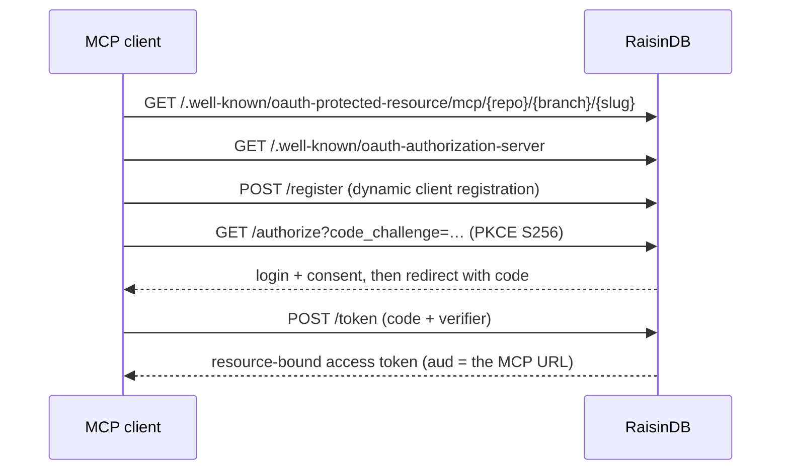

# Authentication & Clients

MCP servers reuse RaisinDB's [access control](../auth/roles-and-permissions.md). A server is either open or gated by scopes, and clients authenticate either interactively (OAuth 2.1) or with a bearer token.

## Public vs. scoped servers

| `public` | `scopes` | Who can open the server |
|----------|----------|-------------------------|
| `true` | — | Anyone, no credential. |
| `false` | `[]` (empty) | Any authenticated caller. **See the note below.** |
| `false` | `[role_or_group, …]` | Only callers holding **all** listed scopes. |

Each scope is a **role or group id** from [`raisin:access_control`](../auth/roles-and-permissions.md). Per-tool `scopes` are checked the same way (`tool.scopes ⊆ caller's roles/groups`), and a tool only appears in `tools/list` if the caller holds its scopes.

:::warning Non-public servers and anonymous access
If [anonymous access](../auth/authentication-setup.md) is enabled for the repository, an unauthenticated request resolves to the **anonymous principal**, which still satisfies a non-public server that declares **no** `scopes`. To restrict a non-public server to specific callers, declare `scopes` the anonymous role does not hold. (Data tools remain row-level-security scoped to the caller either way.)
:::

## Interactive clients: OAuth 2.1

RaisinDB runs a standard OAuth 2.1 authorization server, so MCP clients log in without any pasted tokens. The flow is fully automatic for the client:



Key properties:

- **Discovery** — `/.well-known/oauth-authorization-server` (RFC 8414) and `/.well-known/oauth-protected-resource/mcp/{repo}/{branch}/{slug}` (RFC 9728).
- **Dynamic Client Registration** — `POST /register` (RFC 7591); no pre-provisioning.
- **PKCE S256 required** (OAuth 2.1).
- **Resource-bound tokens** — the issued token's audience is the specific MCP endpoint (RFC 8707), so a token minted for one server is rejected at any other.
- **Consent narrows, never widens** — the granted scopes are the intersection of what the user requested and the roles/groups they actually hold.

The resource owner is authenticated against the existing [identity store](../auth/authentication-setup.md) (the same login as everywhere else) — there is no separate MCP login.

## Headless clients: bearer token

Non-interactive agents present a RaisinDB access token directly:

```
Authorization: Bearer <token>
```

This is the simplest path for first-party or server-to-server agents.

## Connecting a client

Point any MCP client at the Streamable HTTP URL:

```
http://localhost:8080/mcp/{repo}/main/{slug}
```

Most MCP clients let you add an HTTP server by URL — for example an `mcp add --transport http <name> <url>` command, or an entry in the client's MCP config. Interactive clients trigger the OAuth login on first connect; headless clients send the bearer token.

### Quick manual check

```bash
# Public server — no auth needed
curl -s http://localhost:8080/mcp/myapp/main/catalog \
  -H "Content-Type: application/json" \
  -d '{"jsonrpc":"2.0","id":1,"method":"tools/list"}'

# Scoped server — present a token
curl -s http://localhost:8080/mcp/myapp/main/private \
  -H "Content-Type: application/json" \
  -H "Authorization: Bearer $TOKEN" \
  -d '{"jsonrpc":"2.0","id":1,"method":"tools/list"}'
```

## Self-hosting behind a proxy

The OAuth issuer and token audiences are derived from configuration, not request headers. When RaisinDB runs behind a reverse proxy or on a fixed public origin, set:

```bash
RAISINDB_BASE_URL=https://db.example.com
```

so discovery URLs and token audiences stay canonical regardless of inbound headers. Only set `RAISINDB_TRUST_FORWARDED_HEADERS=1` when a trusted proxy sets `X-Forwarded-*` (they are ignored by default, since they are client-spoofable on a directly reachable server).
