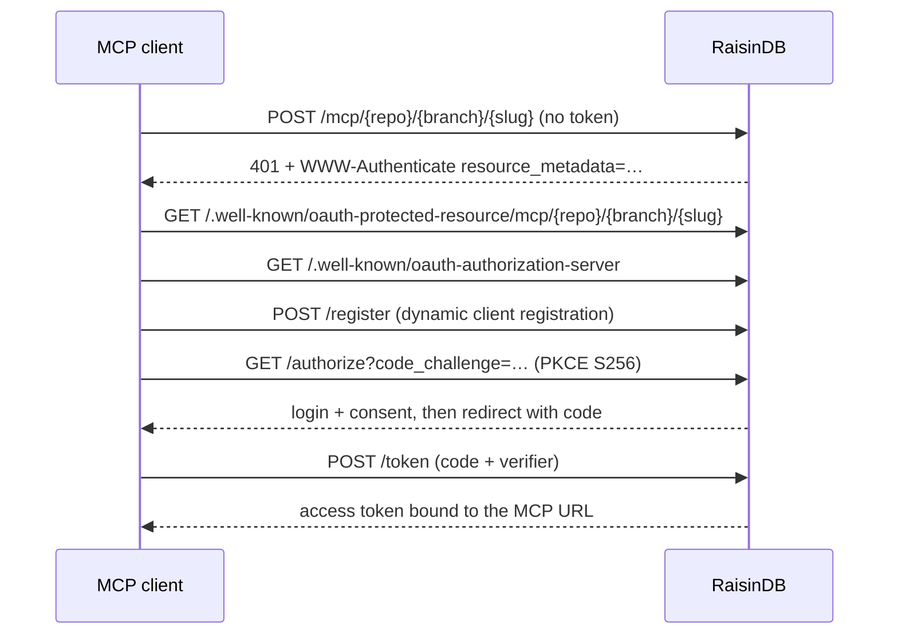

# Authentication & Clients

MCP servers reuse RaisinDB's [access control](../auth/roles-and-permissions.md). A server is either public or requires an authenticated caller, optionally holding specific scopes. Clients authenticate interactively with OAuth 2.1 or by presenting a bearer token.

## Public vs. scoped servers

| `public` | `scopes` | Who can open the server |
|----------|----------|-------------------------|
| `true` | any | Anyone. Requests without a token run as the anonymous role. |
| `false` | `[]` | Any authenticated caller. Anonymous requests are rejected. |
| `false` | `[role_or_group, …]` | Authenticated callers holding **all** listed scopes. |

A scope is a role id or group id from [`raisin:access_control`](../auth/roles-and-permissions.md). The caller's scopes are their effective roles plus group memberships; with an OAuth token they are further narrowed to the scopes the user consented to. Per-tool `scopes` are checked the same way, and a tool only appears in `tools/list` if the caller holds its scopes. A superadmin or system caller satisfies every scope requirement.

Whatever the server's policy, data tools and custom functions run as the caller under [row-level security](../auth/row-level-security.md).

The HTTP status tells a client what went wrong:

- `401` with a `WWW-Authenticate` header when a non-public server is called without a valid token. The header points at the server's protected-resource metadata so an OAuth-capable client can start the login flow.
- `403` when the caller is authenticated but lacks a required scope.
- `200` with a JSON-RPC error for every other failure.

## Interactive clients: OAuth 2.1

RaisinDB runs a standard OAuth 2.1 authorization server, so MCP clients log in without pasted tokens. The flow is automatic for the client:



What the server provides:

- **Discovery** at `/.well-known/oauth-authorization-server` (RFC 8414) and `/.well-known/oauth-protected-resource/mcp/{repo}/{branch}/{slug}` (RFC 9728).
- **Dynamic client registration** at `POST /register` (RFC 7591), so no client needs pre-provisioning.
- **PKCE S256**, the only supported code challenge method.
- **Resource-bound tokens**: the token's audience is the specific MCP endpoint (RFC 8707). A token minted for one server is rejected at any other.
- **Refresh tokens**: the token endpoint supports the `refresh_token` grant.
- **Consent narrows**: the granted scopes are the intersection of the requested scopes and the roles and groups the user actually holds.

The user logs in against the existing [identity store](../auth/authentication-setup.md); there is no separate MCP login.

## Headless clients: bearer token

Non-interactive agents send a RaisinDB access token or API key directly:

```
Authorization: Bearer <token>
```

This is the simplest path for first-party or server-to-server agents.

## Connecting a client

Point any MCP client at the Streamable HTTP URL:

```
http://localhost:8080/mcp/{repo}/main/{slug}
```

Most MCP clients accept an HTTP server by URL, for example through an `mcp add --transport http <name> <url>` command or an entry in the client's MCP config. Interactive clients trigger the OAuth login on first connect; headless clients send the bearer token.

### Quick manual check

```bash
# Public server, no token
curl -s http://localhost:8080/mcp/myapp/main/catalog \
  -H "Content-Type: application/json" \
  -d '{"jsonrpc":"2.0","id":1,"method":"tools/list"}'

# Non-public server, present a token
curl -s http://localhost:8080/mcp/myapp/main/private \
  -H "Content-Type: application/json" \
  -H "Authorization: Bearer $TOKEN" \
  -d '{"jsonrpc":"2.0","id":1,"method":"tools/list"}'
```

Without the token the second call answers:

```
HTTP/1.1 401 Unauthorized
WWW-Authenticate: Bearer error="invalid_token", resource_metadata="https://localhost:8080/.well-known/oauth-protected-resource/mcp/myapp/main/private"

{"jsonrpc":"2.0","id":1,"error":{"code":-32001,"message":"Unauthorized: authentication required for this MCP server"}}
```

## Self-hosting behind a proxy

The OAuth issuer and token audiences are derived per request from the host RaisinDB is reached on, so a deployment that serves each organisation on its own host advertises the right issuer automatically. The derived host is checked against an allowlist so a spoofed `Host` header cannot mint a token for an attacker-chosen audience.

**Single fixed origin**: set an absolute override, which skips host derivation:

```bash
RAISINDB_BASE_URL=https://db.example.com
```

**Multiple hosts or wildcard subdomains**: allowlist trusted host suffixes, comma-separated. A suffix matches its apex and any subdomain (`db.example.com` matches `db.example.com` and `acme.db.example.com`, but not `evil-db.example.com`):

```bash
RAISINDB_TRUSTED_HOST_SUFFIXES=db.example.com
```

A tenant's custom domains are allowlisted per tenant through the `trusted_oauth_hosts` field of its auth config (exact host match), in addition to the global suffixes. Loopback hosts are always accepted.

`X-Forwarded-Host` and `X-Forwarded-Proto` are ignored unless `RAISINDB_TRUST_FORWARDED_HEADERS=1`, because a directly reachable server cannot tell a proxy's headers from a client's. When no allowlist is configured at all, the issuer falls back to the request host and a warning is logged once.
