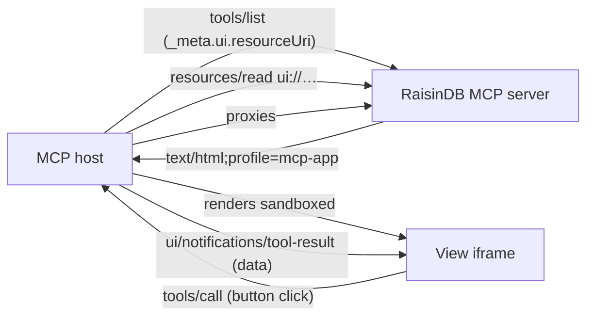

# Interactive Widgets (MCP Apps)

A tool call can return more than JSON. With **MCP Apps** (the MCP UI extension, SEP-1865), a tool advertises an HTML "view" that the MCP host (an AI chat client) renders inline in a sandboxed iframe: an order card, an inventory panel, a review checklist. The view can call your tools back when the user clicks a button.

RaisinDB builds this on the content model you already have. A widget is a **single HTML file stored as a `raisin:Asset`**, and a tool opts in by pointing at it with a `ui` binding. RaisinDB then speaks the MCP Apps protocol for you: it predeclares the view as a `ui://` resource, advertises it on the tool through `_meta.ui.resourceUri`, and serves the bytes through `resources/read` with the Apps profile MIME type. Inside the iframe, the small [`@raisindb/mcp-ui-client`](../../reference/mcp-ui-client/overview.md) helper speaks the view-to-host JSON-RPC protocol so your widget code stays a plain web app.

## How it fits together



At runtime:

1. The host lists tools. A widget-bound tool carries `_meta.ui.resourceUri: "ui://{workspace}/{path}"`.
2. The host fetches the view once through `resources/read` (MIME `text/html;profile=mcp-app`) and renders it in a sandboxed iframe. The file is a template, independent of any particular call, so hosts can cache it.
3. The tool runs server-side as the signed-in caller under [row-level security](../auth/row-level-security.md) and returns its data as `structuredContent`.
4. The host feeds the result to the view (`ui/notifications/tool-result`). Button clicks go back as ordinary `tools/call` requests through the host, which may ask the user first.

The view holds no credentials. Every read and write flows through the host as a tool call under the caller's own permissions.

## 1. Build a self-contained widget

A view is one HTML file with everything inlined: scripts, styles, small images as data URIs. Use any framework and bundle to a single file. With Vite, `vite-plugin-singlefile` does this:

```js
// vite.config.js
import { defineConfig } from 'vite';
import { viteSingleFile } from 'vite-plugin-singlefile';

export default defineConfig({
  plugins: [viteSingleFile()],
  build: { cssCodeSplit: false, assetsInlineLimit: 100_000_000 },
});
```

Inside the widget, use `@raisindb/mcp-ui-client` for all host communication:

```js
import { callTool, onToolResult, updateModelContext } from '@raisindb/mcp-ui-client';

let order;
onToolResult((result) => {
  order = result.structuredContent;   // shaped by your function's output_schema
  render(order);
});

document.querySelector('#approve').addEventListener('click', async () => {
  await callTool('approve_order', { order_id: order.id });   // the host may prompt
  await updateModelContext([{ type: 'text', text: `Order ${order.id} approved.` }]);
});
```

Render a waiting state on load: the data arrives after the view-to-host handshake, never synchronously. Do not size the page with `100vh`; the helper reports the content height to the host.

:::warning Implement the pull fallback
The host only pushes `tool-result` while the view is on screen during tool execution. When the tool finished before your view initialized, no push comes and the view has to pull: read the initiating tool's name and arguments from the handshake and re-issue the call. See [the pull fallback](../../reference/mcp-ui-client/overview.md#the-pull-fallback).
:::

## 2. Ship the file as an asset

Upload the built `index.html` through the [upload flow](../../reference/javascript-client/uploads.md), or ship it as package content. Any non-YAML file under `content/<workspace>/<dirs>/` installs as a `raisin:Asset` at `/<dirs>/<file>` in that workspace, which must allow `raisin:Asset` nodes:

```
package/
  content/
    functions/
      lib/acme/widgets/
        order.html        # the built single-file widget
```

No static-site folder and no serving configuration are needed. The bytes travel over MCP `resources/read`, not over the resource-serving endpoint.

## 3. Wire the tool's `ui` binding

Add a `ui` object to the tool, on the `raisin:McpServer` node's `tools[]` entry or in the [function's `mcp` block](./defining-servers.md#custom-function-tools):

```yaml
tools:
  - function: /lib/acme/get-order
    name: order_card
    description: >
      Show an order as an interactive card. The result renders as an inline
      widget the user sees directly; reply with at most one short sentence.
    ui:
      entry: /lib/acme/widgets/order.html   # path of the widget asset
      workspace: functions                  # workspace the entry resolves in
      name: Order Card                      # resources/list display name
      description: Interactive order view.
      prefersBorder: true
```

Two things the binding depends on:

- The backing `raisin:Function` declares an `output_schema`. That is what the engine returns as `structuredContent`, which is the only data your view receives. Without it the widget renders empty.
- `entry` is a node path inside `workspace`. When `workspace` is omitted it resolves in the session's active workspace, the first entry of the server's `data.workspaces`.

With that binding in place, `tools/list` advertises the widget and `resources/list` predeclares it:

```json
{"name":"order_card","_meta":{"ui":{"resourceUri":"ui://functions/lib/acme/widgets/order.html"}}}
```

```json
{"uri":"ui://functions/lib/acme/widgets/order.html","name":"Order Card","mimeType":"text/html;profile=mcp-app","_meta":{"ui":{"csp":{"connectDomains":["https://db.example.com"],"resourceDomains":["https://db.example.com"]},"prefersBorder":true}}}
```

The full binding:

| Field | Purpose |
|---|---|
| `entry` | Node path of the widget's HTML asset. A `#fragment` is accepted and ignored. Omit it when `resource` is set. |
| `workspace` | Workspace the entry resolves in. |
| `resource` | Name of a `ui_resources` entry on the server node to inherit from (see below). |
| `name`, `description` | How the view appears in `resources/list`. Default to the tool name. |
| `csp` | Extra origins the view needs: `connectDomains`, `resourceDomains`, `frameDomains`, `baseUriDomains`. The server's own origin is always added to `connectDomains` and `resourceDomains`, so images and API calls to the same instance work without configuration. |
| `permissions` | Sandbox permissions the view requests, each as an empty object: `{ camera: {}, microphone: {}, geolocation: {}, clipboardWrite: {} }`. |
| `prefersBorder` | Ask the host to draw a visible border and background. |
| `baseHref` | Inject a `<base href>` pointing at the entry's directory so relative URLs in the widget keep resolving. Off by default. With a base, fragment-only links resolve against the base URL, so keep hash routing programmatic. |
| `domain` | A stable sandbox hostname for hosts that support one (for example a `*.claudemcpcontent.com` origin). Leave unset unless the host documents a value. |
| `visibility` | Who may call the tool: `[model, app]` (default) or `[app]` for tools only the view may trigger. Enforced by the host, not the server; use `scopes` for access control. |
| `mode` | Deprecated. Widgets are always delivered inline as HTML. `uri-list` is still accepted for existing nodes and turns `baseHref` on by default. |

## One widget, many tools

Several tools can share one widget. Declare it once under the server node's `ui_resources` and reference it by name, so its CSP and permissions are stated in one place:

```yaml
ui_resources:
  - id: panel
    entry: /lib/acme/widgets/orders.html
    workspace: functions
    prefersBorder: true
tools:
  - { function: /lib/acme/list-orders, name: list_orders, ui: { resource: panel } }
  - { function: /lib/acme/get-order,   name: get_order,   ui: { resource: panel } }
```

Fields set inline on a tool override the shared resource. The view is listed once in `resources/list`, and every result flows into the same iframe. Discriminate by shape: give each tool's output a `kind` field and route views off it:

```js
onToolResult((result) => {
  const data = result.structuredContent;
  if (data.kind === 'orders') renderOrderList(data);
  else if (data.kind === 'order') renderOrderCard(data);
});
```

A click that calls `list_orders` and a click that calls `get_order` both land in the same listener, and `kind` decides what renders.

## Buttons, actions, and safety

A widget button click is an ordinary `tools/call` on the same MCP session, running the same `raisin:Function` as the same caller. The host proxies the call and may prompt the user before executing it.

Keep destructive operations (delete, refund, irreversible state changes) out of one-click reach, or have the widget render its own confirmation. Use per-tool [`scopes`](./authentication.md) to keep sensitive tools off widgets that should not reach them, and `ui.visibility: [app]` for tools only the view should call.

Two more helper calls your buttons can use:

- `updateModelContext(content)` pushes what the user did back into the conversation so the model's next turn knows ("User approved order 42 from the widget").
- `sendMessage(text)` posts a user message into the chat; `openLink(url)` asks the host to open an external URL.

## Serving images to the view

The host builds the iframe's Content-Security-Policy from the declared `csp` domains plus RaisinDB's own origin. Read that origin with `getServerOrigin()` from the helper rather than hard-coding it; the same widget file is installed on every deployment. Images loaded from the [resource-serving endpoint](../../reference/http-api/resource-serving-api.md) must be readable by the anonymous role, because iframe requests carry no credentials. The self-contained alternative is to resolve images server-side into small data URLs inside the tool result.

## Next steps

- [`@raisindb/mcp-ui-client` reference](../../reference/mcp-ui-client/overview.md) covers the view runtime API and the pull fallback.
- [View-to-host protocol reference](../../reference/mcp-ui-client/view-protocol.md) lists the JSON-RPC messages on the wire.
- [MCP API reference](../../reference/http-api/mcp-api.md) covers `_meta.ui` on tools, `ui://` resources and `resources/read`.
