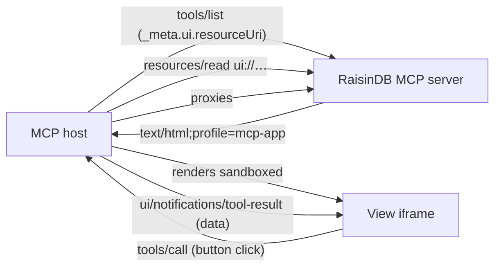

# Interactive Widgets (MCP Apps)

A tool call can return more than JSON. With **MCP Apps** (the MCP UI extension, [SEP-1865](https://github.com/modelcontextprotocol)), a tool advertises an HTML "view" that the MCP host (an AI chat client) renders inline in a sandboxed iframe — an order card, an inventory panel, a review checklist — and the view can call your tools back when the user clicks a button.

RaisinDB builds this on the content model you already have: a widget is just a **built HTML file shipped as an asset**, and a tool opts in by pointing at it with a `ui` binding. RaisinDB then speaks the whole MCP Apps protocol for you — it predeclares the view as a `ui://` resource, advertises it on the tool via `_meta.ui.resourceUri`, and serves the bytes through `resources/read` with the Apps profile mime type. On the browser side, the tiny [`@raisindb/mcp-ui-client`](../../reference/mcp-ui-client/overview.md) helper speaks the view↔host JSON-RPC protocol so your widget code stays a plain web app.

## How it fits together



The flow at runtime:

1. The host lists tools; a widget-bound tool carries `_meta.ui.resourceUri: "ui://…"`.
2. The host fetches the view once via `resources/read` (mime `text/html;profile=mcp-app`) and renders it in a sandboxed iframe — the widget file is a **template**, fetched independently of any particular call and cacheable.
3. The tool runs server-side as the signed-in caller, [RLS-scoped](../auth/row-level-security.md) like any other call, and returns its data as `structuredContent`.
4. The host feeds that result to the view over JSON-RPC (`ui/notifications/tool-result`); button clicks go back as ordinary `tools/call` requests through the host, which may ask the user first.

The view holds no credentials — every read and write flows through the host as an auditable tool call under the caller's own permissions.

## 1. Build a self-contained widget

A view is **one HTML file with everything inlined** (scripts, styles, small images as data URIs). Use any framework; bundle to a single file — with Vite, `vite-plugin-singlefile` does exactly this:

```js
// vite.config.js
import { defineConfig } from 'vite';
import { viteSingleFile } from 'vite-plugin-singlefile';

export default defineConfig({
  plugins: [viteSingleFile()],
  build: { cssCodeSplit: false, assetsInlineLimit: 100_000_000 },
});
```

Inside the widget, use `@raisindb/mcp-ui-client` for all host communication:

```js
import { callTool, onToolResult, updateModelContext } from '@raisindb/mcp-ui-client';

let order;
onToolResult((result) => {
  order = result.structuredContent;   // your tool's output_schema-shaped data
  render(order);
});

document.querySelector('#approve').addEventListener('click', async () => {
  await callTool('approve_order', { order_id: order.id });   // host may prompt
  await updateModelContext([{ type: 'text', text: `Order ${order.id} approved.` }]);
});
```

Render a **waiting state** on load — under MCP Apps the data arrives asynchronously after the view↔host handshake, never synchronously. Don't size with `100vh`; the helper reports your content height to the host automatically.

:::warning Implement the pull fallback
The host only pushes `tool-result` while the view is on screen **during** tool execution. When the tool finished before your view initialized, no push comes — the view must pull: read the initiating tool's name and arguments from the handshake and re-issue the call. See [the pull fallback](../../reference/mcp-ui-client/overview.md#the-pull-fallback) — without it a fast tool leaves the view stuck on its waiting state.
:::

## 2. Ship the file as an asset

Upload the built `index.html` through the [upload flow](../../reference/javascript-client/uploads.md), or ship it as package content — any non-YAML file under `content/<workspace>/<dirs>/` installs as a `raisin:Asset` at `/<dirs>/<file>`:

```
package/
  content/
    assets/
      widgets/
        order/
          index.html      ← the built single-file widget
```

No `raisin:StaticSiteFolder` and no serving config are needed for this delivery — the bytes travel over MCP `resources/read`, not over `/resources`.

## 3. Wire the tool's `ui` binding

Add a `ui` object to the tool — on the `raisin:McpServer` node's `tools[]` entry, or in the [function's `mcp` block](./defining-servers.md#custom-function-tools):

```yaml
tools:
  - function: get_order
    name: order_card
    description: >
      Show an order as an interactive card. The result renders as an inline
      widget the user sees directly — reply with at most one short sentence.
    ui:
      mode: html
      workspace: assets                     # workspace the entry resolves in
      entry: /widgets/order/index.html      # ABSOLUTE node path
      name: Order Card                      # resources/list display name
      description: Interactive order view.
      prefersBorder: true
```

Two rules the binding lives or dies by:

- The backing `raisin:Function` **must declare an `output_schema`** — that is what the engine returns as `structuredContent`, which is the only data your view receives.
- `entry` is an **absolute node path** (leading `/`) inside `workspace`; when `workspace` is omitted it resolves in the session's active workspace (the first entry of the server's `data.workspaces`).

The full binding shape:

| Field | Purpose |
|---|---|
| `mode` | `html` — the MCP Apps view delivery. (`uri-list` is reserved for the spec's deferred external-URL content type.) |
| `entry` | Absolute node path to the widget's HTML asset. |
| `workspace` | Workspace the entry resolves in (useful when the primary workspace can't hold assets). |
| `name`, `description` | How the view appears in `resources/list`. |
| `csp` | External origins the view needs: `connectDomains`, `resourceDomains`, `frameDomains`, `baseUriDomains`. **When omitted, RaisinDB declares its own origin** for connect + resource, so images served from the same instance work out of the box. |
| `permissions` | Sandbox permissions the view requests (`camera`, `microphone`, `geolocation`, `clipboardWrite`). |
| `prefersBorder` | Ask the host to draw a visible border + background. |
| `visibility` | Who may call the tool: `[model, app]` (default), or `[app]` for tools only the view may trigger. |

## One widget, many tools

Several tools can bind the **same** entry file — the view is listed once in `resources/list` and every result flows into the same iframe. Discriminate by shape: give each tool's output a `kind` field and route views off it:

```js
onToolResult((result) => {
  const data = result.structuredContent;
  if (data.kind === 'orders') renderOrderList(data);
  else if (data.kind === 'order') renderOrderCard(data);
});
```

This shape-routing also covers view-initiated navigation for free: a click that calls `list_orders` and a click that calls `get_order` both land in the same listener, and `kind` decides what renders.

## Buttons, actions, and safety

A widget button click is an ordinary `tools/call` against the same MCP session, running the same `raisin:Function`, [RLS-scoped](../auth/row-level-security.md) to the same caller — no new wire protocol. The host proxies the call and **may prompt the user** before executing it.

:::warning One-click tools and destructive actions
Design the tools a widget can trigger accordingly — keep destructive operations (delete, refund, irreversible state changes) out of the one-click set, or gate them behind a confirmation the widget itself renders. Use per-tool [`scopes`](./authentication.md) to keep sensitive tools off widgets that shouldn't reach them, and `ui.visibility: [app]` for tools that only the view — never the model — should call.
:::

Two more protocol verbs your buttons can use:

- `updateModelContext(content)` — push what the user did back into the conversation, so the model's next turn knows ("User approved order 42 from the widget").
- `sendMessage(text)` / `openLink(url)` — post a user-role message into the chat, or ask the host to open an external URL.

## Serving images to the view

The host builds the iframe's Content-Security-Policy from the binding's declared `csp` domains. With RaisinDB's default (its own origin), a view can load images from the [resource-serving endpoint](../../reference/http-api/resource-serving-api.md) — which is deny-by-default: the image subtree needs a `raisin:StaticSiteFolder` ancestor and must be readable by the **anonymous** role (iframe requests carry no credentials; enable anonymous access for the repo and grant read narrowly). The self-contained alternative is resolving images server-side into small data URLs inside the tool result — bounded and credential-free, at payload cost.

## Next steps

- [`@raisindb/mcp-ui-client` reference](../../reference/mcp-ui-client/overview.md) — the full view runtime API and the pull fallback.
- [View↔host protocol reference](../../reference/mcp-ui-client/view-protocol.md) — the JSON-RPC messages on the wire, for building without the helper.
- [MCP API reference](../../reference/http-api/mcp-api.md) — `_meta.ui` on tools, `ui://` resources, `resources/read`.
- [Defining MCP servers](./defining-servers.md) — the `tools[]` and function `mcp` block the `ui` binding attaches to.
