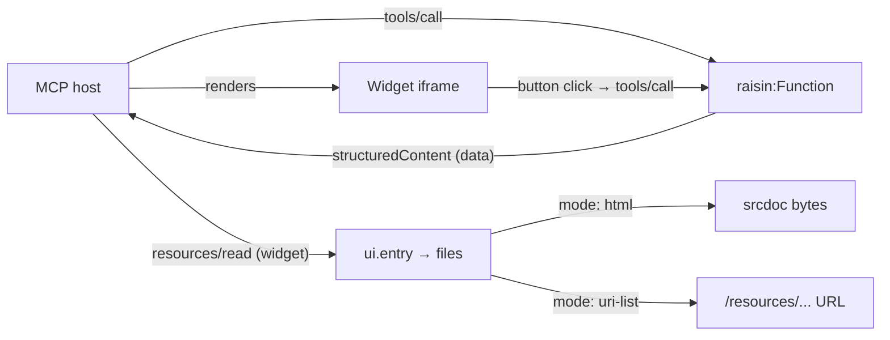

# Interactive Widgets (MCP-UI)

A tool call can return more than JSON. With **MCP-UI**, a tool returns an HTML mini-app that the MCP host (an AI chat client) renders inline — an order card, an inventory panel, a chart — and the widget can call your tools back when the user clicks a button.

RaisinDB builds this on the content model you already have: a widget is just **files in a folder**, served through the [resource-serving endpoint](../../reference/http-api/resource-serving-api.md), and a tool opts in by pointing at them with a `ui` binding. There is no dedicated widget node type to learn.

## How it fits together



The tool runs server-side as the signed-in caller, [RLS-scoped](../auth/row-level-security.md) like any other call, and returns its `data` as `structuredContent`. The host fetches the widget resource once (and caches it), then hands the data to the widget. The widget is a dumb renderer — no cookies, no auth inside the frame.

## 1. Upload the widget files

A widget is an ordinary `raisin:Asset` (single file) or `raisin:Folder` of assets, uploaded through the [upload flow](../../reference/javascript-client/uploads.md) you already use. A multi-file widget (`index.html` + `style.css` + `app.js`) is just a folder tree:

```
site/
  widgets/
    order-card/
      index.html
      style.css
      app.js
```

Relative references inside the HTML (`./style.css`, `./app.js`, `./img/logo.png`) resolve for free — they are ordinary path lookups against the same folder subtree.

## 2. Retype the folder as `raisin:StaticSiteFolder`

For a single-file `mode: html` widget you can stop here — `mode: html` never touches `/resources` (see the callout below). For a multi-file widget the host iframes with a real URL (`mode: uri-list`), you **must** retype the containing folder to [`raisin:StaticSiteFolder`](../../reference/http-api/resource-serving-api.md#the-raisinstaticsitefolder-nodetype). This does two things at once: it makes the subtree servable at all through [`/resources`](../../reference/http-api/resource-serving-api.md#what-is-servable) (deny-by-default — a plain `raisin:Folder` with no `raisin:StaticSiteFolder` ancestor returns `404`), and it grants an embeddability policy (a plain `raisin:Folder` emits **no** `frame-ancestors`, so a host is not allowed to iframe it):

:::warning `uri-list` requires a `raisin:StaticSiteFolder`
`/resources` is deny-by-default. A `mode: uri-list` widget is iframed from `/resources/…`, so **its files `404` unless a `raisin:StaticSiteFolder` covers them** — retyping the folder here is a hard prerequisite, not just a hardening step. `mode: html` widgets are unaffected: they are delivered over MCP `resources/read` (srcdoc bytes), never through `/resources`, so no `raisin:StaticSiteFolder` is needed.

The `raisin:StaticSiteFolder` doesn't have to be created by hand — because it is an ordinary content node, a [raisin package can ship it](../../reference/http-api/resource-serving-api.md#configuring-the-gate-through-a-package), so installing the package publishes the widget subtree automatically.
:::

```yaml
node_type: raisin:StaticSiteFolder
properties:
  description: Order-card widget
  serving_config:
    frame_ancestors:
      - https://host.example.com
      - https://chatgpt.com
    cors_allowed_origins:
      - https://host.example.com
    index_document: index.html
    cache_control: "public, max-age=3600"
```

- **`frame_ancestors`** controls *which host origins may iframe the folder's pages at all* (emitted as `Content-Security-Policy: frame-ancestors …`). Required for `uri-list`.
- **`cors_allowed_origins`** controls *whether client-side JS on that page may call back into RaisinDB APIs from a different origin*. Needed only if the widget's own JS fetches RaisinDB directly (separate from the tool call).

These are two different browser mechanisms — one governs embeddability, the other cross-origin script calls — and a real "iframe a widget" story needs both set correctly. See the [resource-serving reference](../../reference/http-api/resource-serving-api.md) for the full `serving_config` shape and header behavior.

## 3. Wire the tool's `ui` binding

Add a `ui` object to the tool — on the `raisin:McpServer` node's `tools[]` entry, or in the [function's `mcp` block](./defining-servers.md#custom-function-tools):

```yaml
tools:
  - function: order_card
    name: order_card
    description: Show an order as an interactive card.
    ui:
      mode: uri-list            # or "html"
      entry: site/widgets/order-card/index.html
```

`entry` is a **workspace-relative path** to the widget's HTML. The tool still returns its `data` as usual; the `ui` binding only tells the host *how to render* that data.

### `mode: html` vs `mode: uri-list`

| | `mode: html` | `mode: uri-list` |
|---|---|---|
| Best for | Single self-contained file | Multi-file widget / SPA |
| Delivery | MCP engine reads the bytes and returns them as a `text/html` resource | A `text/uri-list` pointing at `/resources/…` |
| Host renders via | `srcdoc` in its own sandbox | real `src=` iframe |
| Cross-origin | None — no folder security config applies | Real HTTP requests → needs `StaticSiteFolder.serving_config` |
| Default | **Recommended** — simplest and safest | Use when one file isn't enough |

`mode: html` is the safe default: no cross-origin iframe, so none of the folder header config matters. Reach for `uri-list` only when the widget genuinely needs multiple files fetched over HTTP.

## One SPA, many routes: the `#fragment` pattern

You can reuse one single-file SPA build across several tools, each binding to a different in-app view, by appending a `#fragment` to `entry`:

```yaml
tools:
  - name: order_card
    ui: { mode: uri-list, entry: site/widgets/order/index.html#/order-card }
  - name: inventory_panel
    ui: { mode: uri-list, entry: site/widgets/order/index.html#/inventory }
```

The fragment is split off on the first `#` (it never affects *which* file is read) and reaches the widget differently per mode:

- **`uri-list`** — the fragment rides along on the iframe `src=` URL; the SPA's hash router reads `location.hash` on mount, exactly like on a normal website. Nothing extra to build.
- **`html`** — there is no navigable URL, so the engine injects `window.__RAISIN_INITIAL_ROUTE__` into the returned HTML before handing it to the host.

Write your router bootstrap to read both, and one code path works under either mode:

```js
const route = window.__RAISIN_INITIAL_ROUTE__ ?? location.hash;
```

## Reading data and calling tools: `@raisindb/mcp-ui-client`

MCP-UI hosts don't share one convention for delivering data or handling button clicks — the official [MCP Apps](https://blog.modelcontextprotocol.io) extension speaks `callServerTool`/`ontoolresult`, while the community [MCP-UI](https://mcpui.dev) project uses raw `postMessage({ type: 'tool', … })`. The `@raisindb/mcp-ui-client` browser helper hides that split so you write one call site regardless of host:

```js
import {
  getInitialRoute,
  getInitialData,
  callTool,
  onToolResult,
  updateModelContext,
} from '@raisindb/mcp-ui-client';

// On load: the route (from #fragment or the injected global) and the tool's data.
const route = getInitialRoute();          // __RAISIN_INITIAL_ROUTE__ ?? location.hash
const order = getInitialData();           // normalized structuredContent

render(order, route);

// Button → tools/call, auto-detecting the host bridge.
document.querySelector('#approve').addEventListener('click', async () => {
  await callTool('approve_order', { order_id: order.id });
});

// React to results the host pushes back.
onToolResult((result) => rerender(result));
```

- `getInitialRoute()` — `window.__RAISIN_INITIAL_ROUTE__` falling back to `location.hash`, so widget code never needs to know its delivery mode.
- `getInitialData()` — normalizes however the host delivered the tool's `structuredContent`.
- `callTool(name, args)` / `onToolResult(cb)` — tries MCP Apps' `callServerTool` first, falls back to the `postMessage` convention.
- `updateModelContext(content)` — pushes structured content into the conversation for the model to see (a no-op where unsupported).

## The button → tools/call action pattern

A widget button click is just an ordinary `tools/call` against the same MCP session, running the same `raisin:Function`, [RLS-scoped](../auth/row-level-security.md) to the same caller — RaisinDB needs no new wire protocol for it. The full round trip (button → message → host decides → re-invokes the tool → result → widget re-renders) lives in the widget's JS and the host's bridge.

:::warning One-click tools and destructive actions
A host **may** run a UI-initiated `tools/call` without a second confirmation. Design the tools a widget can trigger accordingly — keep destructive operations (delete, refund, irreversible state changes) out of the one-click set, or gate them behind a confirmation the widget itself renders. Use per-tool [`scopes`](./authentication.md) to keep sensitive tools off widgets that shouldn't reach them.
:::

## RLS: two surfaces, not one

- **`mode: html`** — the widget only ever sees the tool's `structuredContent`, which is already RLS-scoped to the caller. Nothing extra to reason about.
- **`mode: uri-list`** — the iframed page is served by the static endpoint under *its own* auth/RLS. If the widget's JS calls back into RaisinDB APIs directly, that is a separate access-control surface from the tool call. Don't assume RLS-on-the-tool-call implies RLS-on-the-iframe — the static folder is readable exactly by whoever the [access-control system](../auth/row-level-security.md) already permits (a public folder is one the anonymous role can read).

## Next steps

- [Resource-serving endpoint & `raisin:StaticSiteFolder`](../../reference/http-api/resource-serving-api.md) — the full endpoint, header, and `serving_config` reference.
- [MCP API reference](../../reference/http-api/mcp-api.md) — `resources/read` blob reads and the `ui` binding on the wire.
- [Defining MCP servers](./defining-servers.md) — the `tools[]` and function `mcp` block the `ui` binding attaches to.
