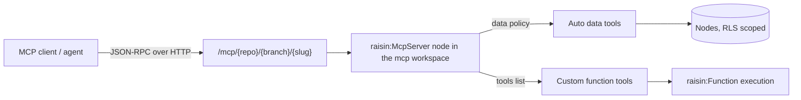

# MCP Servers Overview

Expose your RaisinDB data and functions as **Model Context Protocol (MCP)** servers that AI agents and MCP-capable clients connect to.

## What is an MCP server?

[Model Context Protocol](https://modelcontextprotocol.io) is an open standard that lets AI agents call **tools** and read **resources** over a uniform JSON-RPC interface. In RaisinDB, an MCP server is content: you create a `raisin:McpServer` node and the database handles the protocol, tool generation, authentication and dispatch.

You declare **what** a server exposes; RaisinDB does the rest:

- **Auto data tools** are generated from a data policy (query, get, search, create, update, delete, move, reorder nodes, list children and workspaces). No code.
- **Custom tools** run your own [functions](../functions/creating-functions.md).
- **Resources** expose nodes and binary assets as `raisin://` resources, with live update notifications.
- **Interactive widgets** let a tool render an inline HTML mini-app in the host and call your tools back on a click. See [Interactive Widgets](./interactive-widgets.md).

A repository can hold many servers, each with its own slug, data policy and access rules.

:::tip Going the other way?
This page is about RaisinDB **serving** tools. To let your agents call tools on somebody else's MCP server, see [Connecting to External Servers](./connecting-to-servers.md).
:::

## The endpoint

Each server is served over the MCP Streamable HTTP binding at a branch-aware URL:

```
POST /mcp/{repo}/{branch}/{slug}
```

- `{slug}` is the server node's `slug` property.
- `{branch}` selects the branch the tools operate on, so clients normally use `main` while an editor agent can target a working branch by changing the segment.
- The body is one JSON-RPC 2.0 message (`initialize` or `server/discover`, `tools/list`, `tools/call`, `resources/*`, `subscriptions/listen`).

## How it fits together



Every tool runs as the calling identity under [row-level security](../auth/row-level-security.md). A tool can only read or write what the caller could reach directly.

## Quickstart

The builtin `raisin-mcp` package provisions an `mcp` workspace in every repository. Create a public server there. The node API takes the parent path in the URL and the node name in the body:

```bash
curl -X POST http://localhost:8080/api/repository/myapp/main/head/mcp/ \
  -H "Authorization: Bearer $TOKEN" \
  -H "Content-Type: application/json" \
  -d '{
    "name": "catalog",
    "node_type": "raisin:McpServer",
    "properties": {
      "name": "Catalog",
      "slug": "catalog",
      "version": "1.0.0",
      "instructions": "Query the product catalog.",
      "public": true,
      "data": {
        "workspaces": ["products"],
        "operations": ["query_nodes", "get_node", "search_nodes", "list_children"]
      }
    }
  }'
```

Then talk to it:

```bash
# Handshake
curl -s http://localhost:8080/mcp/myapp/main/catalog \
  -H "Content-Type: application/json" \
  -d '{"jsonrpc":"2.0","id":1,"method":"initialize","params":{"protocolVersion":"2025-06-18","capabilities":{},"clientInfo":{"name":"cli","version":"1.0"}}}'

# List the generated tools
curl -s http://localhost:8080/mcp/myapp/main/catalog \
  -H "Content-Type: application/json" \
  -d '{"jsonrpc":"2.0","id":2,"method":"tools/list"}'
```

The handshake answers with the server's identity and capabilities:

```json
{"jsonrpc":"2.0","id":1,"result":{"protocolVersion":"2025-06-18","capabilities":{"tools":{"listChanged":true},"resources":{"subscribe":true,"listChanged":false}},"serverInfo":{"name":"Catalog","version":"1.0.0"},"instructions":"Query the product catalog."}}
```

`tools/list` returns one tool per entry in `data.operations`, here `query_nodes`, `get_node`, `search_nodes` and `list_children`, each with a JSON Schema for its arguments. Call one:

```bash
curl -s http://localhost:8080/mcp/myapp/main/catalog \
  -H "Content-Type: application/json" \
  -H "Authorization: Bearer $TOKEN" \
  -d '{"jsonrpc":"2.0","id":3,"method":"tools/call","params":{"name":"get_node","arguments":{"path":"/widgets/acme"}}}'
```

A public server accepts requests without a token, but the data tools then run as the anonymous role and return only what that role may read. Send a bearer token to act as a user.

## From JavaScript

The [`@raisindb/client`](../../reference/javascript-client/overview.md) HTTP client wraps the same endpoint:

```typescript
import { RaisinHttpClient } from '@raisindb/client';

const client = new RaisinHttpClient('http://localhost:8080');
await client.authenticate({ type: 'jwt', token });

const mcp = client.database('myapp').mcp('catalog');       // branch defaults to main
const { tools } = await mcp.listTools();
const result = await mcp.callTool('get_node', { path: '/widgets/acme' });
const doc = await mcp.readResource('raisin://products/widgets/acme');

for await (const update of mcp.subscribeResource('raisin://products/widgets/acme')) {
  console.log('changed:', update.uri);
}
```

`callTool` returns the `CallToolResult` (`content`, `structuredContent`, `isError`); a JSON-RPC error is thrown.

## Next steps

- [Defining MCP servers](./defining-servers.md) covers the full node shape, the auto data tools and custom function tools.
- [Authentication & clients](./authentication.md) covers public vs. scoped servers, the OAuth 2.1 flow and connecting a client.
- [Interactive Widgets (MCP Apps)](./interactive-widgets.md) shows how a tool returns an inline HTML widget.
- [MCP API reference](../../reference/http-api/mcp-api.md) lists every method and its response shape.
