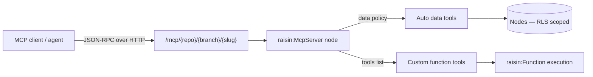

# MCP Servers Overview

Expose your RaisinDB data and functions as **Model Context Protocol (MCP)** servers that AI agents and MCP-capable clients connect to.

## What is an MCP server?

[Model Context Protocol](https://modelcontextprotocol.io) is an open standard that lets AI agents call **tools** and read **resources** over a uniform JSON-RPC interface. RaisinDB can serve your content and server-side logic as one or more MCP servers — you declare a server as content (a `raisin:McpServer` node) and the database handles the protocol, tool generation, authentication, and dispatch.

You declare **what** a server exposes; RaisinDB does the rest:

- **Auto data tools** — generated from your NodeTypes (query, get, search, create, update, delete nodes). No code.
- **Custom tools** — your own [functions](../functions/creating-functions.md) exposed as tools.
- **Resources** — your nodes as readable, subscribable MCP resources.

A repository can hold **many** servers, each with its own identity, policy, and access rules.

## The endpoint

Each server is served over the MCP Streamable HTTP binding at a **branch-aware** URL:

```
POST /mcp/{repo}/{branch}/{slug}
```

- `{slug}` is the server node's `slug` property.
- `{branch}` makes it [publish-aware](../branching/working-with-branches.md) — clients hit `main` (or your live branch) by default; an editor agent can target a working branch by changing the segment.
- The body is one JSON-RPC 2.0 message (`initialize`, `tools/list`, `tools/call`, `resources/*`).

## How it fits together



Every tool runs under the caller's [row-level security](../auth/row-level-security.md) — a tool can never read or write what the caller couldn't.

## Quickstart

The builtin `raisin-mcp` package provisions an `mcp` workspace in every repository. Create a public server there:

```bash
curl -X POST \
  http://localhost:8080/api/repository/myapp/main/head/mcp/catalog \
  -H "Authorization: Bearer $TOKEN" \
  -H "Content-Type: application/json" \
  -d '{
    "node_type": "raisin:McpServer",
    "properties": {
      "name": "Catalog",
      "slug": "catalog",
      "version": "1.0.0",
      "instructions": "Query the product catalog.",
      "public": true,
      "data": { "workspaces": ["products"], "operations": ["query_nodes", "get_node", "search_nodes"] }
    }
  }'
```

Then talk to it:

```bash
# Initialize the session
curl -s http://localhost:8080/mcp/myapp/main/catalog \
  -H "Content-Type: application/json" \
  -d '{"jsonrpc":"2.0","id":1,"method":"initialize","params":{"protocolVersion":"2025-06-18","capabilities":{},"clientInfo":{"name":"cli","version":"1.0"}}}'

# List the generated tools
curl -s http://localhost:8080/mcp/myapp/main/catalog \
  -H "Content-Type: application/json" \
  -d '{"jsonrpc":"2.0","id":2,"method":"tools/list"}'
```

`tools/list` returns the data tools generated from the policy — here `query_nodes`, `get_node`, and `search_nodes`.

:::tip Indexing delay
A brand-new `raisin:McpServer` is discovered through an indexed query that settles a moment after the write. If the first call returns "no raisin:McpServer with slug …", retry after a short pause. In the normal publish flow this is a non-issue — the index is built by the time you merge to your live branch.
:::

## Next steps

- [Defining MCP servers](./defining-servers.md) — the full node shape, auto data tools, and custom function tools.
- [Authentication & clients](./authentication.md) — public vs. scoped servers, the OAuth 2.1 flow, and connecting a client.
