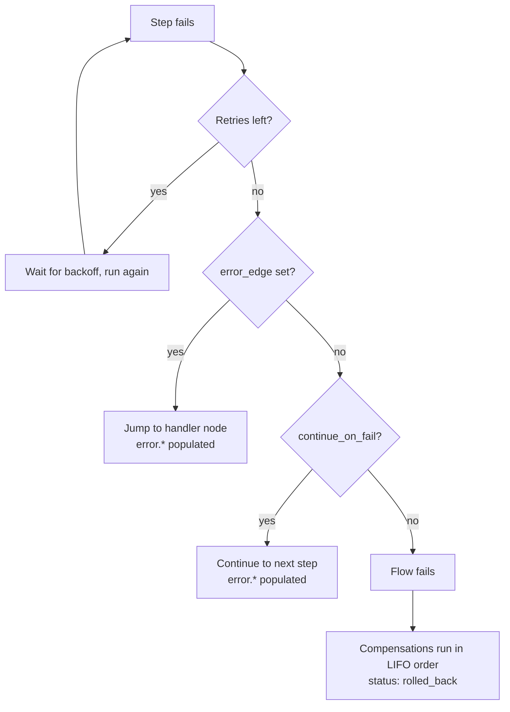
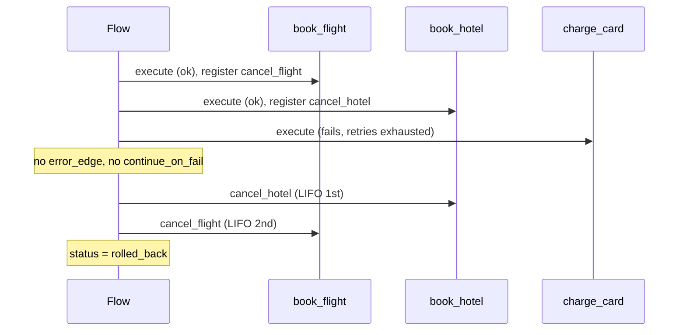

# Error Handling and Compensation

When a step fails, the engine works through a fixed sequence: retry, then error edge, then continue-on-fail, and finally fail the flow and run saga compensations.



A step fails when its function returns an error, when an agent call fails, when a child flow fails, or when a condition or template cannot be evaluated.

## Retries

```yaml
properties:
  retry:
    max_retries: 2          # retry budget for this step
    base_delay_ms: 1000
    max_delay_ms: 10000
  # or pick a preset:
  retry_strategy: llm       # none | quick | standard | aggressive | llm
```

The retry budget is resolved in this order: an explicit `retry.max_retries`, then the `retry_strategy` preset, then the step type's default. Function, agent, and human-task steps default to 3 retries. `parallel`, `sub_flow`, and `loop` default to 0, because running them again would fork the branches or restart the iteration and repeat side effects. Set `retry` explicitly on those when a repeat is safe.

| Preset | Retries | Base delay | Max delay |
|--------|---------|------------|-----------|
| `none` | 0 | | |
| `quick` | 3 | 1 s | 10 s |
| `standard` | 5 | 2 s | 60 s |
| `aggressive` | 10 | 5 s | 120 s |
| `llm` | 5 | 10 s | 120 s |

The delay between attempts is exponential: the base delay doubles per attempt, capped at the max delay. Without a `retry` block or preset, the engine waits 10 s, 30 s, 60 s, and then 120 s per attempt. An unknown `retry_strategy` name falls back to the defaults rather than disabling retries. While a retry backoff is pending, the instance status is `waiting`.

## `error_edge`: Jump to a Handler

Once retries are exhausted, the engine checks for an `error_edge` (on the node or inside `properties`) and jumps to the named node:

```yaml
- id: charge
  node_type: raisin:FlowStep
  properties:
    action: Charge the card
    function_ref: /lib/charge-payment
    retry: { max_retries: 2, base_delay_ms: 1000, max_delay_ms: 10000 }
    error_edge: record_failure
```

On the handler path, the `error` namespace is populated:

```json
"error": {
  "error_type": "step_error",
  "message": "...",
  "step_id": "charge",
  "timestamp": "..."
}
```

Reference it in the handler's steps as `{{ error.message }}` and `{{ error.step_id }}`:

```yaml
- id: record_failure
  node_type: raisin:FlowStep
  properties:
    action: Record failure
    function_ref: /lib/record-failure
    arguments:
      failed_step: "{{ error.step_id }}"
      message: "{{ error.message }}"
```

:::caution Handler placement
In the designer format execution order is array order, so a node that follows an `error_edge` target is also reached on the normal path. To keep a handler out of the happy path, make it the last node and have preceding branches route around it, or make the handler function a no-op when `error` is absent.
:::

## `continue_on_fail`: Best-Effort Steps

Without an `error_edge`, the engine checks `continue_on_fail: true`. The flow then continues to the next step, and `error.*` is populated with `"continued": true`:

```yaml
- id: notify
  node_type: raisin:FlowStep
  properties:
    action: Notify customer
    function_ref: /lib/send-notification
    continue_on_fail: true       # a notification failure must not fail the flow
```

The node-level `on_error: continue` or `on_error: skip` (the designer's error-behaviour choice) has the same effect. `on_error: stop`, the default, lets the failure proceed to compensation and the failed status.

### Flow-Level `error_strategy`

```yaml
workflow_data:
  error_strategy: continue      # fail_fast (default) | continue
```

With `error_strategy: continue`, every function, `ai_agent`, and `ai_sequence` step that has no error handling of its own (no `continue_on_fail`, no `error_edge`) behaves as if `continue_on_fail: true` were set. Per-step settings take precedence.

## Saga Compensation (`compensation_ref`)

For multi-step transactions, attach a compensation function to a step. When a later step fails without recovery, the compensations of the steps that already succeeded are run in reverse order.

```yaml
- id: reserve
  node_type: raisin:FlowStep
  properties:
    action: Reserve seats
    function_ref: /lib/ticketing/reserve-seats
    arguments:
      event_id: "{{ input.event_id }}"
      quantity: "${input.quantity}"
    compensation_ref: /lib/ticketing/cancel-reservation
    compensation_input_mapping:
      reservation_id: "${output.reservation_id}"   # output.* is this step's fresh output
```

How it works:

- A compensation is registered only after the forward function succeeded. A function that never ran is not compensated.
- On a later unrecoverable failure, compensations execute in LIFO order: the most recently succeeded step is compensated first. A compensation that fails is recorded and the remaining ones still run.
- `compensation_input_mapping` resolves against the step's output through the `output.*` namespace. Without a mapping, the forward `arguments` are reused as the compensation's input.
- The flow ends as `rolled_back` when at least one compensation ran, and as `failed` when there was nothing to compensate.



## Timeouts

| Property | Effect |
|----------|--------|
| `timeout_ms` (function step) | The wait deadline of the queued execution, so a stuck function does not hang the flow. |
| `due_in_seconds` (human task) | The task's due time and the flow's wait deadline. |
| `timeout_edge` (any waiting step) | Where to continue when the wait deadline expires. A waiting inbox task is marked `expired`, and `error.*` is populated with `error_type: "timeout"`. Without a `timeout_edge`, an expired wait fails the flow (and compensations run). |

```yaml
- id: approve
  node_type: raisin:FlowStep
  properties:
    action: "Approve order {{ input.order_id }}"
    step_type: human_task
    task_type: approval
    assignee: /users/manager
    due_in_seconds: 86400
    timeout_edge: escalate_step    # continue here if nobody responds within 24h
    options:
      - { value: approve, label: Approve }
      - { value: reject,  label: Reject }
```

The engine schedules a wake-up job at the deadline, so an expiry is acted on even if nothing else touches the instance.

## Test Runs with Mocked Functions

To exercise error paths safely, start a flow with `POST /api/flows/{repo}/test` and mock specific functions or agents:

```json
{
  "flow_path": "/flows/order-fulfillment",
  "input": { "order_id": "ORD-1" },
  "test_config": {
    "mock_functions": {
      "/lib/charge-payment": { "behavior": "mock_output", "mock_output": { "charge_id": "test" } },
      "/lib/audit-log":      { "behavior": "passthrough", "mock_delay_ms": 100 }
    },
    "mock_agents": {
      "/agents/summarizer":  { "behavior": "mock_output", "mock_output": { "response": "stub" } }
    },
    "isolated_branch": true,
    "auto_discard": true
  }
}
```

Behaviors: `real` (default), `passthrough` (the step's `arguments`, or the flow input when there are none, echoed as the output), `mock_output` (the given value). `mock_functions` is keyed by function path and applies to function steps; `mock_agents` is keyed by agent path and applies to `ai_agent` steps, `ai_sequence` containers, and chat steps. The response has the same shape as a normal run. The admin console's Run dialog exposes the same mock editor in test-run mode.
