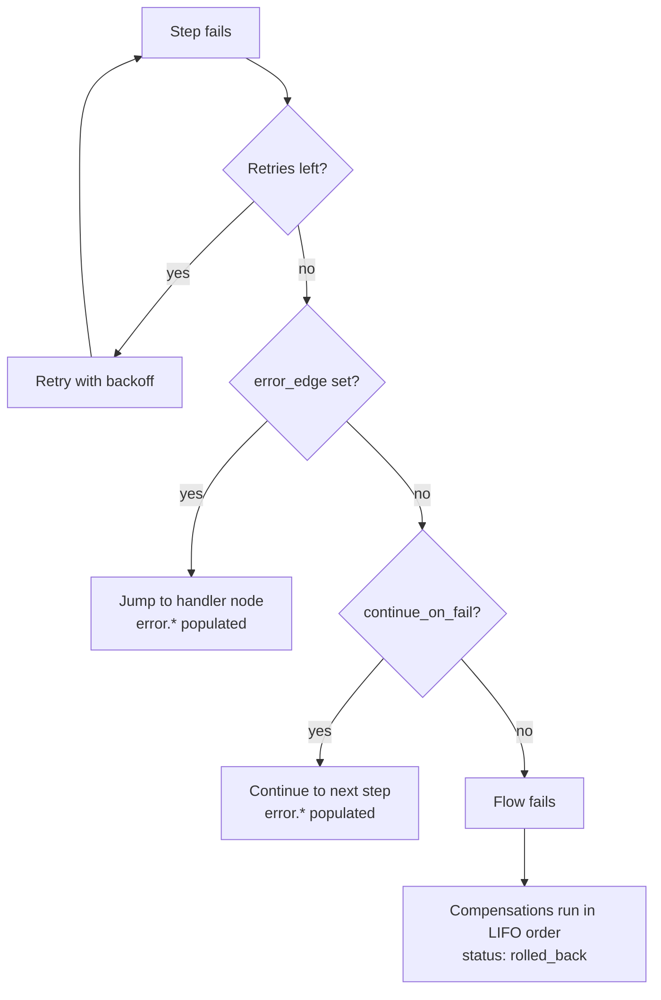
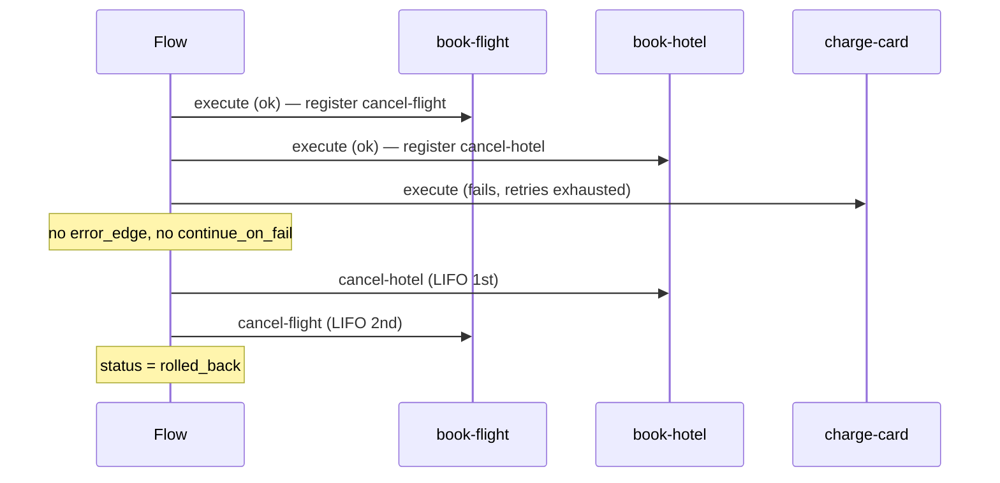

# Error Handling & Compensation

When a step fails, the engine works through a well-defined sequence: **retry → error edge → continue-on-fail → fail the flow and run saga compensations**.



## Retries

```yaml
properties:
  retry:
    max_retries: 2          # retry budget for this step
    base_delay_ms: 1000
    max_delay_ms: 10000
  # OR disable retries entirely:
  retry_strategy: none      # max_retries = 0
```

- The retry budget comes from `max_retries`; **the default is 3** when nothing is configured.
- `retry_strategy: none` disables retries for the step. Other preset names (`quick`, `standard`, `aggressive`, `llm`) are designer/SDK conventions — the designer UI expands them into a `retry` block.
- With a `retry` block, the delay between attempts is **exponential backoff**: `base_delay_ms` doubled per attempt, capped at `max_delay_ms`.
- Without a configured `retry` block, the engine falls back to a default escalating schedule (10s, 30s, 60s, then 120s per attempt).

While a retry backoff is pending, the instance status is `waiting`.

## `error_edge` — Jump to a Handler

Once retries are exhausted, the engine first checks for an `error_edge` (on the node or inside `properties`) and jumps to the named handler node:

```yaml
- id: charge
  node_type: raisin:FlowStep
  properties:
    function_ref: /lib/charge-payment
    retry: { max_retries: 2, base_delay_ms: 1000, max_delay_ms: 10000 }
    error_edge: record-failure
```

On the handler path, the `error` namespace is populated:

```json
"error": {
  "error_type": "step_error",
  "message": "...",
  "step_id": "charge",
  "timestamp": "..."
}
```

Reference it in the handler's steps as `{{ error.message }}`, `{{ error.step_id }}`:

```yaml
- id: record-failure
  node_type: raisin:FlowStep
  properties:
    action: Record failure
    function_ref: /lib/record-failure
    arguments:
      failed_step: "{{ error.step_id }}"
      message: "{{ error.message }}"
```

:::caution Handler placement
In designer format, execution order is array order — a node that follows an `error_edge` target is also reached on the *normal* path. To keep a handler out of the happy path, make it the last node and have preceding branches route around it, or make the handler function idempotent / a no-op when `error` is absent.
:::

## `continue_on_fail` — Best-Effort Steps

Without an `error_edge`, the engine next checks `continue_on_fail: true` — the flow continues to the next step, and `error.*` is populated with `"continued": true`:

```yaml
- id: notify
  node_type: raisin:FlowStep
  properties:
    action: Notify customer
    function_ref: /lib/send-notification
    continue_on_fail: true       # notification failure must not fail the flow
```

`on_error: stop | skip | continue` (node level) is carried through to the runtime as a property for UI/auditing; the enforced mechanics are the `error_edge` / `continue_on_fail` paths.

### Flow-Level `error_strategy`

```yaml
workflow_data:
  error_strategy: continue      # fail_fast (default) | continue
```

With `error_strategy: continue`, every step that has **no explicit error handling of its own** (no `continue_on_fail`, no `error_edge`) behaves as if `continue_on_fail: true` were set. Per-step settings always take precedence.

## Saga Compensation (`compensation_ref`)

For multi-step transactions, attach a compensation function that rolls forward steps back when a later step fails unrecoverably:

```yaml
- id: reserve
  node_type: raisin:FlowStep
  properties:
    function_ref: /lib/ticketing/reserve-seats
    arguments:
      event_id: "{{ input.event_id }}"
      quantity: "${input.quantity}"
    compensation_ref: /lib/ticketing/cancel-reservation
    compensation_input_mapping:
      reservation_id: "${output.reservation_id}"   # output.* = this step's fresh output
```

Semantics:

- Compensation is registered **only after the forward function succeeded**.
- On a later unrecoverable failure, the flow status becomes **`rolled_back`** and compensations execute in **LIFO order** (most recently succeeded step is compensated first).
- `compensation_input_mapping` resolves against the step's fresh output via the `output.*` namespace. **Without a mapping, the forward arguments are reused** as the compensation's input.



## Timeouts

| Property | Effect |
|----------|--------|
| `timeout_ms` (step) | For function steps, the wait deadline of the queued execution — a stuck function doesn't hang the flow. For containers, carried on the lowered node. |
| `due_in_seconds` (human task) | The task's due time **and** the flow's wait deadline. |
| `timeout_edge` (step) | Where to route when a wait deadline expires. Any waiting inbox task is marked `expired`. **Without** a `timeout_edge`, an expired wait fails the flow (then the error-edge / continue-on-fail / compensation sequence applies). |

```yaml
- id: approve
  node_type: raisin:FlowStep
  properties:
    step_type: human_task
    task_type: approval
    assignee: /users/manager
    action: "Approve order {{ input.order_id }}"
    due_in_seconds: 86400
    timeout_edge: escalate-step    # continue here if nobody responds within 24h
    options:
      - { value: approve, label: Approve }
      - { value: reject,  label: Reject }
```

## Test Runs with Mocked Functions

To exercise error paths safely, start a flow with `POST /api/flows/{repo}/test` and mock specific functions:

```json
{
  "flow_path": "/flows/order-fulfillment",
  "input": { "order_id": "ORD-1" },
  "test_config": {
    "is_test_run": true,
    "mock_functions": {
      "/lib/charge-payment": { "behavior": "mock_output", "mock_output": { "charge_id": "test" } },
      "/lib/audit-log":      { "behavior": "passthrough", "mock_delay_ms": 100 }
    },
    "isolated_branch": true,
    "auto_discard": true
  }
}
```

Behaviors: `real` (default), `passthrough` (input echoed as output), `mock_output`. AI agents always run real and cannot be mocked. The admin console's Run dialog exposes the same mock editor in test-run mode.
