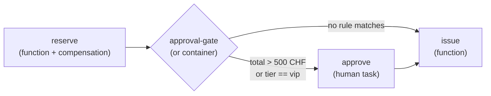

# Workflow Examples

Three complete, runnable example apps ship in the RaisinDB repository under `examples/workflows/`. Each is a self-contained Node.js script against a dev-mode server:

```bash
cd examples/workflows/<example>
npm install && npm start
```

| Example | Demonstrates |
|---------|--------------|
| `approval-flow` | Human task, inbox API, SSE event streaming |
| `ai-approval-flow` | Single-shot agent step, agent-as-assignee, escalation |
| `event-ticketing` | Functions as nodes, saga compensation, REL routing, approval gate |

## approval-flow

The flow behind the [Quickstart](./quickstart.md): a single approval step assigned to `/users/admin`.

1. Deploy a `raisin:Flow` node with one `human_task` step.
2. `flows.run()` — the flow pauses on the approval (`status: waiting`).
3. `inbox.listTasks()` finds the task; `inbox.completeTask()` approves it.
4. The flow resumes; the script streams `step_completed` / `flow_completed` events over SSE and reads the decision from `variables.__human_response`.

## ai-approval-flow

Agent-in-the-loop refund approvals — both AI roles in one flow:

1. **Agent step** — `summarize` makes a one-shot AI call with a templated prompt and exposes `steps.summarize.response`.
2. **Agent as assignee** — the `approve` human task is assigned to `/agents/refund-approver` with `min_confidence: 0.75` and `escalation_assignee: /users/admin`. A confident structured decision (`{ decision, reasoning, confidence }`) completes the task automatically; on low confidence or AI errors the task escalates to the human, who completes it through the same inbox API.

The script handles both outcomes: if the flow emits `flow_waiting`, the task escalated (the script prints `escalated_from` / `escalation_reason` and completes it as the human). Without a configured AI provider the example still finishes — via the escalation path.

See [Human-in-the-Loop — AI agent as assignee](./human-in-the-loop.md#ai-agent-as-assignee).

## event-ticketing

A realistic ticket-ordering workflow combining the main engine features:



- **JS functions deployed as nodes** — `raisin:Function` nodes with the source in a child `index.js` asset (`code` property), under `/lib/ticketing/`: `reserve-seats`, `issue-tickets`, `cancel-reservation`.
- **Saga compensation** — `reserve` registers `cancel-reservation` with a `compensation_input_mapping` of `{ reservation_id: "${output.reservation_id}" }`; if a later step fails unrecoverably the reservation is released automatically.
- **REL routing** — the `approval-gate` `or` container routes orders over 500 CHF or any VIP order to a human approval; when no rule matches, the container is skipped entirely.
- **Cross-step data flow** — `issue` consumes `${steps.reserve.reservation_id}`.

The script runs two live scenarios and asserts the results:

- **Scenario A (standard order, 100 CHF)** — completes without pausing; the approval step never runs (`outputs.approve === undefined`).
- **Scenario B (VIP order, 600 CHF)** — pauses on approval, the task is completed via the inbox API, the flow resumes and issues 4 tickets referencing the reservation.

Key flow definition excerpt:

```javascript
const workflowData = {
  version: 1,
  error_strategy: 'fail_fast',
  nodes: [
    {
      id: 'reserve',
      node_type: 'raisin:FlowStep',
      properties: {
        action: 'Reserve {{ input.quantity }}x {{ input.tier }} for {{ input.event_id }}',
        function_ref: '/lib/ticketing/reserve-seats',
        arguments: {
          event_id: '{{ input.event_id }}',
          quantity: '${input.quantity}', // whole-string expression keeps the number type
          tier: '{{ input.tier }}',
        },
        compensation_ref: '/lib/ticketing/cancel-reservation',
        compensation_input_mapping: {
          reservation_id: '${output.reservation_id}',
        },
        timeout_ms: 30000,
      },
    },
    {
      id: 'approval-gate',
      node_type: 'raisin:FlowContainer',
      container_type: 'or',
      rules: [
        { condition: 'steps.reserve.total_price > 500', next_step: 'approve' },
        { condition: 'input.tier == "vip"', next_step: 'approve' },
      ],
      children: [
        {
          id: 'approve',
          node_type: 'raisin:FlowStep',
          properties: {
            action:
              'Approve {{ input.quantity }}x {{ input.tier }} ticket order ({{ steps.reserve.total_price }} CHF)',
            step_type: 'human_task',
            task_type: 'approval',
            assignee: '/users/admin',
            priority: 4,
            options: [
              { value: 'approve', label: 'Approve', style: 'success' },
              { value: 'reject', label: 'Reject', style: 'danger' },
            ],
          },
        },
      ],
    },
    {
      id: 'issue',
      node_type: 'raisin:FlowStep',
      properties: {
        action: 'Issue tickets for {{ steps.reserve.reservation_id }}',
        function_ref: '/lib/ticketing/issue-tickets',
        arguments: {
          reservation_id: '${steps.reserve.reservation_id}',
          quantity: '${input.quantity}',
        },
        timeout_ms: 30000,
      },
    },
  ],
};
```

## Streaming Execution Events

All three examples observe flows through the SSE event stream:

```typescript
const stream = await flows.createEventStream(instance_id);
for await (const event of stream.events) {
  // ...
}
stream.close();
```

Event types (snake_case, tagged with `type`):

| Event | Payload highlights |
|-------|--------------------|
| `step_started` | `node_id`, `step_name`, `step_type` |
| `step_completed` | `node_id`, `output`, `duration_ms` |
| `step_failed` | `node_id`, `error`, `duration_ms` |
| `flow_waiting` | `node_id`, `wait_type`, `reason` |
| `flow_resumed` | `node_id`, `wait_duration_ms` |
| `flow_completed` | `output`, `total_duration_ms` |
| `flow_failed` | `error`, `failed_at_node`, `total_duration_ms` |
| `text_chunk`, `tool_call_started`, `tool_call_completed`, `log` | AI streaming events |

## HTTP API Summary

| Endpoint | Purpose |
|----------|---------|
| `POST /api/flows/{repo}/run` | Start a flow: `{ "flow_path": "...", "input": {...} }` → `{ instance_id, job_id, status: "queued" }` |
| `POST /api/flows/{repo}/test` | Test run with `test_config` (mocks, isolated branch, auto-discard) |
| `GET /api/flows/{repo}/instances/{id}` | Instance status: `{ id, status, variables, flow_path, started_at, error? }` |
| `POST /api/flows/{repo}/instances/{id}/resume` | Resume a waiting instance with `{ "resume_data": {...} }` |
| `POST /api/flows/{repo}/instances/{id}/cancel` | Cancel a running/waiting instance |
| `DELETE /api/flows/{repo}/instances/{id}` | Delete an instance |
| `GET /api/flows/{repo}/instances/{id}/events` | SSE stream of execution events |
| `GET /api/inbox/{repo}` | List the caller's inbox tasks (`?status=pending&assignee=...`) |
| `GET /api/inbox/{repo}/tasks/{task_id}` | Get one task |
| `POST /api/inbox/{repo}/tasks/{task_id}/complete` | Complete a task (resumes the owning flow) |

## SDK Quick Reference

```javascript
import { RaisinHttpClient, FlowClient, InboxApi } from '@raisindb/client';

const client = new RaisinHttpClient(BASE_URL, { tenantId: 'default' });
await client.authenticate({ username, password });

const flows = FlowClient.fromHttpClient(client, BASE_URL, repo);
const inbox = new InboxApi(BASE_URL, repo, client.getAuthManager());

// Start a flow
const { instance_id } = await flows.run('/flows/order-approval', { order_id: 'ORD-1' });

// Status & events
const status = await flows.getInstanceStatus(instance_id);
const stream = await flows.createEventStream(instance_id);   // { events, close() }
for await (const event of stream.events) { /* event types above */ }

// Convenience runners
await flows.runAndWait('/flows/x', input);     // run + poll until terminal
await flows.runAndCollect('/flows/x', input);  // run + collect all events

// Resume / human tasks
await flows.resume(instance_id, resumeData);
await flows.respondToHumanTask(instance_id, { action: 'approve' });

// Inbox
const { tasks } = await inbox.listTasks({ status: 'pending' });
await inbox.completeTask(tasks[0].id, { action: 'approve', comment: 'LGTM' });
```

On a `Database` obtained with HTTP context, the same clients are available as `db.flow` and `db.inbox`. Full method documentation: [JavaScript Client — Flows](/docs/reference/javascript-client/flows).
