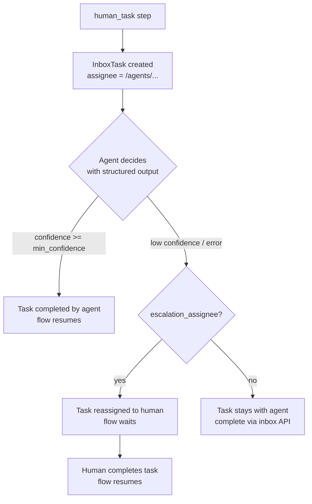

# Human-in-the-Loop & the Inbox

Inbox tasks are the primitive workflows use for approvals, input requests, reviews, and generic actions. A `human_task` step creates a task in the assignee's inbox and pauses the flow; completing the task resumes it. Assignees can be users **or AI agents** — agents decide tasks automatically (with escalation back to humans), and both complete tasks through the same API.

## Task Creation

When a human-task step executes, the engine creates a **`raisin:InboxTask`** node in the **`raisin:access_control`** workspace at:

```
{assignee}/inbox/task-{step_id}-{timestamp}
```

e.g. `/users/manager/inbox/task-approve-1718012345678`. Task properties include `task_type`, `title`, `description`, `assignee`, `priority`, `options` / `input_schema`, `status: pending`, `flow_instance_id`, `step_id`, `created_at`, and `due_in_seconds` + `due_at`. The flow then waits.

Task statuses: `pending | completed | expired | cancelled`.

### Task Types

| `task_type` | Purpose | Response payload convention |
|-------------|---------|------------------------------|
| `approval` | Choose among `options` | `{ action: "<option value>", comment?: string }` |
| `input` | Fill a form defined by `input_schema` | The value(s) matching the schema |
| `review` | Acknowledge a review | Any acknowledgement payload |
| `action` | Confirm an action was done | Any acknowledgement payload |

The step definition (titles, options, priorities, deadlines) is covered in the [Flow Definition Reference](./flow-definition.md#human-task-step).

## Completion and Resume

Complete a task via HTTP (the caller must be the assignee or an admin):

```
POST /api/inbox/{repo}/tasks/{task_id}/complete
{ "response": { "action": "approve", "comment": "LGTM" } }
```

or via the SDK:

```typescript
await inbox.completeTask(taskId, { action: 'approve', comment: 'LGTM' });
```

Completion marks the task `completed` (recording `completed_by`, `responded_at`, `response`) and **resumes the flow**. Downstream steps see the response as the human-task step's output (`steps.approve.*`) **and** as the `__human_response` variable:

```yaml
# A later 'or' rule:
condition: "__human_response.action == \"approve\""
```

:::note Chained human tasks
`__human_response` always holds the response of the **most recently completed** task. With several human tasks in one flow, gate on the specific step's output instead (`steps.quote_review.action`) — the step output carries the response plus `completed_by` and `task_path`.
:::

## The InboxApi (SDK)

```typescript
import { RaisinHttpClient, InboxApi } from '@raisindb/client';

const client = new RaisinHttpClient(BASE_URL, { tenantId: 'default' });
await client.authenticate({ username, password });

const inbox = new InboxApi(BASE_URL, repo, client.getAuthManager());

// List my pending tasks (pending first, then by priority and due time)
const { tasks } = await inbox.listTasks({ status: 'pending' });

// Admins can list another principal's inbox
const managerInbox = await inbox.listTasks({ status: 'pending', assignee: '/users/manager' });

// Get one task
const task = await inbox.getTask(taskId);

// Complete it — resumes the owning flow
const result = await inbox.completeTask(task.id, {
  action: 'approve',
  comment: 'Looks good!',
});
// result.flow?.instance_id / result.flow?.job_id when a flow was resumed
```

On a `Database` obtained with HTTP context, the same client is available as `db.inbox`:

```typescript
const { tasks } = await db.inbox.listTasks({ status: 'pending' });
```

### The `InboxTask` Shape

Key fields of a task returned by the API:

| Field | Description |
|-------|-------------|
| `id`, `path` | Node id and path (under the assignee's inbox) |
| `task_type`, `title`, `description` | What the task is |
| `assignee` | User or agent path |
| `status` | `pending` \| `completed` \| `expired` \| `cancelled` |
| `priority` | 1–5 (5 = highest) |
| `options` / `input_schema` | Approval choices / input form schema |
| `flow_instance_id`, `step_id` | The owning flow instance and step (absent for standalone tasks) |
| `due_at` | Due timestamp when `due_in_seconds` was set |
| `response`, `completed_by`, `responded_at` | Filled on completion |
| `escalated_from`, `escalation_reason` | Set when an agent assignee escalated the task |

## AI Agent as Assignee

If `assignee` resolves to a `raisin:AIAgent` node (in the functions workspace), the task is still created (full audit trail), then **evaluated by the agent immediately**:

```yaml
properties:
  step_type: human_task
  task_type: approval
  assignee: /agents/refund-approver
  min_confidence: 0.75
  escalation_assignee: /users/admin
  options:
    - { value: approve, label: Approve refund }
    - { value: reject,  label: Reject }
```

How it works:

- The agent receives the task (title, description, options/input_schema) plus the workflow context and must answer with a structured decision `{ decision | value, reasoning, confidence }`. The engine builds the JSON schema automatically from `options` / `input_schema`.
- **Confident decision** (`confidence >= min_confidence`, default **0.7**): the task is completed with `completed_by` set to the agent path, the response mirrors a human submission (`{ action, comment, confidence }` for approvals; `{ value, comment, confidence }` for input tasks), and the flow continues — `__human_response` works identically.
- **Low confidence, unparseable output, or AI error**: the task is **escalated** — reassigned to `escalation_assignee` (if configured) with audit fields `escalated_from`, `escalation_reason`, `escalated_at` — and the flow waits for the human like any other task. Without an `escalation_assignee`, the task stays assigned to the agent and must be completed via the inbox API.



Either way the completion API and the response shape are the same — the rest of the flow does not care whether a human or an agent decided.

The [`ai-approval-flow` example](./examples.md#ai-approval-flow) demonstrates the full escalation path end to end.

## Expiry

With `due_in_seconds`, the task gets an absolute `due_at` and the flow's wait gets a deadline. On expiry the task is marked `expired`; with a `timeout_edge` on the step the flow continues at that node, without one the flow fails. See [Error Handling — Timeouts](./error-handling.md#timeouts).

## In the Admin Console

The **Inbox** view (repository → Inbox) is the assignee-facing task list: approve / reject approval tasks, fill input forms, and acknowledge reviews. Completing a task there resumes the flow, exactly like the API.
