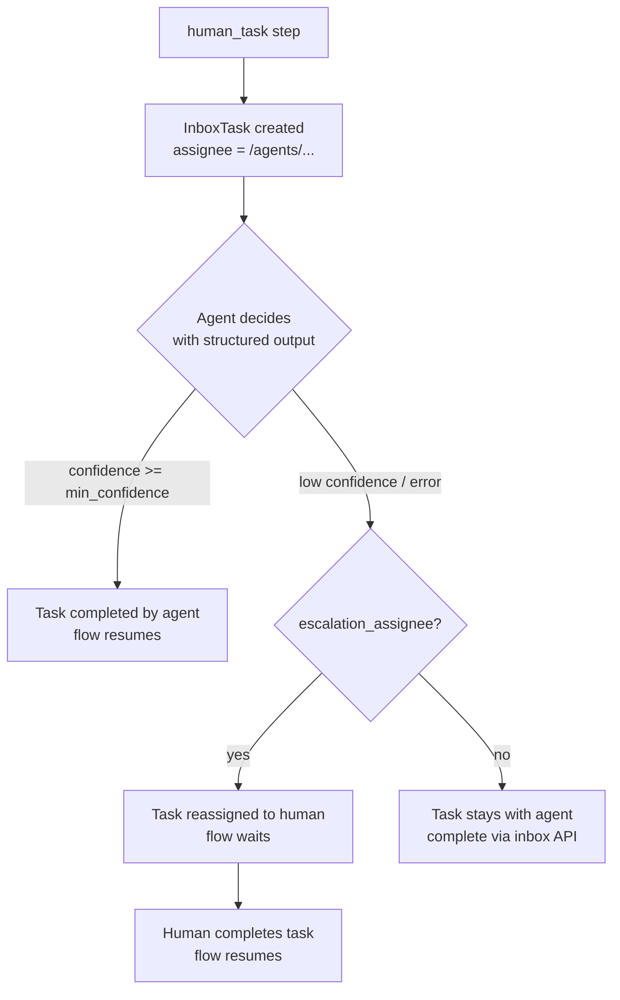

# Human-in-the-Loop and the Inbox

Inbox tasks are how a workflow asks a person for a decision, a form, a review, or a confirmation. A `human_task` step creates a task in the assignee's inbox and pauses the flow. Completing the task resumes it. The assignee can be a user, an AI agent, or a group, and every kind completes tasks through the same API.

## Task Creation

When a human-task step runs, the engine creates a `raisin:InboxTask` node in the `raisin:access_control` workspace at:

```
{assignee}/inbox/task-{step_id}-{instance_hash}-it{iteration}
```

for example `/users/admin/inbox/task-approve-4dc88efa448c-it0`. The hash is derived from the flow instance id, so each run gets its own task, and the iteration counter separates tasks created by the same step inside a loop. The task carries `task_type`, `title`, `description`, `assignee`, `priority`, `options` or `input_schema`, `data`, `status: pending`, `flow_instance_id`, `step_id`, `created_at`, and, when a deadline was set, `due_in_seconds` and `due_at`. The flow then waits.

Task statuses: `pending`, `completed`, `expired`, `cancelled`.

### Task Types

| `task_type` | Purpose | Response payload convention |
|-------------|---------|------------------------------|
| `approval` | Choose among `options` | `{ action: "<option value>", comment?: string }` |
| `input` | Fill a form defined by `input_schema` | The value(s) matching the schema |
| `review` | Acknowledge a review | Any acknowledgement payload |
| `action` | Confirm an action was done | Any acknowledgement payload |
| anything else | Application-defined | Any slug matching `[a-z][a-z0-9_-]{0,63}`; your own UI decides what it means |

The step definition (titles, options, priorities, deadlines, the `data` payload) is covered in the [Flow Definition Reference](./flow-definition.md#human-task-step).

## Completion and Resume

Complete a task over HTTP. The caller must be the assignee or an admin:

```
POST /api/inbox/{repo}/tasks/{task_id}/complete
{ "response": { "action": "approve", "comment": "LGTM" } }
```

```json
{
  "task_id": "IXjXHfYd2pE15yhZz9lzE",
  "task_path": "/users/admin/inbox/task-approve-4dc88efa448c-it0",
  "status": "completed",
  "flow": { "instance_id": "e878c91d-...", "job_id": "zjGAOS2QgwWsHh7MjPMwi" }
}
```

or with the SDK:

```typescript
await inbox.completeTask(taskId, { action: 'approve', comment: 'LGTM' });
```

Completion marks the task `completed` (recording `completed_by`, `responded_at`, and `response`) and resumes the flow. Downstream steps see the response as the step's output (`steps.approve.*`) and as the `__human_response` variable. Both contain the submitted payload plus `completed_by` and `task_path`:

```yaml
# A later 'or' rule:
condition: "__human_response.action == \"approve\""
```

:::note Chained human tasks
`__human_response` holds the response of the most recently completed task. With several human tasks in one flow, gate on the specific step's output instead (`steps.quote_review.action`).
:::

A flow waiting on a human task cannot be resumed through the generic `POST /api/flows/{repo}/instances/{id}/resume` endpoint unless the caller is an admin. The completion endpoint is the normal path, because it validates the assignee and records who decided.

## The InboxApi (SDK)

```typescript
import { RaisinHttpClient, InboxApi } from '@raisindb/client';

const client = new RaisinHttpClient(BASE_URL, { tenantId: 'default' });
await client.authenticate({ username, password });

const inbox = new InboxApi(BASE_URL, repo, client.getAuthManager());

// List my pending tasks (pending first, then by priority and due time)
const { tasks } = await inbox.listTasks({ status: 'pending' });

// Admins can list another principal's inbox, or every task with assignee '*'
const managerInbox = await inbox.listTasks({ status: 'pending', assignee: '/users/manager' });

// Get one task by id or path
const task = await inbox.getTask(taskId);

// Complete it; the owning flow resumes
const result = await inbox.completeTask(task.id, {
  action: 'approve',
  comment: 'Looks good!',
});
// result.flow?.instance_id and result.flow?.job_id when a flow was resumed
```

The list response is `{ assignee, count, tasks }`. On a `Database` obtained from `RaisinClient.database()`, the same client is available as `db.inbox`:

```typescript
const { tasks } = await db.inbox.listTasks({ status: 'pending' });
```

### The `InboxTask` Shape

Key fields of a task returned by the API:

| Field | Description |
|-------|-------------|
| `id`, `path` | Node id and path (under the assignee's inbox) |
| `task_type`, `title`, `description` | What the task is |
| `assignee` | User, agent, or group member path |
| `status` | `pending` \| `completed` \| `expired` \| `cancelled` |
| `priority` | 1 to 5, where 5 is highest |
| `options` / `input_schema` | Approval choices, or the input form schema |
| `data` | Structured payload set by the step for a custom UI |
| `flow_instance_id`, `step_id` | The owning flow instance and step (absent for tasks created outside a flow) |
| `due_at` | Due timestamp when `due_in_seconds` was set |
| `response`, `completed_by`, `responded_at` | Filled on completion |
| `escalated_from`, `escalation_reason`, `escalated_at` | Set when an agent assignee escalated the task |

## AI Agent as Assignee

If `assignee` resolves to a `raisin:AIAgent` node, the task is still created, so there is a full audit trail, and then evaluated by the agent immediately:

```yaml
properties:
  action: "Refund {{ input.amount }} CHF for {{ input.customer }}?"
  step_type: human_task
  task_type: approval
  assignee: /agents/refund-approver
  min_confidence: 0.75
  escalation_assignee: /users/admin
  options:
    - { value: approve, label: Approve refund }
    - { value: reject,  label: Reject }
```

How it works:

- The agent receives the task (title, description, options or input schema) plus the workflow context and answers with a structured decision `{ decision | value, reasoning, confidence }`. The engine builds the JSON schema from `options` or `input_schema`, so an approval decision is constrained to the declared option values.
- Confident decision (`confidence >= min_confidence`, default 0.7): the task is completed with `completed_by` set to the agent path, the response mirrors a human submission (`{ action, comment, confidence }` for approvals, `{ value, comment, confidence }` for input tasks), and the flow continues. `__human_response` works the same way.
- Low confidence, unparseable output, or an AI error: the task is escalated. It is reassigned to `escalation_assignee` when one is configured, with `escalated_from`, `escalation_reason`, and `escalated_at` recorded, and the flow waits for the person like any other task. Without an `escalation_assignee`, the task stays assigned to the agent and must be completed through the inbox API.



The completion API and the response shape are the same either way. The rest of the flow does not care whether a person or an agent decided. The [`ai-approval-flow` example](./examples.md#ai-approval-flow) demonstrates the escalation path end to end.

## Group Assignees

If `assignee` resolves to a `raisin:Group` node, the engine creates one correlated task in the inbox of every user who is a member of that group (users whose `groups` property names the group). The step's `group_completion` decides when the wait is satisfied:

```yaml
properties:
  action: Sign off the release
  step_type: human_task
  task_type: approval
  assignee: /groups/reviewers
  group_completion: quorum          # any (default) | all | quorum
  group_quorum: 2                   # qualifying responses needed for quorum
  response_condition: 'response.action == "approve"'   # optional: which responses count
  options:
    - { value: approve, label: Approve }
    - { value: reject,  label: Reject }
```

With `any` the first response completes the wait. With `all` every member must respond, and with `quorum` the wait completes after `group_quorum` qualifying responses. A `response_condition` is a REL expression over `response` (and `responses`, the answers so far) that decides whether a member's answer counts towards the policy. The flow resumes once, with the qualifying response at the top level and a `group` summary listing every member's answer attached to it. Remaining pending tasks are cancelled with `cancellation_reason: group_completed`.

## Expiry

With `due_in_seconds`, the task gets an absolute `due_at` and the flow's wait gets a deadline. On expiry the task is marked `expired`. With a `timeout_edge` on the step the flow continues at that node; without one the flow fails. See [Error Handling: Timeouts](./error-handling.md#timeouts).

## In the Admin Console

The **Inbox** view (repository sidebar) is the assignee's task list: approve or reject approval tasks, fill input forms, and acknowledge reviews. Completing a task there resumes the flow, exactly like the API.
