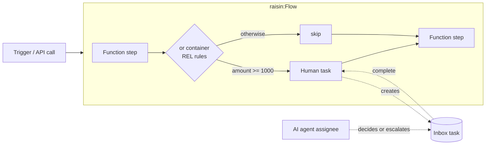

# Workflows Overview

A RaisinDB workflow is a `raisin:Flow` node whose `workflow_data` property lists the steps to run. A step can call a function, call an AI agent, pause for a person, wait for a timer or event, or run another flow. The engine executes the steps in order, pauses whenever a step has to wait (a queued function, an inbox task, a timer, a child flow), and resumes when the awaited thing arrives. Functions, agents, and people are all steps, so a flow can mix them freely.



## Core Concepts

| Concept | What it is |
|---------|-----------|
| **Flow** | A `raisin:Flow` node in the `functions` workspace. Its `workflow_data` property holds the definition. |
| **Step** | A `raisin:FlowStep`: a function call, an AI agent call, a human task, a wait, a decision, a sub-flow, or a chat session. |
| **Container** | A `raisin:FlowContainer` grouping steps: `and` (sequential), `or` (routed by REL rules, optionally by an agent), `parallel` (fork and join), `loop` (repeat the children), `ai_sequence` (agentic tool loop), `competition` (competing agents judged by a referee). |
| **Inbox** | The human-in-the-loop primitive. A `human_task` step creates a `raisin:InboxTask` in the assignee's inbox and pauses the flow. Completing the task resumes it. |
| **Trigger** | A `raisin:Trigger` node that starts a flow when a matching node event occurs. |
| **Instance** | One execution of a flow, with a status, variables, and an event stream. |

## The Authoring Format

Flows are written in the designer format, which is the same format the admin console's visual designer reads and writes. Three rules define it:

- Every node is `node_type: raisin:FlowStep` or `node_type: raisin:FlowContainer`.
- There are no explicit start and end nodes. The engine adds them.
- Execution order is the array order of `nodes`, and of each container's `children`. The engine lowers the tree into a flat graph, chaining each node to the next sibling.

A minimal flow with a single approval step:

```yaml
node_type: raisin:Flow
properties:
  title: Order Approval
  name: order-approval
  enabled: true
  workflow_data:
    version: 1
    error_strategy: fail_fast
    nodes:
      - id: approve
        node_type: raisin:FlowStep
        properties:
          action: Approve order {{ input.order_id }}
          step_type: human_task
          task_type: approval
          assignee: /users/manager
          options:
            - { value: approve, label: Approve, style: success }
            - { value: reject,  label: Reject,  style: danger }
```

Template expressions such as `{{ input.order_id }}` resolve against the flow context. See [Data and Templates](./data-and-templates.md). The `raisindb flow doctor` command checks a definition statically before you deploy it, and `raisindb flow explain` prints the graph the engine will run.

## Execution Lifecycle

A flow instance moves through these statuses:

```
pending → running → waiting ⇄ running → completed | failed | cancelled | rolled_back
```

`waiting` covers human tasks, queued functions, timers, chat turns, child flows, and retry backoff. A flow that fails after some steps registered [saga compensations](./error-handling.md#saga-compensation-compensation_ref) runs those compensations and ends as `rolled_back`.

## Running a Flow

Over HTTP:

```bash
curl -X POST http://localhost:8081/api/flows/my-repo/run \
  -H "Authorization: Bearer $TOKEN" -H 'content-type: application/json' \
  -d '{"flow_path":"/flows/order-approval","input":{"order_id":"ORD-1"}}'
```

```json
{"instance_id":"e878c91d-eacd-46b4-9ae1-a5c02cdb5c4f","job_id":"3wBCWhOucDoHfZg-3Dv0d","status":"queued"}
```

With the JavaScript SDK:

```typescript
import { RaisinHttpClient, FlowClient } from '@raisindb/client';

const client = new RaisinHttpClient(BASE_URL, { tenantId: 'default' });
await client.authenticate({ username, password });

const flows = FlowClient.fromHttpClient(client, BASE_URL, repo);
const { instance_id } = await flows.run('/flows/order-approval', { order_id: 'ORD-1' });
```

Follow progress by polling `getInstanceStatus`, by streaming events with `createEventStream`, or in the admin console's Flow Execution Monitor.

## In the Admin Console

- **Flows** (repository sidebar): list, create, and open flows in the visual designer. The Run dialog starts a flow with a JSON input and shows the live event stream.
- **Inbox** (repository sidebar): the assignee's task list. Approving, rejecting, or filling in a form completes the task and resumes the flow.
- **Flow Execution Monitor** (management area, `flows`): every instance with its status, step timeline, variables, and errors, plus cancel and delete.

## Where to Go Next

- [Quickstart](./quickstart.md): deploy and run a human-in-the-loop approval flow end to end
- [Flow Definition Reference](./flow-definition.md): every step type, container type, and property
- [Data and Templates](./data-and-templates.md): template expressions and REL conditions
- [Error Handling and Compensation](./error-handling.md): retries, error edges, sagas
- [Human-in-the-Loop and the Inbox](./human-in-the-loop.md): inbox tasks, agent assignees, escalation
- [AI Steps](./ai-steps.md): agent steps and agentic tool loops
- [Triggers](./triggers.md): start flows on node events
- [Examples](./examples.md): complete runnable example apps
