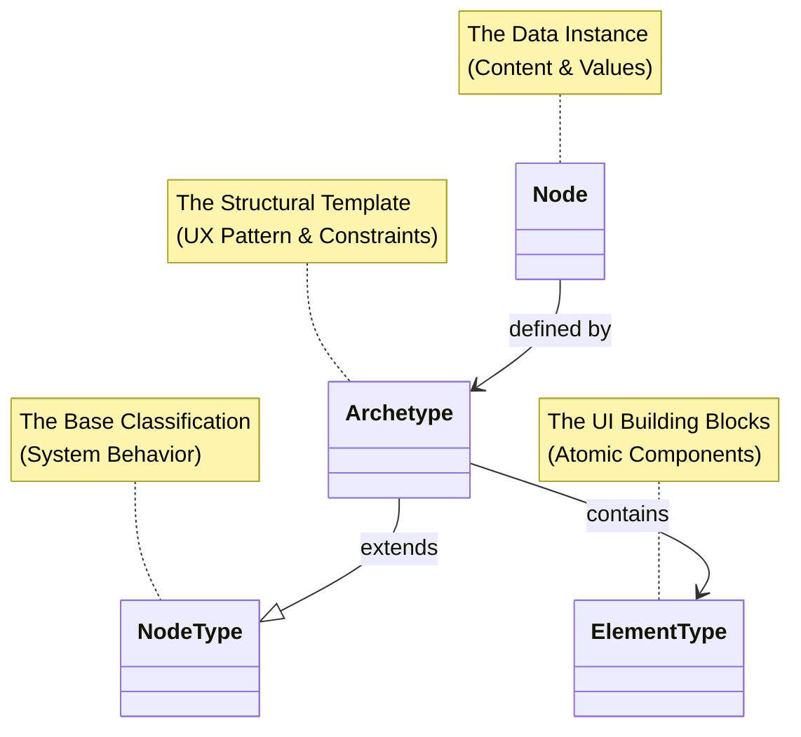
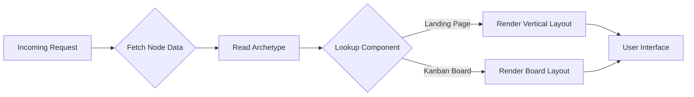

# Data-Centric Application Design (DCAD)

Data-Centric Application Design (DCAD) is a paradigm that shifts the focus of software development from iterating on complex UI logic to systematically improving the quality, consistency, and structure of the data itself.

In traditional development, the “page layout” or “navigation” is often hard-coded into application logic, with data piped in as an afterthought. DCAD inverts this model: it treats **data as a first-class citizen**.

The application structure—functionality, flow, and user experience—is defined entirely within a hierarchical **graph data structure**.

The result is an application that is **schema-driven**: the code effectively becomes a “browser” that interprets your data schema to render the experience. This makes your application dynamically flexible for humans and natively readable for AI agents.

## The core pillars of DCAD

1. **Data as the single source of truth**   
   In traditional MVC (Model–View–Controller), the view often dictates what data is fetched. In DCAD, the **data structure dictates the view**.
   
   The application shell (layout, navigation, routing) is subservient to the data schema. If the schema changes, the application adapts automatically.

2. **Unified graph structure**   
   You define the “what” (content) and the “how” (flow) in the same structure. By using graph data structures, the relationships between data nodes naturally define the navigation paths and hierarchy of the user interface.

3. **Schema-driven dynamic UX**   
   The UI is not hard-coded—it is interpreted. If you switch a node’s archetype from a “Landing Page” to a “Kanban Board,” the UX pattern shifts instantly to accommodate the new interaction model (without requiring a frontend deployment).

4. **Agent-native readability**   
   Because the application is built on strict, self-describing schemas rather than opaque UI logic, AI agents can easily “read,” navigate, and interact with the application.
   
   The schema acts as a universal API for both your frontend and your AI tools.

## The DCAD architecture: how it works

To implement DCAD, we separate the content (the **instance**) from the structure (the **definition**) using a four-part hierarchy. This ensures strict typing while allowing flexible composition.

### 1) Node (the data instance)

This is the actual content stored in your database. It represents a specific entity in your application (for example, “The Home Page” or “Q3 Marketing Board”).

- **Role:** Holds specific values (titles, descriptions, relationships) but contains no logic.
- **Key concept:** It is purely a data vessel that points to an **Archetype** to know how to behave.

### 2) NodeType (the base classification)

The high-level abstract category of a node. It defines the “laws of physics” for that data object within the system.

- **Role:** Defines system-level capabilities.
- **Examples:**
  - Is this versionable?
  - Is this publishable to the web?
  - Is this indexable for search engines?

### 3) Archetype (the structural template)

The Archetype is the bridge between raw data and the user experience. It extends a `NodeType` to define a specific UX pattern.

It dictates what fields exist and—crucially—which specific `ElementType`s are allowed in its content areas.

**Example A: Landing Page archetype**
- **Structure:** A vertical stack of content blocks.
- **Rules:** Only allows marketing elements (Hero, Features, Text).

**Example B: Kanban Board archetype**
- **Structure:** A horizontal set of columns containing draggable cards.
- **Rules:** Only allows Column and Card elements.

### 4) ElementType (the UI building blocks)

These are the atomic units of your interface. They are reusable, self-contained schema definitions that map directly to UI components.

- **Examples:** Hero Section, Feature Grid, Kanban Card, Pricing Table.

## Implementation: the rendering engine

In a DCAD approach, your frontend application acts as a rendering engine. It does not hard-code routes like `/home` or `/dashboard`. Instead, it behaves like a browser interpreting HTML—except it interprets your custom schema.

### The schema map

The application maintains a “registry” or “map”: a simple dictionary that links the name of an archetype (for example, `launchpad:KanbanBoard`) to the code component that knows how to render it.

### The dynamic router

1. **Receive data:** Load `Node` data based on the URL.
2. **Identify archetype:** Read the `archetype` property in the data.
3. **Resolve component:** Check the registry to find the matching component.
4. **Render:** Pass the data into that component.

If the archetype changes in the database, the application automatically switches the entire layout on the next load.

## Why this matters for AI

The biggest advantage of DCAD shows up when integrating AI agents.

### Context window efficiency

Because the UI is separated from the data, you can feed an AI agent the raw data structure. The agent understands the exact structure of the page without needing to parse thousands of lines of HTML or CSS.

### Hallucination prevention

The archetype definition acts as a strict constraint. When an AI generates content, it is bound by the schema.

It can’t “invent” a UI element that doesn’t exist—it must choose from the `allowed_element_types` defined in your structure.

### Self-healing

If the UI pattern needs to change, update the archetype definition. The AI agent, reading the schema, immediately understands the new rules of engagement without retraining.