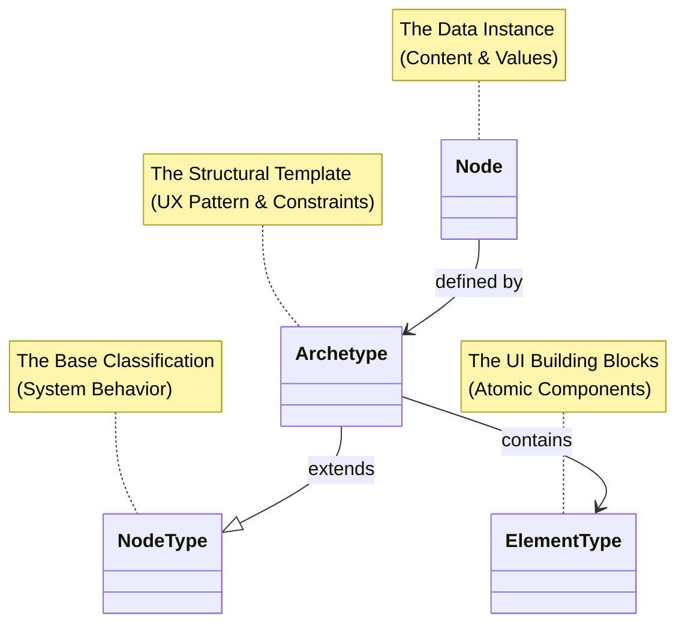
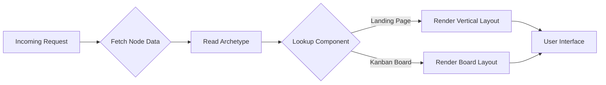

# Data-Centric Application Design (DCAD)

Data-Centric Application Design (DCAD) shifts the focus of software development from iterating on UI logic to improving the quality, consistency, and structure of the data itself.

In traditional development, the page layout or navigation is hard-coded into application logic, with data piped in afterwards. DCAD inverts this model: it treats data as a first-class citizen.

The application structure (functionality, flow, and user experience) is defined within a hierarchical graph data structure.

The result is a schema-driven application: the code becomes a "browser" that interprets your data schema to render the experience. This makes the application flexible for humans and readable for AI agents.

## The core pillars of DCAD

1. **Data as the single source of truth**
   In traditional MVC (Model, View, Controller), the view often dictates what data is fetched. In DCAD, the data structure dictates the view.

   The application shell (layout, navigation, routing) follows the data schema. If the schema changes, the application adapts.

2. **Unified graph structure**
   You define the "what" (content) and the "how" (flow) in the same structure. The relationships between data nodes define the navigation paths and hierarchy of the user interface.

3. **Schema-driven dynamic UX**
   The UI is interpreted, not hard-coded. If you switch a node's archetype from "Landing Page" to "Kanban Board", the UX pattern changes to the new interaction model without a frontend deployment.

4. **Agent-native readability**
   Because the application is built on self-describing schemas rather than opaque UI logic, AI agents can read, navigate, and interact with it.

   The schema acts as a shared API for both your frontend and your AI tools.

## The DCAD architecture: how it works

DCAD separates the content (the instance) from the structure (the definition) using a four-part hierarchy. This gives you strict typing while allowing flexible composition.

```mermaid
classDiagram
  class Node
  class NodeType
  class Archetype
  class ElementType

  note for Node "The Data Instance
  (Content & Values)"
  note for NodeType "The Base Classification
  (System Behavior)"
  note for Archetype "The Structural Template
  (UX Pattern & Constraints)"
  note for ElementType "The UI Building Blocks
  (Atomic Components)"

  Node --> Archetype : defined by
  Archetype --|> NodeType : extends
  Archetype --> ElementType : contains
```

### 1) Node (the data instance)

The actual content stored in your database. It represents a specific entity in your application (for example, "The Home Page" or "Q3 Marketing Board").

- **Role:** Holds specific values (titles, descriptions, relationships) but contains no logic.
- **Key concept:** A data vessel that points to an Archetype to know how to behave. In RaisinDB a node carries `node_type`, an optional `archetype`, and a `properties` object.

### 2) NodeType (the base classification)

The high-level category of a node. It defines the rules for that data object within the system.

- **Role:** Defines system-level capabilities and the typed properties.
- **Examples:**
  - Is this versionable?
  - Is this publishable?
  - Is this indexable for search?

### 3) Archetype (the structural template)

The Archetype is the bridge between raw data and the user experience. It extends a NodeType (`base_node_type`) to define a specific UX pattern.

It dictates which fields exist and which ElementTypes are allowed in its content areas (`allowed_element_types` on a section field).

**Example A: Landing Page archetype**
- **Structure:** A vertical stack of content blocks.
- **Rules:** Only allows marketing elements (Hero, Features, Text).

**Example B: Kanban Board archetype**
- **Structure:** A horizontal set of columns containing draggable cards.
- **Rules:** Only allows Column and Card elements.

### 4) ElementType (the UI building blocks)

The atomic units of your interface. They are reusable, self-contained schema definitions that map to UI components.

- **Examples:** Hero Section, Feature Grid, Kanban Card, Pricing Table.

## Implementation: the rendering engine

In a DCAD application the frontend acts as a rendering engine. It does not hard-code routes like `/home` or `/dashboard`. It behaves like a browser interpreting HTML, except that it interprets your schema.

```mermaid
graph LR
    A[Incoming Request] --> B{Fetch Node Data}
    B --> C[Read Archetype]
    C --> D{Lookup Component}
    D -->|Landing Page| E[Render Vertical Layout]
    D -->|Kanban Board| F[Render Board Layout]
    E --> G[User Interface]
    F --> G
```

### The schema map

The application maintains a registry: a dictionary that links the name of an archetype (for example, `launchpad:KanbanBoard`) to the component that knows how to render it.

### The dynamic router

1. **Receive data:** Load the node based on the URL.
2. **Identify archetype:** Read the `archetype` property in the data.
3. **Resolve component:** Look up the matching component in the registry.
4. **Render:** Pass the data into that component.

If the archetype changes in the database, the application switches the layout on the next load.

## Why this matters for AI

The biggest advantage of DCAD shows up when integrating AI agents.

### Context window efficiency

Because the UI is separated from the data, you can feed an AI agent the raw data structure. The agent understands the structure of the page without parsing HTML or CSS.

### Constrained generation

The archetype definition acts as a constraint. When an AI generates content, it is bound by the schema.

It cannot invent a UI element that does not exist; it must choose from the `allowed_element_types` defined in your structure.

### Adapting to change

If the UI pattern needs to change, update the archetype definition. An agent that reads the schema sees the new rules without any retraining.

The [Kanban Board tutorial](../kanaban-board) puts these four parts into files you can deploy.
