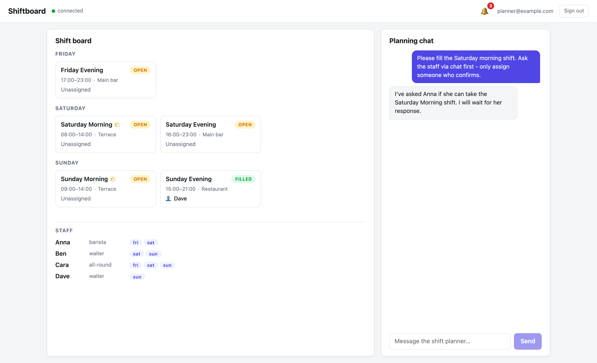
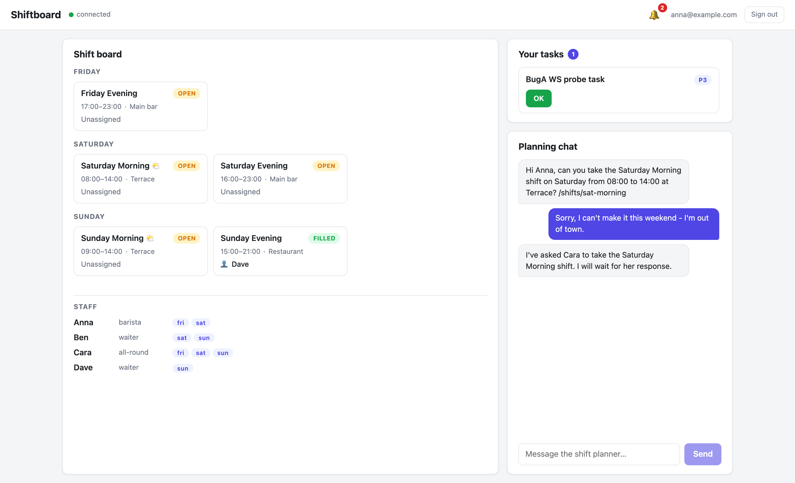
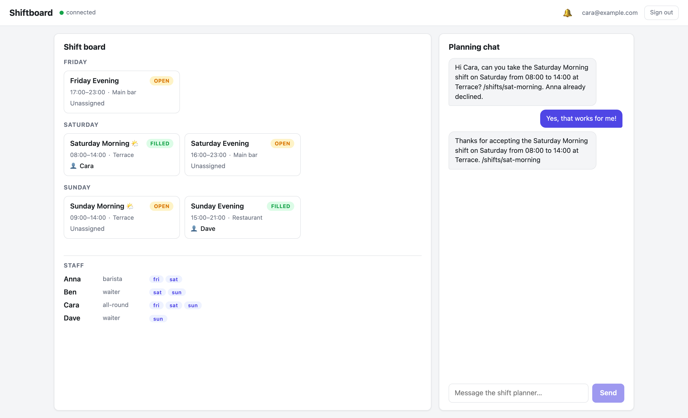

# Part 4: The Agent Coordinates Your Staff

**What you'll have at the end of this part:** the agent filling a shift by *negotiating* — it messages staff members in their own chats, handles a decline by asking the next candidate, assigns only after a confirmation, and reports back to the manager. Plus one honest lesson about the limits of chat-only coordination.

Register the staff accounts if you haven't (Part 1 style):

```bash
raisindb user register anna@example.com --password 'Staff12345!' \
  --display-name Anna --repo shiftboard --exists-ok
raisindb user register cara@example.com --password 'Staff12345!' \
  --display-name Cara --repo shiftboard --exists-ok
```

Staff are **real users with their own logins**. The staff nodes in `staffing` carry an `email` property; `list-staff` reports `reachable: true` for anyone whose email belongs to a registered identity user — that's how the agent connects board staff to chat addresses.

## The scenario

1. The **manager** writes: *"Please fill the Saturday morning shift. Ask the staff via chat first — only assign someone who confirms."*
2. The **agent** checks the board (`list-shifts`, `list-staff`), picks one available + reachable candidate, and messages her via `message-staff` — then tells the manager who it asked.
3. **Anna declines** in her own chat session. Her reply lands in the agent's inbox thread and re-triggers it: it asks the next candidate, *mentioning that Anna declined*.
4. **Cara accepts** → the agent runs `assign-shift` (the board card fills live) and sends the manager a confirmation.


*The manager's ask. The agent reports which candidate it contacted instead of assigning blindly.*


*Anna's own chat session: the agent's request includes the shift title, time, location, and node path.*


*Cara accepts; the agent assigns the shift and the manager's board card fills live.*

## How `message-staff` works

The tool resolves the recipient by email, then drops a `raisin:Message` node into the **agent's outbox** in the `ai` workspace — the builtin messaging pipeline delivers it into the recipient's inbox conversation (creating it if needed). When the person replies, the reply is delivered into the agent's inbox and the agent runs again in that thread. Trimmed from `message-staff/index.js`:

```javascript
// 1. Resolve the recipient user by email in the access-control workspace.
const users = await raisin.sql.query(
  "SELECT id, path, properties FROM 'raisin:access_control' " +
    "WHERE node_type = 'raisin:User' AND properties->>'email'::String = $1 LIMIT 1",
  [staff_email],
);
if (!users.length) {
  // Graceful error so the agent can pick another candidate instead of failing
  return { error: 'No chat user found with email ' + staff_email + ' ...' };
}

// ... reuse an existing agent<->user conversation if one exists ...

// 4. Drop the message into the agent's outbox - the process-chat trigger
//    delivers it to the user (and mirrors it into both conversations).
await raisin.nodes.create('ai', agentHomePath + '/outbox', {
  slug, name: slug,
  node_type: 'raisin:Message',
  properties: {
    role: 'assistant',
    message_type: 'chat',
    status: 'pending',
    recipient_id: userId,
    body: { message_text: message, thread_id: conversationId, ... },
    conversation_id: conversationId,
  },
});
```

Note the graceful `{ error: ... }` return instead of a throw — the agent reads it and picks another candidate, instead of the whole turn failing.

## Each thread must be self-sufficient

A staff member's reply arrives hours later in *their* thread, with none of the manager-thread context. The system prompt forces the agent to carry the state in the messages themselves:

```
4. Restate which shift you are talking about (title, day, time, shift
   path) in every message you send, so each thread keeps its context.
```

That is why Anna's message contains *"the Saturday Morning shift, 08:00-14:00, Terrace, /shifts/sat-morning"* — and why the follow-up to Cara mentions which colleague already declined. The thread **is** the state.

## The honest lesson

During development, the manager asked a harmless status question — *"how does the board look?"* — and the agent, seeing an earlier "fill this shift" instruction in one thread but unaware a staff member had confirmed in another, **reassigned a filled shift**. Cross-thread blindness: each conversation only sees itself.

The fix was a protocol rule in the system prompt:

```
- A shift that is already filled stays as it is - never reassign or
  overwrite an existing assignee unless the manager explicitly asks
  you to change it. For status questions, report the live board state
  from list-shifts; do not take any action.
```

That works — but notice what it is: a *prompt* defending against a *state* problem. The coordination state (who was asked, who declined, what's pending) lives only in LLM context windows scattered across threads. Part 5 moves that state where it belongs: into a durable workflow engine with explicit steps, deadlines, and an audit trail.

## Prove it headlessly

`negotiation-test.mjs` scripts exactly this scenario with three separate SDK sessions (manager, Anna, Cara) and asserts every hop — including the final node state and the manager confirmation:

```bash
npm run negotiation-test     # ~6 Groq turns; run sparingly
```

It is order-agnostic: it detects which staff member the agent asked first and replies accordingly — the *first* asked declines, the *second* accepts, and the test asserts `/shifts/sat-morning` ends up `filled` by the accepter.

**Next:** [Part 5 — Same scenario as a durable workflow](./durable-workflow)
