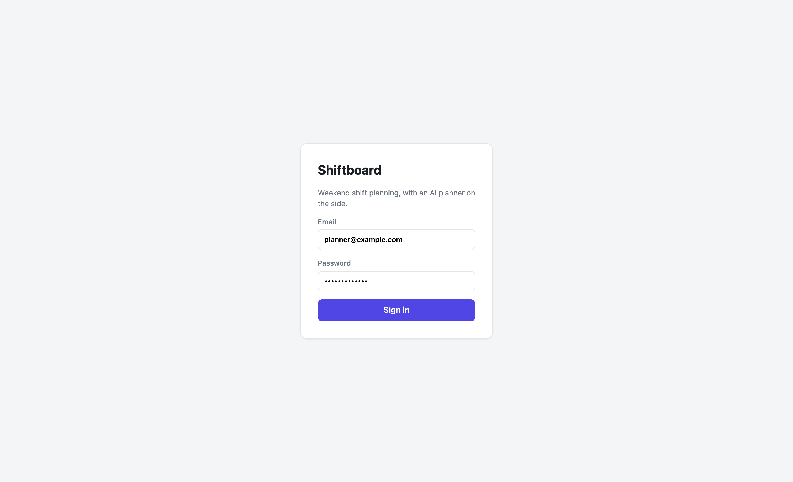
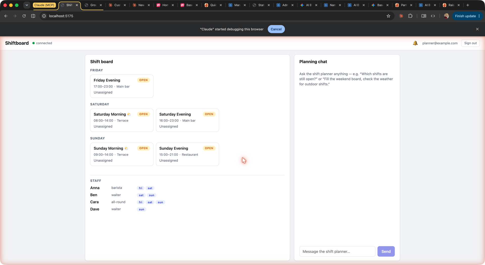
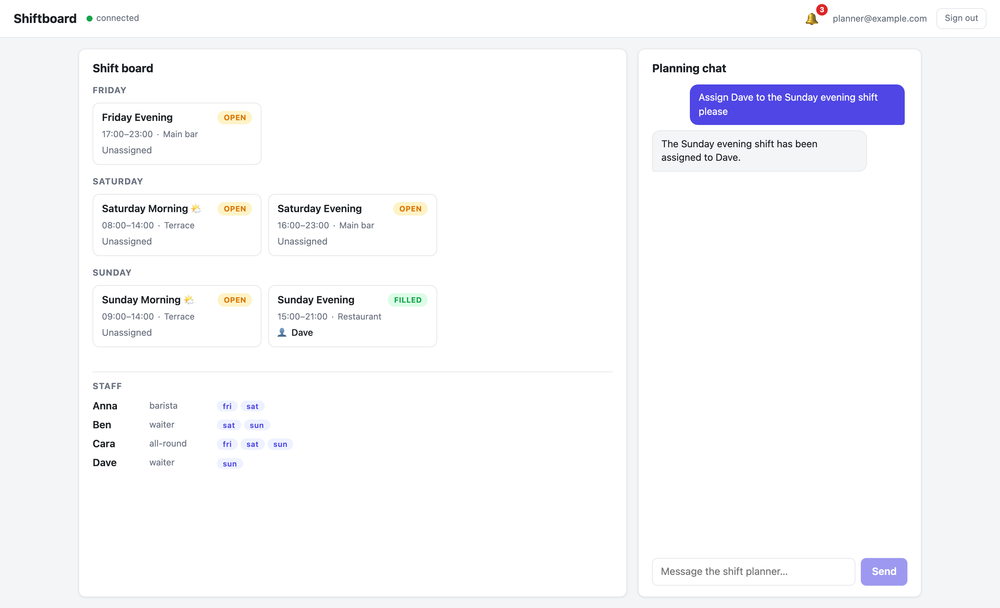

# Part 2: Chat with the Agent + Tools That Act

**What you'll have at the end of this part:** a working understanding of the three pieces behind "tell the AI to assign Ben, watch the board change" — the agent node, its tool functions, and the token accounting that makes it operable.

Log in to the frontend (or use the admin console's Test Chat) as `planner@example.com` and try:

> *Assign Ben to the Saturday evening shift, please.*

The agent calls `assign-shift`, the node `/shifts/sat-evening` flips to `status: filled`, `assignee: Ben` — and in Part 3 you'll see the board card update live.


*The demo login — SSR form post, no client JavaScript required.*


*The shift board with the planning chat. Both render from the same nodes.*

## The agent is a node

The shift-planner is a `raisin:AIAgent` node, installed by the package at `/agents/shift-planner` in the `functions` workspace. Trimmed from `package/content/functions/agents/shift-planner/.node.yaml`:

```yaml
node_type: raisin:AIAgent
properties:
  title: Shift Planner
  system_prompt: |-
    You are the shift planning assistant for a small cafe. You help the
    manager fill the weekend shift board, and you coordinate with staff
    directly over chat.

    You have tools to list shifts, list staff (role, availability, email),
    assign or clear shift assignments, check the weather for outdoor
    shifts, and send a chat message to a person by email (message-staff).
    # ... coordination protocol, see Part 4 ...
  provider: groq
  model: llama-3.3-70b-versatile
  temperature: 0.2
  max_tokens: 1024
  execution_mode: automatic
  execution_context: system
  tools:
    - /lib/shiftboard/list-shifts
    - /lib/shiftboard/list-staff
    - /lib/shiftboard/assign-shift
    - /lib/shiftboard/message-staff
    - /lib/shiftboard/start-shift-fill
    - /lib/raisin/ai/weather
```

`tools` is a list of function node paths. Five are shipped by this package; `/lib/raisin/ai/weather` comes from the builtin `ai-tools` package — tools compose across packages.

## A tool is a `raisin:Function` with an input schema

Each tool is a function node whose `input_schema` (JSON Schema) becomes the tool definition the LLM sees. `list-shifts/.node.yaml`, trimmed:

```yaml
node_type: raisin:Function
properties:
  name: list-shifts
  description: >
    List the shifts on the staffing board with day, time, location, whether
    the spot is outdoor, status (open/filled) and current assignee.
  language: javascript
  execution_mode: async
  entry_file: index.js:handler
  input_schema:
    type: object
    additionalProperties: false
    properties:
      day:
        type: string
        enum: [friday, saturday, sunday]
      status:
        type: string
        enum: [open, filled]
```

The implementation is the sibling `index.js`. Here is `assign-shift` — the tool that actually changes the board:

```javascript
async function handler(input) {
  const { shift_path, staff_name } = input || {};
  if (!shift_path || !shift_path.startsWith('/shifts/')) {
    throw new Error('shift_path is required and must start with /shifts/');
  }

  // raisin.sql.query returns the row array directly in the function runtime
  const existing = await raisin.sql.query(
    "SELECT path, properties FROM 'staffing' WHERE path = $1",
    [shift_path],
  );
  const row = existing[0];
  if (!row) throw new Error('shift not found: ' + shift_path);

  const props = row.properties || {};
  const assignee = staff_name && String(staff_name).trim() ? String(staff_name).trim() : null;
  props.assignee = assignee;
  props.status = assignee ? 'filled' : 'open';

  await raisin.sql.execute(
    "UPDATE 'staffing' SET properties = $1::jsonb WHERE path = $2",
    [JSON.stringify(props), shift_path],
  );

  return { shift_path, assignee, status: props.status };
}
```


*Tool-call badges stream into the chat while functions run; the board card flashes when the node updates.*

:::warning The function-runtime SQL trap
In the **function runtime**, `raisin.sql.query(...)` returns the **row array directly**. In the **client SDK**, `db.executeSql(...)` returns `{ rows }`. The same SQL string, two different shapes — `rows[0]` in a function, `result.rows?.[0]` in the browser/Node client. Every tool in this example carries a comment to that effect; copy the habit.
:::

## Token accounting

Every model call the agent makes is recorded as a `raisin:AICostRecord` node under the agent-side conversation in the `ai` workspace. The smoke test (`smoke.mjs`) verifies it with an admin session — regular users can't read the agent's side (row-level security):

```javascript
const costRows = await adminDb.executeSql(
  `SELECT path, properties FROM 'ai'
   WHERE DESCENDANT_OF($1) AND node_type = 'raisin:AICostRecord'`,
  [agentConv],   // /agents/shift-planner/inbox/chats/<conversation>
);
let inputTokens = 0, outputTokens = 0;
for (const row of costRows.rows ?? []) {
  inputTokens += row.properties?.input_tokens ?? 0;
  outputTokens += row.properties?.output_tokens ?? 0;
}
```

Cost records carry `input_tokens`, `output_tokens`, and `model` — your usage dashboard is one SQL query away.

Long conversations are kept in budget by properties on the agent node itself — declared in the package, like everything else (`package/content/functions/agents/shift-planner/.node.yaml`):

```yaml
node_type: raisin:AIAgent
properties:
  provider: groq
  model: llama-3.3-70b-versatile
  # ... system_prompt, tools ...

  # Token safeguards (all optional)
  auto_compact: true               # summarize old turns automatically
  compact_threshold_messages: 30   # when to compact
  max_history_messages: 50         # hard window for the prompt
  max_conversation_tokens: 50000   # hard budget per conversation
```

When a conversation crosses the threshold, the agent-handler summarizes older messages into a persisted `raisin:AICompaction` node (facts survive, tokens don't); when it exceeds the budget, the agent answers with a polite "start a new conversation" instead of failing or silently truncating. The repeatable proof for both behaviors is `npm run compaction-test` in the example.

## Try it headlessly

`smoke.mjs` proves the whole pipeline without a browser (costs a few Groq tokens):

```bash
cd examples/shiftboard
npm install
npm run smoke
```

It sends two chat turns over the SDK, asserts the assistant streamed a reply, asserts `/shifts/sat-evening` was really updated (`assignee` includes "ben", `status: filled`), and asserts cost records exist.

**Next:** [Part 3 — A real app: SSR, live board, inbox notifications](./ssr-live-board)
