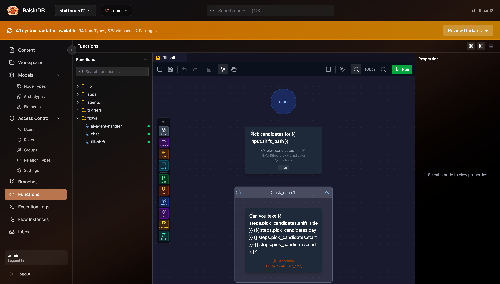
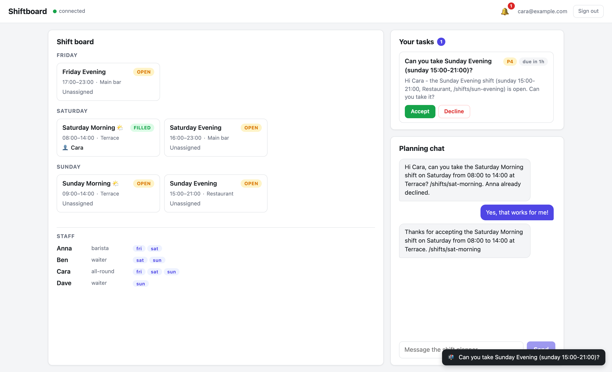
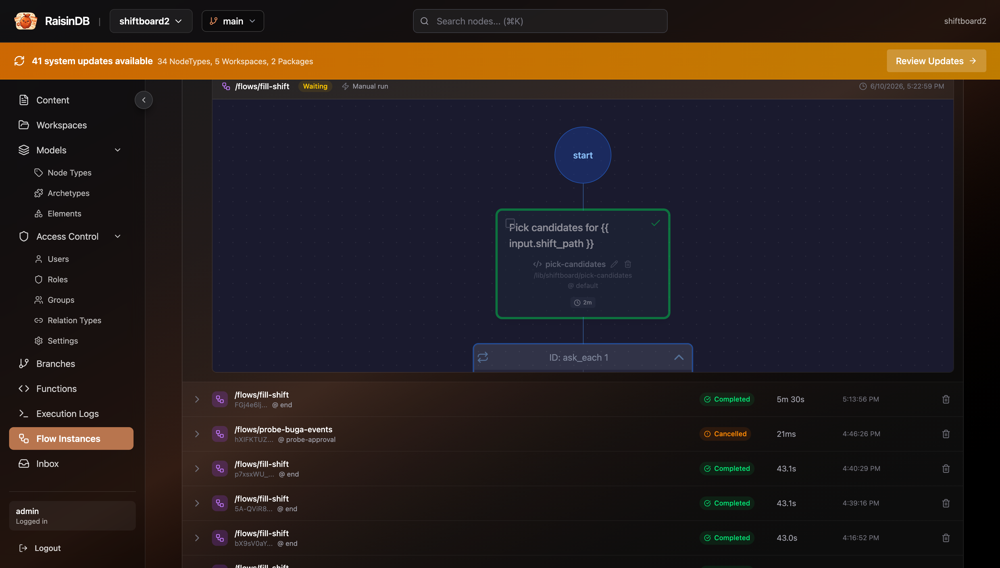

# Part 5: Same Scenario as a Durable Workflow

**What you'll have at the end of this part:** the fill-a-shift coordination from Part 4 running as a `raisin:Flow` — candidates asked one by one via inbox approval tasks with accept/decline buttons and deadlines, the first accepter assigned, the manager notified — plus the task panel wired into the app, and the agent starting the workflow conversationally.

Chat coordination works, but the process state lives in LLM context. The workflow variant moves the *process* into the engine: it survives restarts, enforces deadlines, and leaves an audit trail — every ask is a node with who/when/what answered.

## The flow definition

`/flows/fill-shift` is a `raisin:Flow` node; its `workflow_data` is the designer format. From `package/content/functions/flows/fill-shift/.node.yaml` (comments trimmed):

```yaml
node_type: raisin:Flow
properties:
  name: fill-shift
  title: Fill Shift
  enabled: true
  workflow_data:
    version: 1
    error_strategy: fail_fast
    nodes:
      # 1. Who could take this shift? Available on the day + registered
      #    identity user (their home path becomes the task assignee).
      - id: pick_candidates
        node_type: raisin:FlowStep
        properties:
          action: "Pick candidates for {{ input.shift_path }}"
          function_ref: /lib/shiftboard/pick-candidates
          arguments:
            shift_path: "${input.shift_path}"
          timeout_ms: 120000

      # 2. Ask each candidate in order; `until` stops after the first accept.
      - id: ask_each
        node_type: raisin:FlowContainer
        container_type: loop
        loop:
          over: "${steps.pick_candidates.candidates}"
          item: candidate
          index: candidate_index
          max_iterations: 10
          until: 'steps.ask_candidate.action == "accept"'
        children:
          - id: ask_candidate
            node_type: raisin:FlowStep
            properties:
              action: "Can you take {{ steps.pick_candidates.shift_title }} ({{ steps.pick_candidates.day }} {{ steps.pick_candidates.start }}-{{ steps.pick_candidates.end }})?"
              step_type: human_task
              task_type: approval
              assignee: "${candidate.user_path}"
              task_description: >-
                Hi {{ candidate.name }} - the {{ steps.pick_candidates.shift_title }}
                shift ({{ steps.pick_candidates.day }}
                {{ steps.pick_candidates.start }}-{{ steps.pick_candidates.end }},
                {{ steps.pick_candidates.location }},
                {{ input.shift_path }}) is open. Can you take it?
              priority: 4
              due_in_seconds: 300
              timeout_edge: resolve_accepter
              options:
                - { value: accept, label: Accept, style: success }
                - { value: decline, label: Decline, style: danger }

      # 3. Pair loop results with the candidate list: who accepted/declined.
      - id: resolve_accepter
        node_type: raisin:FlowStep
        properties:
          action: Determine who accepted
          function_ref: /lib/shiftboard/resolve-accepter
          arguments:
            candidates: "${steps.pick_candidates.candidates}"
            results: "${steps.ask_each.results}"
            shift_path: "${input.shift_path}"
          timeout_ms: 120000

      # 4. Somebody accepted -> assign them; no match skips the container.
      - id: assign_or_report
        node_type: raisin:FlowContainer
        container_type: or
        rules:
          - condition: "steps.resolve_accepter.accepted == true"
            next_step: assign_shift
        children:
          - id: assign_shift
            node_type: raisin:FlowStep
            properties:
              action: "Assign {{ steps.resolve_accepter.accepter_name }} to {{ input.shift_path }}"
              function_ref: /lib/shiftboard/assign-shift
              arguments:
                shift_path: "${input.shift_path}"
                staff_name: "${steps.resolve_accepter.accepter_name}"

      # 5. Always report the outcome to the manager - best effort.
      - id: notify_manager
        node_type: raisin:FlowStep
        properties:
          action: Report the outcome to the manager
          function_ref: /lib/shiftboard/message-staff
          arguments:
            staff_email: planner@example.com
            message: "${steps.resolve_accepter.summary}"
          continue_on_fail: true
```

Read it top to bottom and you have the whole process:

- **`pick_candidates`** — a function step (`pick-candidates`) loads the shift and filters staff who are available on that day **and** reachable, resolving each to their identity-user home path — that path becomes the task assignee.
- **`ask_each`** — a **loop container** (`over` / `item` / `until`) whose body is a single **human task**. The `human_task` step pauses the flow until the candidate clicks Accept or Decline in their inbox, or the 5-minute deadline (`due_in_seconds: 300`) expires — `timeout_edge` then routes to `resolve_accepter`. Candidates are asked **one at a time**, never broadcast, and the `until` stops the loop at the first accept.
- **`resolve_accepter`** — pairs the loop output (`${steps.ask_each.results}`, one human response per asked candidate, in order) back with the candidate list.
- **`assign_or_report`** — an **or-gate**: if someone accepted, run `assign_shift` (the *same* `assign-shift` function the chat agent uses as a tool); otherwise skip.
- **`notify_manager`** — always messages the manager with the outcome (`continue_on_fail: true` — reporting must never fail the flow). Also the same `message-staff` function from Part 4.

The same functions serve as agent tools *and* workflow steps. You write the capability once.


*The fill-shift flow in the visual designer — the YAML above is the designer's storage format.*

## Inbox tasks are nodes in the user's inbox

When the flow hits a `human_task` step, the engine creates a **`raisin:InboxTask` node** under the assignee's home inbox in the `raisin:access_control` workspace and pauses. Tasks are just nodes the logged-in user can read — no task-UI framework required. The node the engine writes (also what `GET /api/inbox/{repo}?status=pending` returns):

```json
{
  "path": "/users/internal/planner-at-example-com/inbox/task-approve-1781091873086",
  "task_type": "approval",
  "title": "Cover Sunday Evening?",
  "assignee": "/users/internal/planner-at-example-com",
  "status": "pending",
  "priority": 4,
  "due_at": "2026-06-11T11:24:57Z",
  "options": [
    { "value": "accept",  "label": "Accept",  "style": "success" },
    { "value": "decline", "label": "Decline", "style": "danger" }
  ],
  "flow_instance_id": "28fd62eb-…",
  "step_id": "approve"
}
```

## The in-app task panel

The Shiftboard frontend renders pending tasks as a card list above the chat — `TaskPanel.svelte` is completely generic: **one button per entry in the task's `options` array**, nothing shift-specific:

```svelte
<!-- TaskPanel.svelte: buttons driven entirely by each task's options array -->
{#each tasks.tasks as task (task.path)}
  <li class="task-card">
    <span class="task-title">{task.title}</span>
    ...
    {#each optionsFor(task) as option}
      <button onclick={() => tasks.complete(task.id, option.value)}>
        {option.label}
      </button>
    {/each}
  </li>
{/each}
```

Three pieces wire it into the app (`src/lib/stores/tasks.svelte.ts`):

1. **SSR seed** — `+page.server.ts` loads the pending list alongside the board (`InboxApi.listTasks({ status: 'pending' })`), so the cards are part of the first HTML byte.
2. **Live updates** — the app's single inbox subscription from Part 3 (`${home}/inbox/**`) forwards `raisin:InboxTask` events to the task store: created + pending upserts a card, any other status removes it.
3. **Complete** — each button posts the chosen value with the *user's own* bearer; the server validates the caller is the assignee, flips the node to `completed`, and resumes the waiting flow:

```typescript
// tasks.svelte.ts — optimistic removal with rollback on error
async complete(taskId: string, value: string): Promise<void> {
  const removed = this.tasks.find((t) => t.id === taskId);
  this.tasks = this.tasks.filter((t) => t.id !== taskId);
  try {
    // POST /api/inbox/{repo}/tasks/{taskId}/complete  { response: { action } }
    await getInbox().completeTask(taskId, { action: value });
  } catch (err) {
    this.tasks = [removed, ...this.tasks];          // roll back
    this.error = err instanceof Error ? err.message : String(err);
  }
}
```

The flow sees the decision as `__human_response.action` (plus `completed_by` and `task_path`).


*Anna's view: the approval task as a card with Accept/Decline buttons, deadline chip included.*

## The agent starts the workflow

The bridge between both worlds is the agent's `start-shift-fill` tool. Tell the agent:

> *Start the fill-shift workflow for the Sunday evening shift.*

…and instead of chatting with staff itself, it calls the tool, which starts the flow from inside the function runtime:

```javascript
// start-shift-fill/index.js (trimmed)
const run = await raisin.flows.run('/flows/fill-shift', { shift_path });

return {
  instance_id: run.instance_id,
  status: run.status || 'queued',
  message: 'Fill-shift workflow started for ' + shift_path + '. ...',
};
```

The system prompt routes the intent: phrases like *"via tasks"*, *"with a workflow"*, or *"a tracked process"* trigger `start-shift-fill`; a plain *"fill the shift"* uses the Part 4 chat protocol. The agent reports the instance id, and the coordination continues in the background — independent of the chat session.


*The flow instance: every step, every human response, timestamps — the audit trail chat can't give you.*

## Chat agent vs. workflow

| | Chat coordination (Part 4) | Workflow (Part 5) |
|---|---|---|
| Process state | LLM context, scattered across threads | Engine-owned, survives restarts |
| Deadlines | None — a silent staff member stalls the process | `due_in_seconds` + `timeout_edge`, enforced |
| Audit | Re-read the chat threads | Every ask is a task node with who/when/what |
| Staff UX | Free-text reply (and the LLM interprets it) | Accept/Decline buttons, unambiguous |
| Flexibility | Handles anything you can phrase | Exactly the modeled process |
| LLM cost | Every hop is a model call | Zero model calls once started |

They compose: the agent is the conversational front door, the workflow is the durable back office. Use chat for judgment, workflows for process.

## Prove it headlessly — without an LLM

`workflow-test.mjs` drives the entire flow through the engine (deterministic and free): reset `/shifts/sun-evening` → start the flow via `FlowClient` → Anna's inbox gets the approval task (Cara's does **not** yet) → Anna declines via `POST /api/inbox/{repo}/tasks/{id}/complete` → Cara gets her task → Cara accepts → the flow completes, the shift is `filled` by Cara, and the manager has the outcome message:

```bash
npm run workflow-test
```

## Where to go next

- [Workflows overview](/docs/guides/workflows/overview) and [Human-in-the-loop](/docs/guides/workflows/human-in-the-loop) — the full flow-definition and task model behind Part 5.
- [JavaScript Client reference](/docs/reference/javascript-client/overview) — `RaisinClient`, events, [chat](/docs/reference/javascript-client/chat), [flows](/docs/reference/javascript-client/flows), and the [realtime inbox](/docs/reference/javascript-client/realtime-inbox).
- [Sync and Watch](/docs/guides/packages/sync-and-watch) — the live dev loop from Part 3 in depth.
- [CLI commands](/docs/reference/cli/commands) — everything you used in Part 1.

One piece remains. Chat handles one shift; a workflow handles one shift durably. In [Part 6](./planner-plans-workflows) the manager says *"fill all open weekend shifts"* — and a plan-enabled agent proposes an approvable task list that starts one of these workflows per shift.
