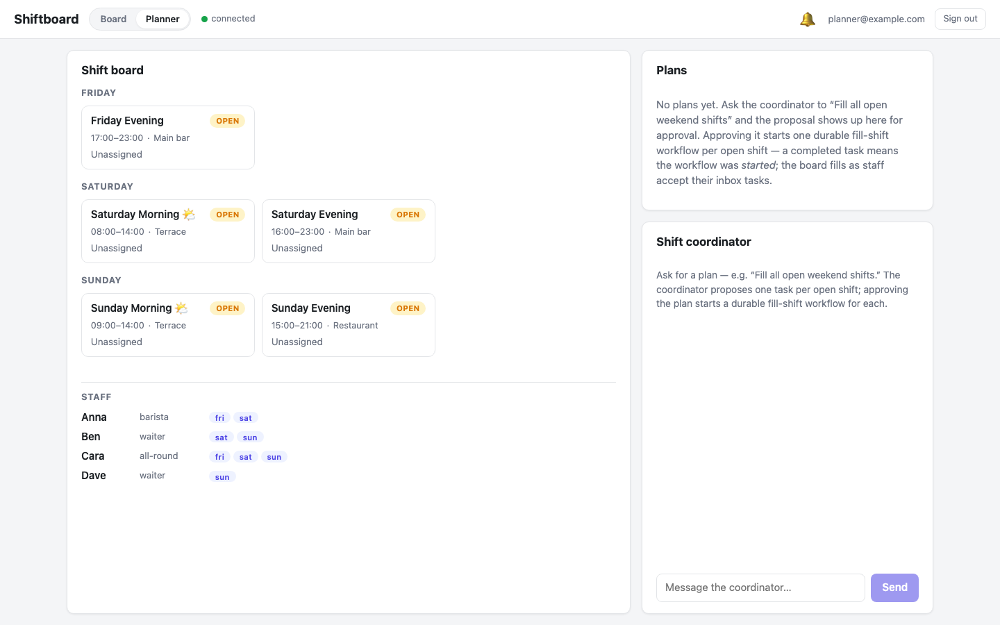
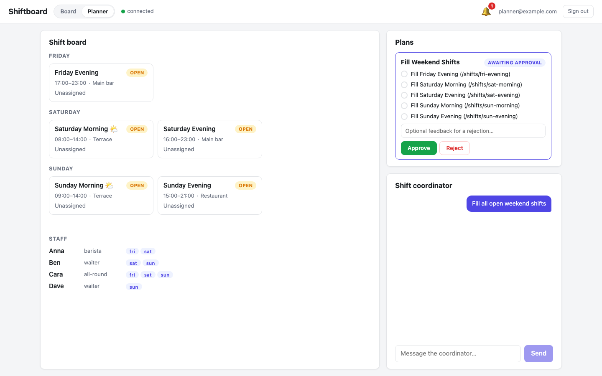
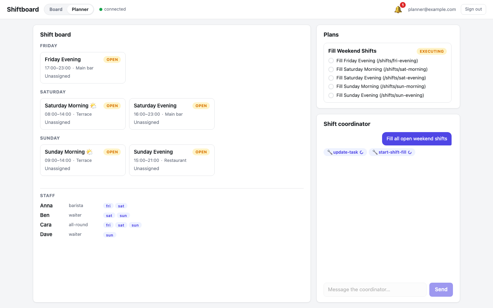
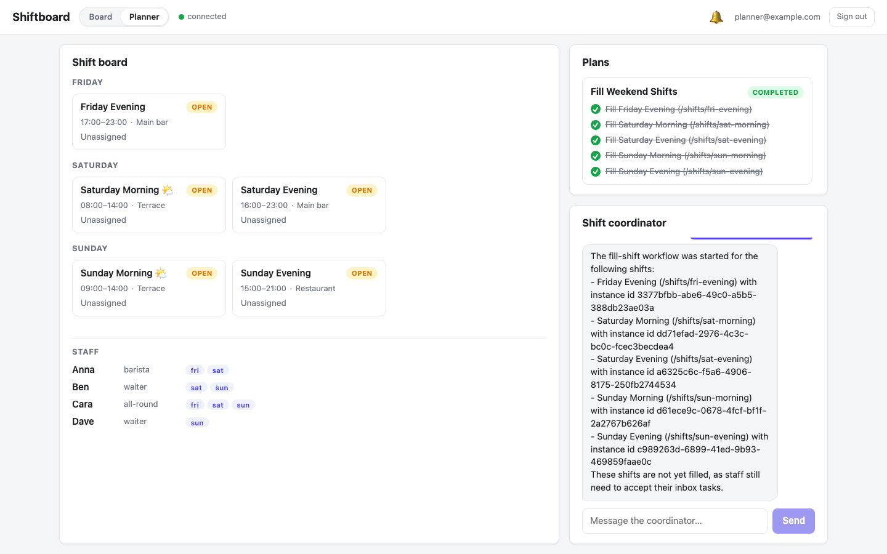
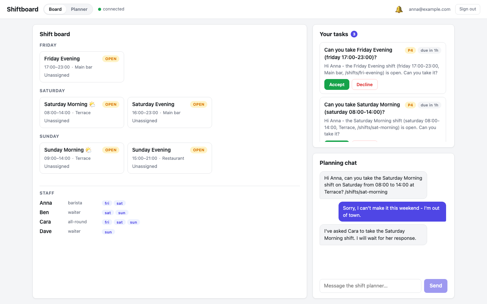
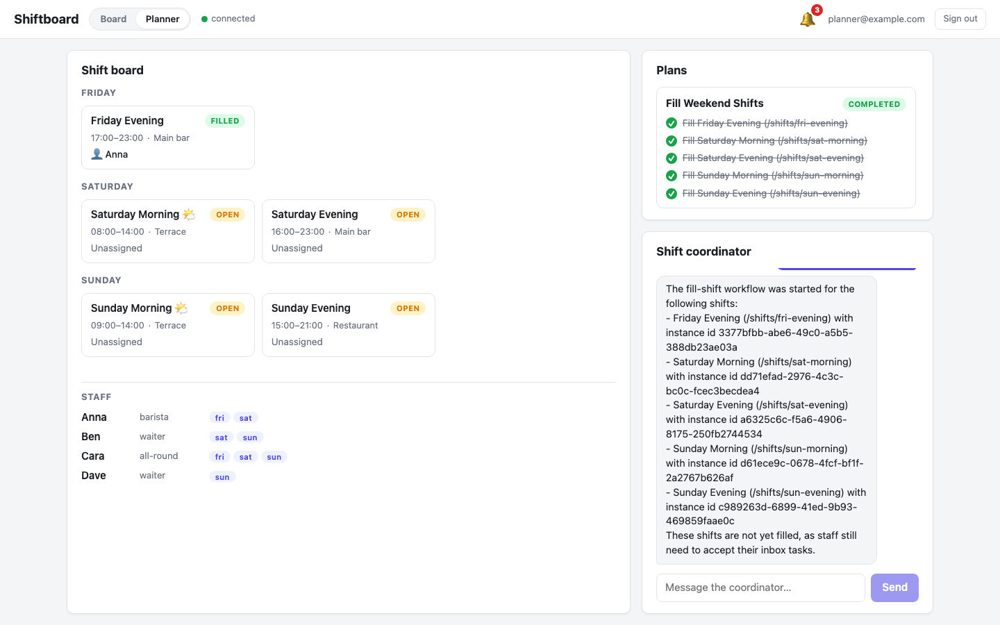

# Part 6: The Planner — Plans and Workflows Composed

**What you'll have at the end of this part:** a second, plan-enabled agent that fills the *whole* weekend board in one request — it proposes a **plan** with one task per open shift, waits for the manager's **approval**, and then starts one durable fill-shift workflow (from Part 5) per task. You'll see the plan execute in seconds and the board fill asynchronously as staff accept their inbox tasks.

Parts 4 and 5 each solved *one shift*. The natural next request is "fill all open weekend shifts" — five shifts, five workflows. You could prompt the chat agent to just loop, but then the decomposition is invisible and ungated: you can't see what it intends to do before it does it. The **plan/task system** fixes exactly that: the agent decomposes the request into a persisted, ordered task list, and an **execution mode** decides whether it runs immediately or waits for your approval.

This is the composition lesson of the whole tutorial: **chat is the interface, plans are the gated intent, workflows are the durable process.**

## The coordinator agent

The Planner tab talks to a second agent, `/agents/shift-coordinator` (`package/content/functions/agents/shift-coordinator/.node.yaml`). Two properties turn on planning, and the builtin planning tools join the app's own tools:

```yaml
node_type: raisin:AIAgent
properties:
  title: Shift Coordinator
  provider: groq
  model: llama-3.3-70b-versatile
  task_creation_enabled: true        # may decompose work into a plan
  execution_mode: approve_then_auto  # plan waits for ONE approval, then runs
  tools:
    - /lib/shiftboard/list-shifts
    - /lib/shiftboard/list-staff
    - /lib/shiftboard/start-shift-fill   # Part 5's workflow starter
    - /lib/raisin/ai/create-plan         # builtin planning tools
    - /lib/raisin/ai/add-task
    - /lib/raisin/ai/update-task
    - /lib/raisin/ai/get-plan-status
```

With `task_creation_enabled: true` the agent can call `create-plan`, which persists a `raisin:AIPlan` node with `raisin:AITask` children — real nodes, like everything else in this tutorial. `execution_mode` controls the gate:

| Mode | Behavior |
|------|----------|
| `automatic` | Plan executes immediately, no gate |
| `approve_then_auto` | One approval, then all tasks run — what we use here |
| `step_by_step` | One task per "continue" signal |
| `manual` | Approval plus explicit instructions for each step |

The system prompt does the domain wiring. The important excerpts:

```text
When the manager asks to fill MULTIPLE shifts:
1. Call list-shifts with status "open" to get the open shifts.
2. Call create-plan with ONE task per open shift. Each task title
   MUST be the shift title followed by its path, e.g.
   "Fill Saturday Morning (/shifts/sat-morning)".
3. When executing a task: mark it in_progress with update-task,
   call start-shift-fill with that task's shift path, then mark
   the task completed with update-task.

Be honest about what "completed" means: completing a task means the
fill-shift WORKFLOW WAS STARTED for that shift - staff still have to
accept their inbox tasks before the shift is actually filled.

When the manager names a SINGLE specific shift, do NOT create a
plan - just call start-shift-fill directly.
```

Note the last rule: plans are for multi-step intent. A single-shift request shouldn't pay the planning overhead — the agent just calls the tool, exactly as in Part 5.

> The full plan/task contract — modes, the SDK projection, approval handlers, building approval UIs — is documented in [Agent Plans & Tools](/docs/guides/ai/agent-plans-and-tools). This part shows it applied.

## The Planner tab

The frontend gains a `Board | Planner` toggle in the header. The Planner view keeps the shift board visible on the left — that's deliberate, because the payoff of this part is *watching the board fill* — and swaps the right column for a **plan panel** and a chat with the coordinator. It's a second, independent conversation: the Board tab's chat with `/agents/shift-planner` is untouched.



## Ask for a plan

The manager types one sentence: **"Fill all open weekend shifts."**

The coordinator calls `list-shifts`, finds five open shifts, and calls `create-plan` with five tasks. Because the agent runs in `approve_then_auto`, the plan is persisted in status `pending_approval` and the turn parks — **nothing executes yet**. The proposal renders as a card:



One task per open shift, in board order, each titled with the shift and its node path. The client side is small because the SDK does the bookkeeping: `ConversationStore` projects plan and task state from the conversation's `ai_plan` / `ai_task_update` messages into a deterministic `plans` array, and resolving the gate is one call:

```ts
// PlanPanel.svelte (excerpt) — plans come from the store snapshot
const plan = snapshot.plans.find((p) => p.status === 'pending_approval');

await store.approvePlan(plan.planPath);
// or:
await store.rejectPlan(plan.planPath, 'Skip Sunday, we are closed.');
```

Rejecting with feedback sends the text back to the agent, which revises the plan and proposes again.

## Approve, and watch it execute

On **Approve** the agent works through the tasks in order. For each one it marks the task `in_progress`, calls `start-shift-fill` for that shift, and marks the task `completed`. The plan panel shows the live progression, and the chat shows the tool calls as they happen:



`start-shift-fill` is the same function the Board agent used in Part 5 — `raisin.flows.run('/flows/fill-shift', { shift_path })`, fire-and-forget. Five tasks, five workflow instances, a few seconds total.

## The seam, stated honestly

Look closely at the completed plan — every task is checked off, but **the board is still all-open**:



This is the most important design point of this part. A plan task flipping to *completed* means *"the workflow for this shift was started"* — not *"the shift is filled."* The plan finishes in seconds; whether and when each shift actually fills is up to the staff answering the inbox tasks those workflows created. The agent's summary says exactly that ("These shifts are not yet filled, as staff still need to accept their inbox tasks") because its prompt demands honesty about what *completed* means — without that rule, models happily claim success they haven't verified.

Could you couple them tighter, so a task only completes when its flow completes? Yes — but then the agent (and the plan) would block on human response times, which is precisely what Part 5 built workflows to absorb. The loose seam is the feature: **plans gate and sequence intent in seconds; workflows own the slow, durable, human part.**

## The payoff: the board fills itself

Each workflow instance asks candidates one by one via inbox approval tasks — exactly the Part 5 machinery. Anna logs in and finds her tasks waiting:



She accepts Friday Evening, the workflow assigns her and completes — and on the manager's still-open Planner page, the card flips to **FILLED · Anna** live, via the same node subscription from Part 3. No refresh:



## Two client-side timing quirks (and the pattern that handles them)

Plan and task lifecycle messages are delivered into the conversation **asynchronously** — they are nodes being routed, not stream events. Two consequences show up in any real client, and `frontend/src/lib/stores/planner.svelte.ts` handles both with short reload polling:

1. **Proposal grace.** The turn's `done` event (finish reason `awaiting_plan_approval`) can arrive *before* the `ai_plan` card message lands in the conversation. If you treat `done` as "render final state," you'll briefly show an approved-of nothing. The fix: when the last finish reason is `awaiting_plan_approval` but the `plans` projection has no pending plan yet, reload the conversation every couple of seconds until the card appears.
2. **Execution watch.** After `approvePlan()` the agent continues *without any user message*, so there's no stream attached to your next render. Poll `loadMessages()` until the plan reaches a terminal status (`completed` / `failed` / `cancelled`), skipping fetches while a live stream is active.

Also filter `ai_plan` / `ai_task_update` messages **out of the chat transcript** (their content is just the task title — they belong in the plan panel) and out of toast notifications, or a five-task plan fires eleven toasts.

## Prove it headlessly

`planner-tab-check.mjs` drives the whole story end to end through a real browser and the API: reset all five shifts to open → log in as the manager → "Fill all open weekend shifts" → assert the proposal has exactly one task per open shift → approve → assert all tasks complete *while the board is still all-open* (the honest seam) → assert Anna and Cara hold the workflows' inbox tasks → accept one via the API → assert that shift flips to filled on the live page. It restores the demo state afterwards.

```bash
npm run planner-tab-check
```

## Chat vs. plan vs. workflow

| | Chat tool calls (Part 2/4) | Plan (Part 6) | Workflow (Part 5) |
|---|---|---|---|
| Decomposition | Invisible, in the model's head | Visible, persisted task list | Modeled ahead of time |
| Approval gate | None | `execution_mode` (approve / step / manual) | Wherever you model one |
| Survives restarts | No | Plan/task nodes persist | Yes, engine-owned |
| Best at | Judgment, single actions | Gating multi-step *intent* | Slow, durable, human-paced process |

They stack: the manager speaks to a chat agent, the agent's intent is gated by a plan, and each approved step delegates the long-running human part to a workflow. Every layer is nodes, so every layer is queryable, subscribable, and auditable.

## Where to go next

- [Agent Plans & Tools](/docs/guides/ai/agent-plans-and-tools) — the full plan contract: all four execution modes, the SDK `plans` projection, `approvePlan`/`rejectPlan`, step-by-step continuation, and approval handlers.
- [Workflows overview](/docs/guides/workflows/overview) and [Human-in-the-loop](/docs/guides/workflows/human-in-the-loop) — the engine underneath every plan task in this part.
- [JavaScript Client reference](/docs/reference/javascript-client/overview) — `ConversationStore`, [chat](/docs/reference/javascript-client/chat), [flows](/docs/reference/javascript-client/flows), and the [realtime inbox](/docs/reference/javascript-client/realtime-inbox).

You now have the complete stack: nodes as the single source of truth, an agent that acts through functions, a UI that's just subscriptions, plans that make multi-step intent visible and gated, and a workflow engine for everything that must not be forgotten.
