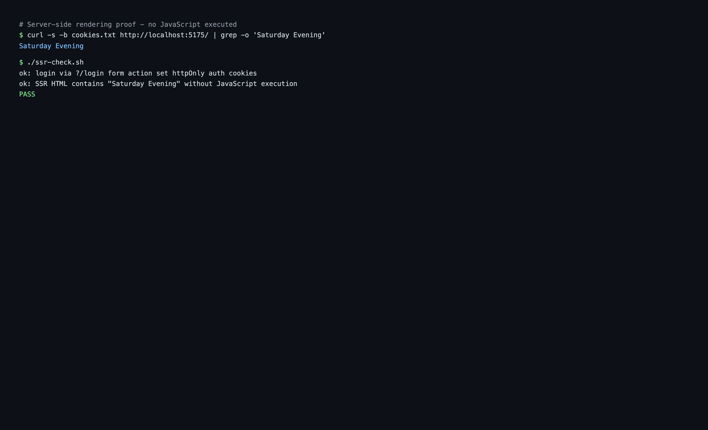

# Part 3: A Real App — SSR, Live Board, Inbox Notifications

**What you'll have at the end of this part:** the SvelteKit frontend running with server-side rendering (cookie auth, board + chat in the first HTML byte), a board that updates live when the agent writes a node, a notification bell driven by a single inbox subscription — and a sub-second edit-to-server dev loop.

Run it:

```bash
cd examples/shiftboard/frontend
npm install
npm run dev        # http://localhost:5175
```

`VITE_RAISIN_WS_URL` (default `ws://localhost:8081/ws/shiftboard`) and `VITE_RAISIN_REPO` (default `shiftboard`) configure the target, e.g. via `frontend/.env.local`. The tenant-less `/ws/{repository}` URL is all a client needs; multi-tenant operators can use `ws://host/sys/{tenant}/{repository}` instead.

## SSR architecture: the server owns the session

Auth lives in **httpOnly cookies**. The login form posts to a SvelteKit action which calls RaisinDB's identity endpoint and stores the tokens; `hooks.server.ts` resolves the session on every request and refreshes near-expiry tokens:

```typescript
// src/hooks.server.ts (trimmed)
export const handle: Handle = async ({ event, resolve }) => {
  let access = event.cookies.get(COOKIE_ACCESS);
  const refresh = event.cookies.get(COOKIE_REFRESH);

  if ((!access || tokenExpiresSoon(access)) && refresh) {
    const tokens = await refreshTokens(refresh);   // POST /auth/{repo}/refresh
    if (tokens) { setAuthCookies(event.cookies, tokens); access = tokens.access_token; }
  }
  // valid access + identity cookie → event.locals.session, else null
  ...
};
```

The page's server `load` fetches **everything** the first paint needs — board, chat history, and pending tasks — over `RaisinHttpClient` (SQL over HTTP):

```typescript
// src/routes/+page.server.ts (trimmed)
export const load: PageServerLoad = async ({ parent }) => {
  const { session } = await parent();
  if (!session) return { board: null, chat: null, tasks: null };

  const client = createHttpClient(session.token);
  const db = client.database(REPOSITORY);

  const [shiftsRes, staffRes, pendingTasks] = await Promise.all([
    db.executeSql(SHIFTS_SQL),
    db.executeSql(STAFF_SQL),
    listPendingTasks(client),
  ]);

  // ... latest ai_chat conversation via ConversationManager.list() +
  //     manager.getMessages(conversationPath) ...

  return {
    board: { shifts: rowsToShifts(shiftsRes.rows ?? []), staff: rowsToStaff(staffRes.rows ?? []) },
    chat: { conversationPath, messages },
    tasks: pendingTasks,
  };
};
```

The first response is **complete HTML** — `view-source:` shows the shift titles before any JavaScript runs. `frontend/ssr-check.sh` proves it with curl only: log in via the form action, then assert the shift titles appear in the raw HTML.


*View-source on the freshly loaded page: shift cards and chat history are server-rendered HTML.*

After hydration, the page seeds the Svelte stores from the SSR data (no re-fetch) and switches to the live layer: the browser connects a WebSocket client and authenticates with the same access token (`client.authenticate({ type: 'jwt', token })`).

## The live board: one node subscription

When the agent (or anyone else) updates a shift node, the matching card updates in place — no polling. From `src/lib/stores/board.svelte.ts`:

```typescript
// Live updates: any node:updated under /shifts patches the matching card.
await getDb().workspace('staffing').events().subscribe(
  { path: '/shifts/*', event_types: ['node:updated'], include_node: true },
  (event) => this.#onShiftEvent(event),
);

// The SDK restores subscriptions after a reconnect, but events missed
// while offline are gone — reload the board to resync.
getClient().onReconnected(() => { this.#load().catch(() => {}); });
```

Path filter semantics matter here:

- `*` matches **exactly one** path segment — `/shifts/*` catches `/shifts/sat-morning` but not deeper nodes.
- `**` matches **any depth**.
- There is **no implicit prefix matching** — `/shifts` alone does not match children.

`include_node: true` delivers the full node in the event payload, so the handler patches state directly without a follow-up query:

```typescript
#onShiftEvent(event: EventMessage): void {
  const node = (event.payload as { node?: ... })?.node;
  if (!node?.path || !node.properties) return;
  const idx = this.shifts.findIndex((s) => s.path === node.path);
  if (idx < 0) return;
  // Replace the card data, bumping flashSeq so the UI replays the highlight.
  this.shifts[idx] = toShift(node.path, node.properties, this.shifts[idx].flashSeq + 1);
}
```

## The notification bell: a subscription on your inbox

The messaging pipeline delivers items into the logged-in user's home inbox in the `raisin:access_control` workspace. The bell is nothing more than a subscription on that subtree — from `src/lib/stores/notifications.svelte.ts`:

```typescript
await getDb().workspace('raisin:access_control').events().subscribe(
  {
    path: `${home}/inbox/**`,            // ** because inbox items nest
    event_types: ['node:created', 'node:updated'],
    include_node: true,
  },
  (event) => this.#onInboxEvent(event),
);
```

`**` is required because inbox items nest (`chats/<conversation>/<message>`). This is the app's **single** inbox subscription: it bumps the badge, shows toasts, and (in Part 5) also feeds the human-task panel. One subscription, three features.

## The dev loop

Deploy once (Part 1), then keep the package directory live-synced while you develop:

```bash
raisindb sync ./package --repo shiftboard --watch
```

While the watcher runs:

- Editing a **function source** (e.g. `package/content/functions/lib/shiftboard/list-shifts/index.js`) updates the function's code on the server — the next tool call runs the new code, no reinstall. Roughly one second from save to live.
- Editing a **`.node.yaml`** or a named node YAML (e.g. `content/staffing/shifts/fri-evening.yaml`) PUTs the node's properties.
- Editing **`manifest.yaml`**, **`workspaces/`**, or **`nodetypes/`** cannot be hot-synced — the watcher prints a hint to re-run `raisindb deploy ./package --repo shiftboard --install`.

See the [Sync and Watch guide](/docs/guides/packages/sync-and-watch) for the full behavior.

**Next:** [Part 4 — The agent coordinates your staff](./agent-coordination)
